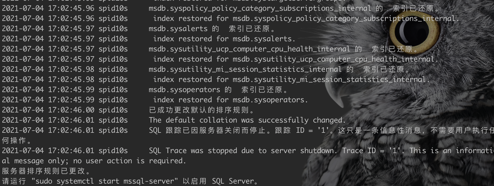

# sqlserver linux

## 一、SqlServer 安装

### 1.1 2017 版本

1. 环境配置

   ```bash
   # 安装python2
   yum install python2
   # 设置默认python
   sudo alternatives --config python
   ```

2. 下载yum源

   ```bash
   # centos 7
   sudo curl -o /etc/yum.repos.d/mssql-server.repo https://packages.microsoft.com/config/rhel/7/mssql-server-2017.repo
   # centos 8
   sudo curl -o /etc/yum.repos.d/mssql-server.repo https://packages.microsoft.com/config/rhel/8/mssql-server-2017.repo
   ```

3. 安装

   ```bash
   sudo yum install -y mssql-server
   ```

4. 配置

   ```bash
   sudo /opt/mssql/bin/mssql-conf setup
   ```

5. 防火墙

   ```bash
   sudo firewall-cmd --zone=public --add-port=1433/tcp --permanent
   sudo firewall-cmd --reload
   ```

### 1.2 2019 版本

1. 环境配置

   ```bash
   # 安装python2
   yum install python2
   # 设置默认python
   sudo alternatives --config python
   ```

2. 下载yum源

   ```bash
   # centos 7
   sudo curl -o /etc/yum.repos.d/mssql-server.repo https://packages.microsoft.com/config/rhel/7/mssql-server-2019.repo
   # centos 8
   sudo curl -o /etc/yum.repos.d/mssql-server.repo https://packages.microsoft.com/config/rhel/8/mssql-server-2019.repo
   ```

3. 安装

   ```bash
   sudo yum install -y mssql-server
   ```

4. 配置

   ```bash
   sudo /opt/mssql/bin/mssql-conf setup
   ```

5. 防火墙

   ```bash
   sudo firewall-cmd --zone=public --add-port=1433/tcp --permanent
   sudo firewall-cmd --reload
   ```

## 二、command-line tools

1. 下载yum源

   ```bash
   # centos 7
   sudo curl -o /etc/yum.repos.d/msprod.repo https://packages.microsoft.com/config/rhel/7/prod.repo
   # centos 8
   sudo curl -o /etc/yum.repos.d/msprod.repo https://packages.microsoft.com/config/rhel/8/prod.repo
   ```

2. 卸载旧版本**mssql-tools**

   ```bash
   sudo yum remove unixODBC-utf16 unixODBC-utf16-devel
   ```

3. 安装

   ```bash
   sudo yum install -y mssql-tools unixODBC-devel
   ```

4. 环境变量

   ```bash
   echo 'export PATH="$PATH:/opt/mssql-tools/bin"' >> ~/.bash_profile
   echo 'export PATH="$PATH:/opt/mssql-tools/bin"' >> ~/.bashrc
   source ~/.bashrc
   ```

5. 连接

   ```bash
   sqlcmd -S localhost -U SA -P '<YourPassword>'
   ```

6. 测试SQL

   ```sql
   SELECT Name from sys.Databases
   ```

   > 使用go触发sql执行

## 三、配置数据库[参考](https://docs.microsoft.com/en-us/sql/linux/sql-server-linux-configure-mssql-conf?view=sql-server-ver15)

1. 配置排序规则

   ```bash
   # 登录数据库
   sqlcmd -S localhost -U sa -P '<yourpassword>'
   # 执行如下SQL
   use master
   go
   # 我需要的是中文二进制
   SELECT Name from sys.fn_helpcollations() where name like '%PRC_BIN%'
   # 结果
   Chinese_PRC_BIN
   # 停止服务
   systemctl stop mssql-server
   # 配置
   sudo /opt/mssql/bin/mssql-conf set-collation
   # 输入 Chinese_PRC_BIN ,等待配置完成
   ```

   

2. 配置数据存放目录

   ```bash
   # 创建目录
   sudo mkdir /tmp/data
   # 修改所属用户
   sudo chown mssql /tmp/data
   # 修改所属组
   sudo chgrp mssql /tmp/data
   # 设置数据目录
   sudo /opt/mssql/bin/mssql-conf set filelocation.defaultdatadir /tmp/data
   # 设置日志目录
   sudo /opt/mssql/bin/mssql-conf set filelocation.defaultlogdir /tmp/log
   ```

3. 配置master数据库存放目录

   ```bash
   # 创建目录
   sudo mkdir /tmp/masterdatabasedir
   # 修改所属用户
   sudo chown mssql /tmp/masterdatabasedir
   # 修改所属组
   sudo chgrp mssql /tmp/masterdatabasedir
   # 指定文件
   sudo /opt/mssql/bin/mssql-conf set filelocation.masterdatafile /tmp/masterdatabasedir/master.mdf
   sudo /opt/mssql/bin/mssql-conf set filelocation.masterlogfile /tmp/masterdatabasedir/mastlog.ldf
   # 停止服务
   sudo systemctl stop mssql-server
   # 复制文件
   sudo mv /var/opt/mssql/data/master.mdf /tmp/masterdatabasedir/master.mdf 
   sudo mv /var/opt/mssql/data/mastlog.ldf /tmp/masterdatabasedir/mastlog.ldf
   # 启动服务
   sudo systemctl start mssql-server
   ```


## 四、数据库还原

数据库还原存在两种模式，一种是使用SSMS环境，一种是使用命令还原，命令还原需要知道当前数据库使用的文件信息，下面就是使用命令还原的数据库

```sql
RESTORE DATABASE win60_pdb FROM DISK = '/winning/data/win60_pdb1_backup_2021_07_02_030049_5743867.bak' 
WITH 
MOVE 'WIN60_PDB' TO '/winning/data/mssql/win60_pdb/win60_pdb_0731_line.mdf',
MOVE 'WIN60_PDB02' TO '/winning/data/mssql/win60_pdb/win60_pdb_0731_line02.mdf',
MOVE 'WIN60_PDB03' TO '/winning/data/mssql/win60_pdb/win60_pdb_0731_line03.mdf',
MOVE 'WIN60_PDB04' TO '/winning/data/mssql/win60_pdb/win60_pdb_0731_line04.mdf',
MOVE 'WIN60_PDB_log' to '/winning/data/mssql/win60_pdb/win60_pdb_0731_line_log.mdf' 
go
```

```sql
RESTORE DATABASE THIS4_LYLT FROM DISK = '/winning/data/THIS4_LYLT_backup_2021_05_17_030006_9618293.bak'
WITH 
MOVE 'SAMPLE_Data' TO '/winning/data/mssql/this4_lylt/this4_lylt.mdf',
MOVE 'SAMPLE_Log' TO '/winning/data/mssql/win60_pdb/this4_lylt_log.mdf'
go
```

```sql
RESTORE DATABASE dev_aio FROM DISK = '/winning/mssql/dev_aio_backup_2021_10_31_001006_9507879.bak' 
WITH 
MOVE 'his_dev_ipt_202011210' TO '/winning/mssql/data/dev_aio.mdf',
MOVE 'his_dev_ipt_202011210_log' TO '/winning/mssql/data/dev_aio_log.mdf'
go
```