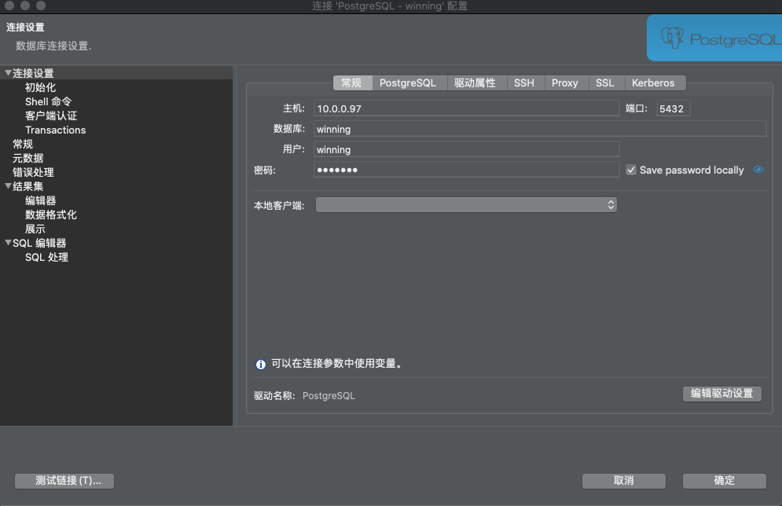
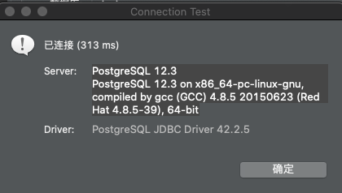

# postgresql

## 1、PostgreSQL 安装

### 1.1 **CentOS安装**

```url
# 官网
https://www.postgresql.org/download/linux/redhat/
# 国内镜像
# 浙江大学
http://mirrors.zju.edu.cn/postgresql/
# 中国科技大学
http://mirrors.ustc.edu.cn/postgresql/
```

#### 1.1.1 **PostgresSQL的安装**

##### 1.1.1.1 下载源,安装rpm文件

```bash
yum install -y http://mirrors.ustc.edu.cn/postgresql/repos/yum/12/redhat/rhel-7.12-x86_64/pgdg-redhat-repo-latest.noarch.rpm
```

##### 1.1.1.2 安装

```bash
# 安装客户端
yum install postgresql12 -y
# 安装服务端
yum install postgresql12-server -y 
```

##### 1.1.1.3 服务设置

```bash
# 初始化
/usr/pgsql-12/bin/postgresql-12-setup initdb
# 开机启动
systemctl enable postgresql-12
# 启动服务
systemctl start postgresql-12
```

### 1.2 **创建用户和数据库**

#### 1.2.1 使用postgres用户登录（PostgresSQL安装后会自动创建postgres用户，无密码）

```bash
su - postgres
Last login: Fri Jun  5 22:54:30 CST 2020 on pts/1
```

#### 1.2.2 登录postgresql数据库

```bash
-bash-4.2$ psql
psql (12.3)
Type "help" for help.
```

#### 1.2.3 创建用户和数据库并授权

```sql
create user winning with password 'winning';            // 创建用户
create database winning owner winning;                 // 创建数据库
grant all privileges on database winning to winning;   // 授权
```

### 1.3 **开启远程访问**

#### 1.3.1  postgresql.conf

修改`/var/lib/pgsql/12/data/postgresql.conf`文件，取消 listen_addresses 的注释，将参数值改为“*”

```bash
# 修改前
listen_addresses = 'localhost'                  # what IP address(es) to listen on;
# 修改后
listen_addresses = '*'                          # what IP address(es) to listen on;
```

#### 1.3.2 pg_hba.conf

修改`/var/lib/pgsql/10/data/pg_hba.conf`文件，增加ip访问

```bash
# 修改前
# IPv4 local connections:
host    all             all             127.0.0.1/32            ident
# 修改后
# IPv4 local connections:
host    all             all             127.0.0.1/32            ident
host    all             all             0.0.0.0/0               md5
```

#### 1.3.2 切换到root用户，重启postgresql服务

```bash
# 退出postgres 切换用户
exit
# 重启服务
systemctl restart postgresql-12
```

### 1.4 测试使用




