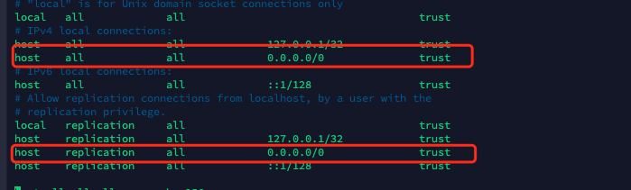

Docker常用中间件安装

## neo4j

```bash
docker pull neo4j:3.5.9
mkdir -p /data/neo4j/{data,conf,logs}
docker run -d --name neo4j -h neo4j \
  -p 7474:7474 -p 7687:7687 \
  -v /data/neo4j/data:/data \
  -v /data/neo4j/conf:/conf \
  -v /data/neo4j/logs:/logs \
  -e "NEO4J_dbms_default__database=graph.db" \
  neo4j:3.5.9
# 备份文件还原 
docker cp database neo4j:/data/
docker exec -it neo4j bash 
cd /data/
chown -R neo4j:neo4j ./*
exit
docker stop neo4j
docker start neo4j

# neo4j 4
docker pull neo4j
mkdir -p /data/neo4j/{data,conf,logs}
docker run -d --name neo4j -h neo4j \
  -p 7474:7474 -p 7687:7687 \
  -v /data/neo4j/data:/data \
  -v /data/neo4j/conf:/conf \
  -v /data/neo4j/logs:/logs \
  -e "NEO4J_dbms_default__database=graph.db" \
  neo4j
```

## minio

```bash
docker pull minio/minio
mkdir -p /data/minio/config
mkdir -p /data/minio/data
docker run -p 9000:9000 -p 9001:9001 \
           --name minio -d --restart=always 
           -e "MINIO_ACCESS_KEY=www.winning.com.cn" \
           -e "MINIO_SECRET_KEY=www.winning.com.cn" 
           -v /data/minio/data:/data \
           -v /data/minio/config:/root/.minio minio/minio \
           server /data --console-address ":9001" -address ":9000"
rm -rf /data/minio/data
cp data.zip /data/minio
cd /data/minio
unzip data.zip
docker stop minio
docker start minio
```

## Xxl-job

```bash
mkdir -p /data/xxl-job
docker pull xuxueli/xxl-job-admin:2.0.2
docker run -e PARAMS="--spring.datasource.url=jdbc:mysql://192.168.31.244:3306/xxl_job?useUnicode=true&characterEncoding=UTF-8&autoReconnect=true&serverTimezone=Asia/Shanghai --spring.datasource.username=winning --spring.datasource.password=Maria@win60.DB --server.context-path=/ "\
 -p 18080:8080 \
 -v /data/xxl-job/:/data/applogs \
 --name xxl-job-admin  -d xuxueli/xxl-job-admin:2.0.2
```

## mariadb

```bash
# 查看mariadb数据源
docker search mariadb
# 拉取mariadb数据库
docker pull mariadb
# 创建msyql到本地的数据文件夹映射路径
mkdir -p /data/mariadb/data
#  启动mariadb容器
docker run --name mariadb -p 3306:3306 \
           -e MYSQL_ROOT_PASSWORD=root \
           -v /data/mariadb/data:/var/lib/mysql -d mariadb
# -e MYSQL_ROOT_PASSWORD=root 赋值mysql的量，来设置root用户的密码为root
#  设置容器自启动随docker的启动而启动
docker container update --restart=always d72e7e910ab6
```

## postgresql

```bash
# 拉取
docker pull postgres
# 创建数据文件夹
mkdir -p /data/postgres/data
# 创建容器
# 60
docker run -h postgres --name postgres --restart always \
           -e POSTGRES_PASSWORD='winning' \
           -e ALLOW_IP_RANGE=0.0.0.0/0 \
           -v /data/postgres/data5x:/var/lib/postgresql \
           -p 15432:5432 -d postgres
# 5x           
docker run -h pg5x --name pg5x --restart always \
           -e POSTGRES_PASSWORD='winning' \
           -e ALLOW_IP_RANGE=0.0.0.0/0 \
           -v /data/postgres/data5x:/var/lib/postgresql \
           -p 15433:5432 -d postgres
           
# 拷贝文件           
docker cp db_bak.sql postgres:/var/lib/postgresql/
# 修改配置
docker cp postgres:/var/lib/postgresql/data/pg_hba.conf ./
vim pg_hba.conf
```



```bash
# TYPE  DATABASE        USER            ADDRESS                 METHOD

# "local" is for Unix domain socket connections only
local   all             all                                     trust
# IPv4 local connections:
host    all             all             127.0.0.1/32            trust
host    all             all             0.0.0.0/0               trust
# IPv6 local connections:
host    all             all             ::1/128                 trust
# Allow replication connections from localhost, by a user with the
# replication privilege.
local   replication     all                                     trust
host    replication     all             127.0.0.1/32            trust
host    replication     all             0.0.0.0/0               trust
host    replication     all             ::1/128                 trust

host all all all scram-sha-256
```

```bash
docker cp pg_hba.conf  postgres:/var/lib/postgresql/data/pg_hba.conf
# psql 执行 创建用户，创建数据库
# 进入容器
docker exec -it postgres bash;
# 切换用户
su postgres;
# 进入psql
psql
# 创建用户 数据库 赋权
```

```sql
create user winning superuser password 'winning';
create database win60_dcs;
GRANT ALL PRIVILEGES ON DATABASE win60_dcs to winning;
```

```bash
# 数据库还原
# 备份脚本
pg_dump -h 127.0.0.1 -p 5432 -U winning win60_dcs >db_bak.sql
# 还原脚本
psql -h localhost -U winning -d win60_dcs < db_bak.sql
```

## rabbitmq

```bash
docker pull rabbitmq:management
docker run -d -h rabbitmq --name rabbitmq \
           -e RABBITMQ_DEFAULT_USER=admin \
           -e RABBITMQ_DEFAULT_PASS=win.2019 \
           -p 15672:15672 -p 5672:5672 \
           rabbitmq:management
# -e RABBITMQ_DEFAULT_USER=admin 
# -e RABBITMQ_DEFAULT_PASS=admin
# 指定manage模块的用户名和密码，也可以完全省略参数
# 如果不指定默认用户名密码，系统会有默认用户名密码：guest guest
# 如果执行报错，执行如下命令
docker run -d --hostname rabbit --name rabbit -p 15672:15672-p 5673:5672 rabbitmq:management
# 现在可以通过访问http://linuxip:15672，访问web界面，这里的用户名和密码默认都是guest。
# 如果访问失败，可能是没有开启manage模块。
# 通过docker ps -a查看部署的mq容器id，在通过 docker exec -it 容器id /bin/bssh 进入容器内部在
# 运行：rabbitmq-plugins enable rabbitmq_management，执行完毕后重新访问web界面即可
```

## elasticsearch

```bash
docker pull elasticsearch:7.4.2
docker run -d --name es52 -h es52 \
           -p 19200:9200 -p 19300:9300 \
           -v /data/elasticsearch/data52:/usr/share/elasticsearch/data \
           -e "discovery.type=single-node" \
           -e "node.name=192.168.31.144" \
           -e "cluster.name=winning_elasticsearch" \
           -e "bootstrap.memory_lock=true" \
           -e "'ES_JAVA_OPTS=-Xms512m -Xmx10240m'" \
           elasticsearch:7.4.2
# 需要提供用户名密码
docker network create es_net           
docker run -d --name es -h es --restart=always\
           --net es_net \
           -p 29200:9200 -p 29300:9300 \
           -v /data/es/7.6.2/data:/usr/share/elasticsearch/data \
           -e "discovery.type=single-node" \
           -e "node.name=192.168.31.144" \
           -e "cluster.name=winning_elasticsearch" \
           -e "bootstrap.memory_lock=true" \
           -e "'ES_JAVA_OPTS=-Xms1g -Xmx16g'" \
           elasticsearch:7.6.2
/data/es/7.6.2/data
```

> elasticsearch.yml
>
> ```yml
> cluster.name: winning_elasticsearch
> http.cors.allow-origin: '*'
> http.cors.allow-credentials: true
> http.cors.enabled: true
> xpack.license.self_generated.type: basic
> xpack.security.enabled: true
> xpack.security.transport.ssl.enabled: true
> http.port: 9200
> transport.tcp.port: 9300
> network.host: 0.0.0.0
> ```
>
> 需要将文件路径设置为777权限
>
> ```bash
> chmod -R 777 /data/elasticsearch
> ```

## kibana
```bash
# kibana.yml 配置文件
#
## ** THIS IS AN AUTO-GENERATED FILE **
##
#
## Default Kibana configuration for docker target
server.name: kibana
server.host: 0.0.0.0
elasticsearch.hosts: [ "http://192.168.31.144:19200" ]
xpack.monitoring.ui.container.elasticsearch.enabled: true

## 用户名和密码模式
erver.name: kibana
server.host: 0.0.0.0
elasticsearch.hosts: [ "http://192.168.31.144:29200" ]
#xpack.monitoring.ui.container.elasticsearch.enabled: true
elasticsearch.username: elastic
elasticsearch.password: abcd1234
```

```bash
docker run -d \
  --name=kibana \
  --restart=always \
  -p 5601:5601 \
  -v /data/kibana/config/kibana.yml:/usr/share/kibana/config/kibana.yml \
  kibana:7.4.2
 
docker pull kibana:7.4.2
docker run -d --name kibana52 -h kibana52 \
           -p 5601:5601 \
           -v /data/kibana/config52:/usr/share/kibana/config \
           -e "ELASTICSEARCH_HOSTS=http://192.168.31.144:19200" \
           kibana:7.4.2
           
docker run -d --name kibana_7.6.2 -h kibana_7.6.2 \
           --restart=always --net es_net \
           -p 15601:5601 \
           -v /data/kibana/7.6.2/config:/usr/share/kibana/config \
           -e "ELASTICSEARCH_HOSTS=http://192.168.31.144:29200" \
           kibana:7.6.2           
           
           
```

## consul

```bash
mkdir -p /data/consul/data
mkdir -p /data/consul/config
docker pull consul
docker run  -d -p 8500:8500 \
            -v /data/consul/data:/consul/data \
            -v /data/consul/config:/consul/config \
            --name consul \
            -h consul \
            consul
```

## redis

[配置文件](http://download.redis.io/redis-stable/redis.conf)

```bash
mkdir -p /data/redis/data
mkdir -p /data/redis/conf
docker pull redis
# 简版
docker run  -d -p 6379:6379 \
            --name redis \
            -v /data/redis/data:/data \
            -h redis \
            redis
# 配置版本
docker run  -d -p 6379:6379 \
            --name redis_conf \
            -v /data/redis/data:/data \
            -v /data/redis/conf/redis.conf:/etc/redis/redis.conf \
            -h redis_conf \
            redis \
            redis-server /etc/redis/redis.conf
```

> 修改启动默认配置(从上至下依次)：
>
> bind 127.0.0.1 #注释掉这部分，这是限制redis只能本地访问
>
> protected-mode no #默认yes，开启保护模式，限制为本地访问
>
> daemonize no#默认no，改为yes意为以守护进程方式启动，可后台运行，除非kill进程，改为yes会使配置文件方式启动redis失败
>
> databases 16 #数据库个数（可选），我修改了这个只是查看是否生效。。
>
> dir  ./ #输入本地redis数据库存放文件夹（可选）
>
> appendonly yes #redis持久化（可选）


# elastichd

```bash
docker pull containerize/elastichd
docker run -p 9800:9800 \
  -d --link es \
  --name elastichd \
  -h elastichd \
  containerize/elastichd
```


## rocketmq

```bash
# 拉取镜像
docker pull rocketmqinc/rocketmq
# 创建数据存储目录
mkdir -p /data/rocketmq/namesrv/logs /data/rocketmq/namesrv/store
# 安装
docker run -d --restart=always --name rmqnamesrv \
    --privileged=true -p 9876:9876  \
    -v /data/rocketmq/namesrv/logs:/root/logs \
    -v /data/rocketmq/namesrv/store:/root/store \
    -e "MAX_POSSIBLE_HEAP=100000000" \
    rocketmqinc/rocketmq sh mqnamesrv
```

修改配置broker.conf 

```
# 所属集群名称，如果节点较多可以配置多个
brokerClusterName = DefaultCluster 
#broker名称，master和slave使用相同的名称，表明他们的主从关系 
brokerName = broker-a 
#0表示Master，大于0表示不同的
slave brokerId = 0 
#表示几点做消息删除动作，默认是凌晨4点 
deleteWhen = 04 
#在磁盘上保留消息的时长，单位是小时 
fileReservedTime = 48 
#有三个值：SYNC_MASTER，ASYNC_MASTER，SLAVE；同步和异步表示Master和Slave之间同步数据的机 制；
brokerRole = ASYNC_MASTER 
#刷盘策略，取值为：ASYNC_FLUSH，SYNC_FLUSH表示同步刷盘和异步刷盘；SYNC_FLUSH消息写入磁盘后 才返回成功状态，ASYNC_FLUSH不需要；
flushDiskType = ASYNC_FLUSH 
# 设置broker节点所在服务器的ip地址 
brokerIP1 = 192.168.31.144 
#剩余磁盘比例 
diskMaxUsedSpaceRatio=99
```

```bash
mkdir -p /data/rocketmq/broker/logs /data/rocketmq/broker/store
docker run -d --restart=always --name rmqbroker \
    --link rmqnamesrv:namesrv  --privileged=true \
    -p 10911:10911 -p 10909:10909 \
    -v /data/rocketmq/broker/logs:/root/logs \
    -v /data/rocketmq/broker/store:/root/store \
    -v /data/rocketmq/broker/conf/broker.conf:/opt/rocketmq-4.4.0/conf/broker.conf \
    -e "NAMESRV_ADDR=namesrv:9876" \
    -e "MAX_POSSIBLE_HEAP=200000000" \
    rocketmqinc/rocketmq sh mqbroker -c /opt/rocketmq-4.4.0/conf/broker.conf

```

## **控制台安装**

```bash
 docker pull pangliang/rocketmq-console-ng
docker run -d --restart=always --name rmqadmin \
 -e "JAVA_OPTS=-Drocketmq.namesrv.addr=192.168.31.144:9876 -Dcom.rocketmq.sendMessageWithVIPChannel=false" \
 -p 20080:8080 pangliang/rocketmq-console-ng
```

