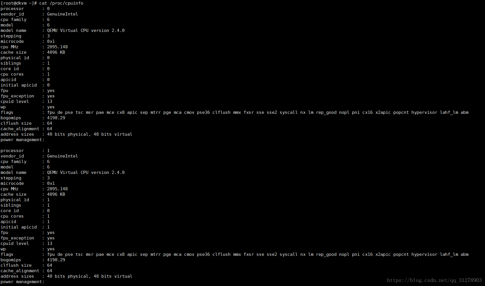
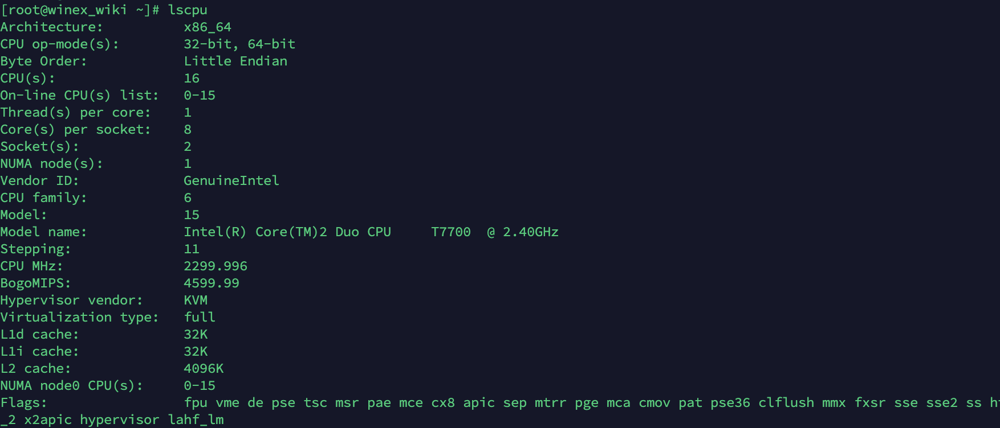
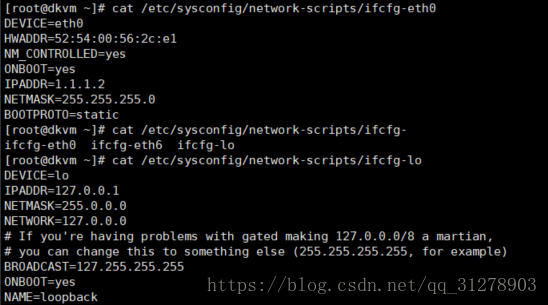
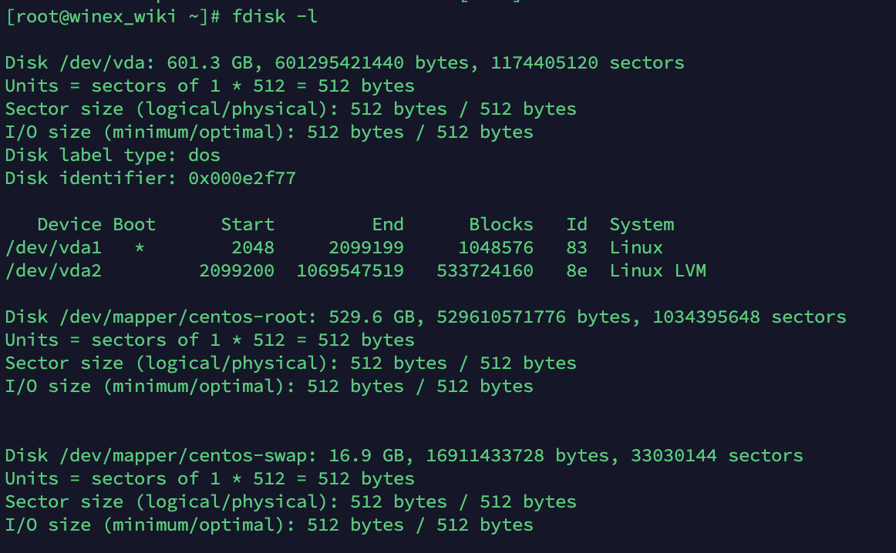

Linux系统信息

1. uname －a   （Linux查看版本当前操作系统内核信息）

2. cat /proc/version （Linux查看当前操作系统版本信息）

3. cat /etc/issue  或cat /etc/redhat-release（Linux查看版本当前操作系统发行版信息）

4. cat /proc/cpuinfo

   

lscpu （Linux查看cpu相关信息，包括型号、主频、内核信息等）

5. getconf LONG_BIT  （Linux查看版本说明当前CPU运行在32bit模式下， 但不代表CPU不支持64bit）

6. hostname （查看服务器名称）

7. cat /etc/sysconfig/network-scripts/ifcfg-eth0

cat /etc/sysconfig/network-scripts/ifcfg-l0

ifconfig  （查看网络信息）

8. lsblk （查看磁盘信息 - 列出所有可用块设备的信息，而且还能显示他们之间的依赖关系，但是它不会列出RAM盘的信息）

   

fdisk -l   （观察硬盘实体使用情况，也可对硬盘分区）

df -k  （用于显示磁盘分区上的可使用的磁盘空间）

# 附 系统信息查询大全

uname -a  查看内核/操作系统/CPU信息 
head -n 1 /etc/issue 查看操作系统版本 
cat /proc/cpuinfo 查看CPU信息 
hostname 查看计算机名 
lspci -tv 列出所有PCI设备 
lsusb -tv 列出所有USB设备 
lsmod 列出加载的内核模块 
env 查看环境变量资源 
free -m 查看内存使用量和交换区使用量 
df -h 查看各分区使用情况 
du -sh <目录名> 查看指定目录的大小 
grep MemTotal /proc/meminfo 查看内存总量 
grep MemFree /proc/meminfo 查看空闲内存量 
uptime 查看系统运行时间、用户数、负载 
cat /proc/loadavg 查看系统负载磁盘和分区 
mount | column -t 查看挂接的分区状态 
fdisk -l 查看所有分区 
swapon -s 查看所有交换分区 
hdparm -i /dev/hda 查看磁盘参数(仅适用于IDE设备) 
dmesg | grep IDE 查看启动时IDE设备检测状况网络 
ifconfig 查看所有网络接口的属性 
iptables -L 查看防火墙设置 
route -n 查看路由表 
netstat -lntp 查看所有监听端口 
netstat -antp 查看所有已经建立的连接 
netstat -s 查看网络统计信息进程 
ps -ef 查看所有进程 
top 实时显示进程状态用户 
w 查看活动用户 
id <用户名> 查看指定用户信息 
last 查看用户登录日志 
cut -d: -f1 /etc/passwd 查看系统所有用户 
cut -d: -f1 /etc/group 查看系统所有组 
crontab -l 查看当前用户的计划任务服务 
chkconfig –list 列出所有系统服务 
chkconfig –list | grep on 列出所有启动的系统服务程序 

rpm -qa 查看所有安装的软件包

查看/proc/uptime文件计算系统启动时间：
cat /proc/uptime
输出: 5113396.94 575949.85

第一数字即是系统已运行的时间5113396.94秒，运用系统工具date即可算出系统启动时间

date -d "$(awk -F. '{print $1}' /proc/uptime) second ago" +"%Y-%m-%d %H:%M:%S"

输出: 2018-01-02 06:50:52

查看/proc/uptime文件计算系统运行时间

cat /proc/uptime| awk -F. '{run_days=$1 / 86400;run_hour=($1 % 86400)/3600;run_minute=($1 % 3600)/60;run_second=$1 % 60;printf("系统已运行：%d天%d时%d分%d秒",run_days,run_hour,run_minute,run_second)}'

输出:系统已运行：1天1时36分13秒

Linux查看物理CPU个数、核数、逻辑CPU个数
总核数 = 物理CPU个数 X 每颗物理CPU的核数 
总逻辑CPU数 = 物理CPU个数 X 每颗物理CPU的核数 X 超线程数

查看物理CPU个数
cat /proc/cpuinfo| grep "physical id"| sort| uniq| wc -l
2

查看每个物理CPU中core的个数(即核数)
cat /proc/cpuinfo| grep "cpu cores"| uniq
cpu cores       : 2

查看逻辑CPU的个数
cat /proc/cpuinfo| grep "processor"| wc -l

查看CPU信息（型号）
cat /proc/cpuinfo | grep name | cut -f2 -d: | uniq -c
      4  Intel(R) Core(TM) i5-6500 CPU @ 3.20GHz

输入命令cat /proc/cpuinfo 查看physical id有几个就有几个物理cpu；查看processor有几个就有几个逻辑cpu。
(一)概念
① 物理CPU
实际Server中插槽上的CPU个数
物理cpu数量，可以数不重复的physical id有几个
② 逻辑CPU 
/proc/cpuinfo用来存储cpu硬件信息的
信息内容分别列出了processor 0 –processor n 的规格。这里需要注意，n+1是逻辑cpu数
一般情况，我们认为一颗cpu可以有多核，加上intel的超线程技术(HT), 可以在逻辑上再分一倍数量的cpu core出来
逻辑CPU数量=物理cpu数量 x cpu cores 这个规格值 x 2(如果支持并开启ht)    
备注一下：Linux下top查看的CPU也是逻辑CPU个数
 ③ CPU核数
一块CPU上面能处理数据的芯片组的数量、比如现在的i5 760,是双核心四线程的CPU、而 i5 2250 是四核心四线程的CPU
一般来说，物理CPU个数×每颗核数就应该等于逻辑CPU的个数，如果不相等的话，则表示服务器的CPU支持超线程技术

lscpu命令，查看的是cpu的统计信息

内存

概要查看内存情况  free  -m    详细情况：cat /proc/meminfo

查看硬盘和分区分布： lsblk

如果要看硬盘和分区的详细信息：fdisk -l

使用“df -k”命令，以KB为单位显示磁盘使用量和占用率，-m则是以M为单位显示磁盘使用量和占用率

网卡

查看网卡硬件信息
lspci | grep -i 'eth'
02:00.0 Ethernet controller: Realtek Semiconductor Co., Ltd. RTL8111/8168B PCI Express Gigabit Ethernet controller (rev 06)

查看系统的所有网络接口：ifconfig -a

如果要查看某个网络接口的详细信息，例如eth0的详细参数和指标：ethtool eth0

查看pci信息，即主板所有硬件槽信息：lspci

如果要更详细的信息:lspci -v 或者 lspci -vv

如果要看设备树:lspci -t

 Linux /proc目录详解

1. /proc目录
Linux 内核提供了一种通过 /proc 文件系统，在运行时访问内核内部数据结构、改变内核设置的机制。proc文件系统是一个伪文件系统，它只存在内存当中，而不占用外存空间。它以文件系统的方式为访问系统内核数据的操作提供接口。
用户和应用程序可以通过proc得到系统的信息，并可以改变内核的某些参数。由于系统的信息，如进程，是动态改变的，所以用户或应用程序读取proc文件时，proc文件系统是动态从系统内核读出所需信息并提交的。下面列出的这些文件或子文件夹，并不是都是在你的系统中存在，这取决于你的内核配置和装载的模块。另外，在/proc下还有三个很重要的目录：net，scsi和sys。 Sys目录是可写的，可以通过它来访问或修改内核的参数，而net和scsi则依赖于内核配置。例如，如果系统不支持scsi，则scsi 目录不存在。
除了以上介绍的这些，还有的是一些以数字命名的目录，它们是进程目录。系统中当前运行的每一个进程都有对应的一个目录在/proc下，以进程的 PID号为目录名，它们是读取进程信息的接口。而self目录则是读取进程本身的信息接口，是一个link。

2. 子文件或子文件夹
/proc/buddyinfo 每个内存区中的每个order有多少块可用，和内存碎片问题有关
/proc/cmdline 启动时传递给kernel的参数信息
/proc/cpuinfo cpu的信息
/proc/crypto 内核使用的所有已安装的加密密码及细节
/proc/devices 已经加载的设备并分类
/proc/dma 已注册使用的ISA DMA频道列表
/proc/execdomains Linux内核当前支持的execution domains
/proc/fb 帧缓冲设备列表，包括数量和控制它的驱动
/proc/filesystems 内核当前支持的文件系统类型
/proc/interrupts x86架构中的每个IRQ中断数
/proc/iomem 每个物理设备当前在系统内存中的映射
/proc/ioports 一个设备的输入输出所使用的注册端口范围
/proc/kcore 代表系统的物理内存，存储为核心文件格式，里边显示的是字节数，等于RAM大小加上4kb
/proc/kmsg 记录内核生成的信息，可以通过/sbin/klogd或/bin/dmesg来处理
/proc/loadavg 根据过去一段时间内CPU和IO的状态得出的负载状态，与uptime命令有关
/proc/locks 内核锁住的文件列表
/proc/mdstat 多硬盘，RAID配置信息(md=multiple disks)
/proc/meminfo RAM使用的相关信息
/proc/misc 其他的主要设备(设备号为10)上注册的驱动
/proc/modules 所有加载到内核的模块列表
/proc/mounts 系统中使用的所有挂载
/proc/mtrr 系统使用的Memory Type Range Registers (MTRRs)
/proc/partitions 分区中的块分配信息
/proc/pci 系统中的PCI设备列表
/proc/slabinfo 系统中所有活动的 slab 缓存信息
/proc/stat 所有的CPU活动信息
/proc/sysrq-trigger 使用echo命令来写这个文件的时候，远程root用户可以执行大多数的系统请求关键命令，就好像在本地终端执行一样。要写入这个文件，需要把/proc/sys/kernel/sysrq不能设置为0。这个文件对root也是不可读的
/proc/uptime 系统已经运行了多久
/proc/swaps 交换空间的使用情况
/proc/version Linux内核版本和gcc版本
/proc/bus 系统总线(Bus)信息，例如pci/usb等
/proc/driver 驱动信息
/proc/fs 文件系统信息
/proc/ide ide设备信息
/proc/irq 中断请求设备信息
/proc/net 网卡设备信息
/proc/scsi scsi设备信息
/proc/tty tty设备信息
/proc/net/dev 显示网络适配器及统计信息
/proc/vmstat 虚拟内存统计信息
/proc/vmcore 内核panic时的内存映像
/proc/diskstats 取得磁盘信息
/proc/schedstat kernel调度器的统计信息
/proc/zoneinfo 显示内存空间的统计信息，对分析虚拟内存行为很有用

以下是/proc目录中进程N的信息
/proc/N pid为N的进程信息
/proc/N/cmdline 进程启动命令
/proc/N/cwd 链接到进程当前工作目录
/proc/N/environ 进程环境变量列表
/proc/N/exe 链接到进程的执行命令文件
/proc/N/fd 包含进程相关的所有的文件描述符
/proc/N/maps 与进程相关的内存映射信息
/proc/N/mem 指代进程持有的内存，不可读
/proc/N/root 链接到进程的根目录
/proc/N/stat 进程的状态
/proc/N/statm 进程使用的内存的状态
/proc/N/status 进程状态信息，比stat/statm更具可读性
/proc/self 链接到当前正在运行的进程