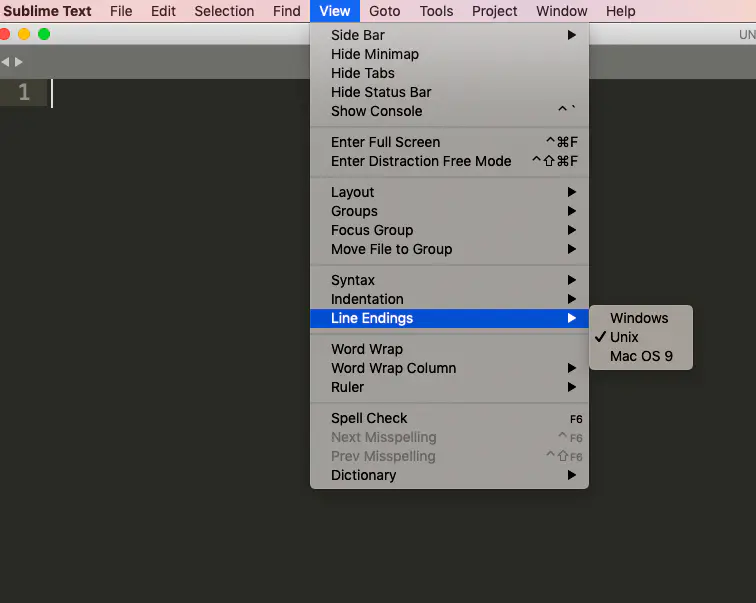
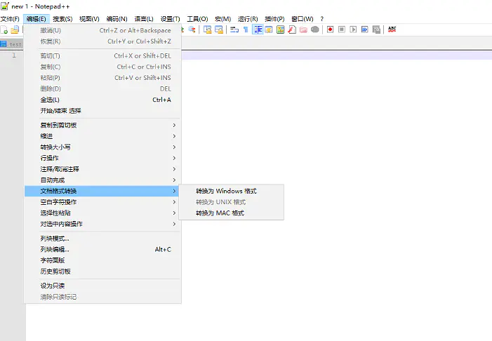

# shell脚本

## 1. #!/bin/bash - no such file or directory
```bash
head -1 yourscript | od -c
0000000 357 273 277   #   !   /   u   s   r   /   b   i   n   /   e   n
0000020   v       b   a   s   h  \n
0000027
```
发现是错误的，然后再用
```bash
sed -i '1s/^.*#//;s/\r$//' yourscript
```
再次检查
```bash
head -1 yourscript | od -c
0000000   !   /   u   s   r   /   b   i   n   /   e   n   v       b   a
0000020   s   h  \n
0000023
```
> 原因一：文件开头有BOM；
> linux上是无视BOM的，在linux上生成的文件也是不带BOM，但是在window下，windows记事本默认> 会给文件添加BOM头，尽管这几个字符正常情况肉眼不可见，但是在程序处理这些文件时，这些字符> 是能被识别到的，所以经常会出现看似正常的文件，程序处理却报错，以及window上看似正确的脚> 本在Linux下执行却报错。
>
> 原因二：第一行末尾有一个回车键
>

想知道是哪个原因，运行一下
```bash
head -1 qc3.sh | od -c
#scriptWithBom:有BOM
0000000 357 273 277   #   !   /   b   i   n   /   b   a   s   h  \n
#scriptWithCRLF: 有回车
0000000   #   !   /   b   i   n   /   b   a   s   h  \r  \n
```
其实出现这种问题的最根本的原因就是windows和unix下格式的不对等。最根本的解决方法是，在windows下写脚本的时候转化成unix格式。

在Sublime text中，是在view中的Line Endings




在Notepad++中是在编辑中的文档格式转换




但是在Notepad++中转化之后仍然出现问题。所以我后来直接选择在Linux下操作。
Linux中最简单的方法是dos2unix，不过这个命令需要安装dos2unix这个软件。
