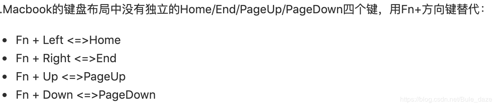

# MacOS快捷键

常用手势
可在“系统偏好设置”中进行修改。

系统偏好设置 -> 触控板

（触控板）
单指轻点
♦️ 相当于点击鼠标左键

双指轻点
♦️ 相当于点击鼠标右键
♦️ 在文字上轻点可直接查询文字

双指滑动（上下左右）
♦️ 相当于鼠标滚轮
   可上下或左右滚动页面

双指左滑、右滑
♦️ 在浏览器上相当于前进和后退

双指从右边缘向左轻扫
♦️ 打开通知中心

三指(或四指)向上轻扫
♦️ 打开调度中心，也就是显示所有窗口

三指向下轻扫
♦️ 关闭调度中心，或者说显示当前应用的所有窗口

拇指和其它三指(或四指)向中间集中
♦️ 打开启动台

拇指和其它三指(或四指)向外张开
关闭启动台，或者说显示桌面

两指旋转
♦️ 旋转图片

快捷键
拷贝 command + C

粘贴 command + V

全选 command + A

剪切 command + X

打印 command + P

保存 command + S

撤销 command + Z

重做 command + shift + Z

查找 command + F

查找文档/应用 command + 空格

打开文件 command + O

新建文件 command + N

切换页面 control + tab

切换应用 command + tab

切换输入法 control + option + 空格

关闭窗口 command + W

显示桌面 command + F3 / fn + F11

打开新标签页 command + T

最小化到程序坞 command + M

隐藏最前方应用 command + H

退出应用 command + Q

强制退出应用 command + option + esc

截图 command + shift + 5

全屏截图：command + shift + 3
窗口截图：command + shift + 4 + 空格
选择截图：command + shift + 4
               a.按住shift后，将锁定X或者Y轴进行拖动；
               b.按住option后将按照区域圆心进行放大

删除 command + delete

清空回收站 command + shift + delete

跳到行首 command + ⬅️

跳到行尾 command + ➡️

跳到段首 command + ⬆️ / fn + ⬅️

跳到段尾 command + ⬇️ / fn + ➡️

放大 command + ➕

缩小 command + ➖

显示隐藏文件 command + shift + .

全屏显示/退出全屏 command + control + F

开发者工具 command + option + i

重命名 选中文件后按回车

进入文件 选中文件后 command + ⬇️

浏览器中添加书签(收藏页面) command + D

显示／隐藏收藏夹栏 command ＋ shift ＋ B

