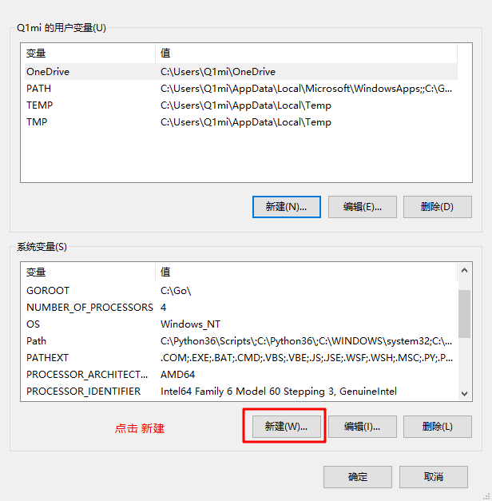

# Go 001

## 1、环境搭建

参考文档：[李文周个人博客](https://www.liwenzhou.com/)

### 1.1 安装

#### Windows安装

此安装实例以 `64位Win10`系统安装 `Go1.11.5可执行文件版本`为例。

将上一步选好的安装包下载到本地。


双击下载好的文件，然后按照下图的步骤安装即可。


#### Linux下安装

我们在版本选择页面选择并下载好`go1.11.5.linux-amd64.tar.gz`文件：

```bash
wget https://dl.google.com/go/go1.11.5.linux-amd64.tar.gz
```

将下载好的文件解压到`/usr/local`目录下：

```bash
mkdir -p /usr/local/go  # 创建目录
tar -C /usr/local/go zxvf go1.11.5.linux-amd64.tar.gz. # 解压
```

如果提示没有权限，加上`sudo`以root用户的身份再运行。执行完就可以在`/usr/local/`下看到go目录了。

配置环境变量： Linux下有两个文件可以配置环境变量，其中`/etc/profile`是对所有用户生效的；`$HOME/.profile`是对当前用户生效的，根据自己的情况自行选择一个文件打开，添加如下两行代码，保存退出。

```bash
export GOROOT=/usr/local/go
export PATH=$PATH:$GOROOT/bin
```

修改`/etc/profile`后要重启生效，修改`$HOME/.profile`后使用source命令加载`$HOME/.profile`文件即可生效。 检查：

```bash
~ go version
go version go1.11.5 linux/amd64
```

#### Mac下安装

下载可执行文件版，直接点击**下一步**安装即可，默认会将go安装到`/usr/local/go`目录下。

#### 检查

上一步安装过程执行完毕后，可以打开终端窗口，输入`go version`命令，查看安装的Go版本。

### 1.2 配置GOPATH

`GOPATH`是一个环境变量，用来表明你写的go项目的存放路径（工作目录）。

`GOPATH`路径最好只设置一个，所有的项目代码都放到`GOPATH`的`src`目录下。

*补充说明：Go1.11版本之后，开启`go mod`模式之后就不再强制需要配置`GOPATH`了。*

Linux和Mac平台就参照上面配置环境变量的方式将自己的工作目录添加到环境变量中即可。 Windows平台按下面的步骤将`D:\code\go`添加到环境变量：





在 Go 1.8 版本之前，`GOPATH`环境变量默认是空的。从 Go 1.8 版本开始，Go 开发包在安装完成后会为 `GOPATH`设置一个默认目录，参见下表。

**GOPATH在不同操作系统平台上的默认值**

|  平台   |   GOPATH默认值   |        举例        |
| :-----: | :--------------: | :----------------: |
| Windows | %USERPROFILE%/go | C:\Users\用户名\go |
|  Unix   |     $HOME/go     |  /home/用户名/go   |

同时，我们将 `GOROOT`下的bin目录及`GOPATH`下的bin目录都添加到环境变量中。

配置环境变量之后需要重启你电脑上已经打开的终端。（例如cmd、VS Code里面的终端和其他编辑器的终端）。

### 1.3 Go项目结构


在进行Go语言开发的时候，我们的代码总是会保存在`$GOPATH/src`目录下。在工程经过`go build`、`go install`或`go get`等指令后，会将下载的第三方包源代码文件放在`$GOPATH/src`目录下， 产生的二进制可执行文件放在 `$GOPATH/bin`目录下，生成的中间缓存文件会被保存在 `$GOPATH/pkg` 下。

如果我们使用版本管理工具（Version Control System，VCS。常用如Git）来管理我们的项目代码时，我们只需要添加`$GOPATH/src`目录的源代码即可。`bin` 和 `pkg` 目录的内容无需版本控制。

#### 1.3.1 适合个人开发者

我们知道源代码都是存放在`GOPATH`的`src`目录下，那我们可以按照下图来组织我们的代码。


#### 1.3.2 目前流行的项目结构

Go语言中也是通过包来组织代码文件，我们可以引用别人的包也可以发布自己的包，但是为了防止不同包的项目名冲突，我们通常使用`顶级域名`来作为包名的前缀，这样就不担心项目名冲突的问题了。

因为不是每个个人开发者都拥有自己的顶级域名，所以目前流行的方式是使用个人的github用户名来区分不同的包。


举个例子：张三和李四都有一个名叫`studygo`的项目，那么这两个包的路径就会是：

```go
import "github.com/zhangsan/studygo"
```

和

```go
import "github.com/lisi/studygo"
```

以后我们从github上下载别人包的时候，如：

```bash
go get github.com/jmoiron/sqlx
```

那么，这个包会下载到我们本地`GOPATH`目录下的`src/github.com/jmoiron/sqlx`。

#### 1.3.3 适合企业开发场景


### 1.4 Go开发编辑器

Go采用的是UTF-8编码的文本文件存放源代码，理论上使用任何一款文本编辑器都可以做Go语言开发，这里推荐使用`VS Code`和`Goland`。 `VS Code`是微软开源的编辑器，而`Goland`是jetbrains出品的付费IDE。

我们这里使用`VS Code` 加插件做为go语言的开发工具。

#### 1.4.1 VS Code介绍

`VS Code`全称`Visual Studio Code`，是微软公司开源的一款**免费**现代化轻量级代码编辑器，支持几乎所有主流的开发语言的语法高亮、智能代码补全、自定义热键、括号匹配、代码片段、代码对比 Diff、GIT 等特性，支持插件扩展，支持 Win、Mac 以及 Linux平台。

虽然不如某些IDE功能强大，但是它添加Go扩展插件后已经足够胜任我们日常的Go开发。

#### 1.4.2 下载与安装

`VS Code`官方下载地址：https://code.visualstudio.com/Download

三大主流平台都支持，请根据自己的电脑平台选择对应的安装包。双击下载好的安装文件，双击安装即可。

#### 1.4.3 配置

##### 1.4.3.1 安装中文简体插件

点击左侧菜单栏最后一项`管理扩展`，在`搜索框`中输入`chinese` ，选中结果列表第一项，点击`install`安装。

安装完毕后右下角会提示`重启VS Code`，重启之后你的VS Code就显示中文啦！`VSCode`主界面介绍：

##### 1.4.3.2 安装go扩展

现在我们要为我们的VS Code编辑器安装`Go`扩展插件，让它支持Go语言开发。

### 1.5 第一个Go程序

#### 1.5.1 Hello World

现在我们来创建第一个Go项目——`hello`。在我们的`GOPATH`下的src目录中创建hello目录。

在该目录中创建一个`main.go`文件：

```go
package main  // 声明 main 包，表明当前是一个可执行程序

import "fmt"  // 导入内置 fmt 包

func main(){  // main函数，是程序执行的入口
	fmt.Println("Hello World!")  // 在终端打印 Hello World!
}
```

#### 1.5.2 go build

`go build`表示将源代码编译成可执行文件。

在hello目录下执行：

```bash
go build
```

或者在其他目录执行以下命令：

```bash
go build hello
```

go编译器会去 `GOPATH`的src目录下查找你要编译的`hello`项目

编译得到的可执行文件会保存在执行编译命令的当前目录下，如果是windows平台会在当前目录下找到`hello.exe`可执行文件。

可在终端直接执行该`hello.exe`文件：

```bash
d:\code\go\src\hello>hello.exe
Hello World!
```

我们还可以使用`-o`参数来指定编译后得到的可执行文件的名字。

```bash
go build -o heiheihei.exe
```

**注意事项：** 如果你打开VS Code的终端界面出现如下场景十分推荐你按照下面的步骤，选择`cmd.exe`作为默认的终端工具：此时，VS Code正上方中间位置会弹出如下界面，参照下图挪动鼠标使光标选中后缀为`cmd.exe`的那一个，然后点击鼠标左键。

最后重启VS Code中已经开开的终端或者直接重启VS Code就可以了。如果没有出现下拉三角，也没有关系，按下`Ctrl+Shift+P`，VS Code正上方会出现一个框，你按照下图输入`shell`，然后点击指定选项即可出现上面的界面了。

*补充说明：由于VS Code对go mod模式的支持暂时还不够完善，建议大家使用Goland编辑器。*

#### 1.5.3 go run

像执行脚本文件一样执行Go代码

#### 1.5.4 go install

`go install`表示安装的意思，它先编译源代码得到可执行文件，然后将可执行文件移动到`GOPATH`的bin目录下。因为我们的环境变量中配置了`GOPATH`下的bin目录，所以我们就可以在任意地方直接执行可执行文件了。

#### 1.5.4 跨平台编译

默认我们`go build`的可执行文件都是当前操作系统可执行的文件，如果我想在windows下编译一个linux下可执行文件，那需要怎么做呢？

只需要指定目标操作系统的平台和处理器架构即可：

```bash
SET CGO_ENABLED=0  // 禁用CGO
SET GOOS=linux  // 目标平台是linux
SET GOARCH=amd64  // 目标处理器架构是amd64
```

*使用了cgo的代码是不支持跨平台编译的*

然后再执行`go build`命令，得到的就是能够在Linux平台运行的可执行文件了。

Mac 下编译 Linux 和 Windows平台 64位 可执行程序：

```bash
CGO_ENABLED=0 GOOS=linux GOARCH=amd64 go build
CGO_ENABLED=0 GOOS=windows GOARCH=amd64 go build
```

Linux 下编译 Mac 和 Windows 平台64位可执行程序：

```bash
CGO_ENABLED=0 GOOS=darwin GOARCH=amd64 go build
CGO_ENABLED=0 GOOS=windows GOARCH=amd64 go build
```

Windows下编译Mac平台64位可执行程序：

```bash
SET CGO_ENABLED=0
SET GOOS=darwin
SET GOARCH=amd64
go build
```

现在，开启你的Go语言学习之旅吧。人生苦短，let’s Go.

## 2. Go语言基础

### 2.1 变量和常量

#### 2.1.1 标识符与关键字

##### 2.1.1.1 标识符

在编程语言中标识符就是程序员定义的具有特殊意义的词，比如变量名、常量名、函数名等等。 Go语言中标识符由**字母数字**和**`_`(下划线）**组成，并且只能以字母和`_`开头。 举几个例子：`abc`, `_`, `_123`, `a123`。

##### 2.1.1.2 关键字

关键字是指编程语言中预先定义好的具有特殊含义的标识符。 关键字和保留字都不建议用作变量名。

Go语言中有25个关键字：

```go
    break        default      func         interface    select
    case         defer        go           map          struct
    chan         else         goto         package      switch
    const        fallthrough  if           range        type
    continue     for          import       return       var
```

此外，Go语言中还有37个保留字。

```go
    Constants:    true  false  iota  nil

        Types:    int  int8  int16  int32  int64  
                  uint  uint8  uint16  uint32  uint64  uintptr
                  float32  float64  complex128  complex64
                  bool  byte  rune  string  error

    Functions:   make  len  cap  new  append  copy  close  delete
                 complex  real  imag
                 panic  recover
```

#### 2.1.2 变量

##### 2.1.2.1 变量的来历

程序运行过程中的数据都是保存在内存中，我们想要在代码中操作某个数据时就需要去内存上找到这个变量，但是如果我们直接在代码中通过内存地址去操作变量的话，代码的可读性会非常差而且还容易出错，所以我们就利用变量将这个数据的内存地址保存起来，以后直接通过这个变量就能找到内存上对应的数据了。

##### 2.1.2.2 变量类型

变量（Variable）的功能是存储数据。不同的变量保存的数据类型可能会不一样。经过半个多世纪的发展，编程语言已经基本形成了一套固定的类型，常见变量的数据类型有：整型、浮点型、布尔型等。

Go语言中的每一个变量都有自己的类型，并且变量必须经过声明才能开始使用。

##### 2.1.2.3 变量声明

Go语言中的变量需要声明后才能使用，同一作用域内不支持重复声明。 并且Go语言的变量声明后必须使用。

##### 2.1.2.4 标准声明

Go语言的变量声明格式为：

```go
var 变量名 变量类型
```

变量声明以关键字`var`开头，变量类型放在变量的后面，行尾无需分号。 举个例子：

```go
var name string
var age int
var isOk bool
```

##### 2.1.2.5 批量声明

每声明一个变量就需要写`var`关键字会比较繁琐，go语言中还支持批量变量声明：

```go
var (
    a string
    b int
    c bool
    d float32
)
```

##### 2.1.2.6 变量的初始化

Go语言在声明变量的时候，会自动对变量对应的内存区域进行初始化操作。每个变量会被初始化成其类型的默认值，例如： 整型和浮点型变量的默认值为`0`。 字符串变量的默认值为`空字符串`。 布尔型变量默认为`false`。 切片、函数、指针变量的默认为`nil`。

当然我们也可在声明变量的时候为其指定初始值。变量初始化的标准格式如下：

```go
var 变量名 类型 = 表达式
```

举个例子：

```go
var name string = "Q1mi"
var age int = 18
```

或者一次初始化多个变量

```go
var name, age = "Q1mi", 20
```

命名方式

```go
// Go 语言中推荐使用驼峰式命名
// 推荐小驼峰式命名 就是第二种
var student_name string
var studentName string
var StudentName string
```

###### 2.1.2.6.1 类型推导

有时候我们会将变量的类型省略，这个时候编译器会根据等号右边的值来推导变量的类型完成初始化。

```go
var name = "Q1mi"
var age = 18
```

###### 2.1.2.6.2 短变量声明

在函数内部，可以使用更简略的 `:=` 方式声明并初始化变量。

```go
package main

import (
	"fmt"
)
// 全局变量m
var m = 100

func main() {
	n := 10
	m := 200 // 此处声明局部变量m
	fmt.Println(m, n)
}
```

###### 2.1.2.6.3 匿名变量

在使用多重赋值时，如果想要忽略某个值，可以使用`匿名变量（anonymous variable）`。 匿名变量用一个下划线`_`表示，例如：

```go
func foo() (int, string) {
	return 10, "Q1mi"
}
func main() {
	x, _ := foo()
	_, y := foo()
	fmt.Println("x=", x)
	fmt.Println("y=", y)
}
```

匿名变量不占用命名空间，不会分配内存，所以匿名变量之间不存在重复声明。 (在`Lua`等编程语言里，匿名变量也被叫做哑元变量。)

注意事项：

1. **函数外的每个语句都必须以关键字开始（var、const、func等）**
2. **`:=`不能使用在函数外。**
3. **`_`多用于占位，表示忽略值。**

#### 2.1.3 常量

相对于变量，常量是恒定不变的值，多用于定义程序运行期间不会改变的那些值。 常量的声明和变量声明非常类似，只是把`var`换成了`const`，常量在定义的时候必须赋值。

```go
const pi = 3.1415
const e = 2.7182
```

声明了`pi`和`e`这两个常量之后，在整个程序运行期间它们的值都不能再发生变化了。

多个常量也可以一起声明：

```go
const (
    pi = 3.1415
    e = 2.7182
)
```

const同时声明多个常量时，如果省略了值则表示和上面一行的值相同。 例如：

```go
const (
    n1 = 100
    n2
    n3
)
```

上面示例中，常量`n1`、`n2`、`n3`的值都是100。

##### 2.1.3.1 iota

`iota`是go语言的常量计数器，只能在常量的表达式中使用。

`iota`在const关键字出现时将被重置为0。const中每新增一行常量声明将使`iota`计数一次(iota可理解为const语句块中的行索引)。 使用iota能简化定义，在定义枚举时很有用。

举个例子：

```go
const (
		n1 = iota //0
		n2        //1
		n3        //2
		n4        //3
	)
```

##### 2.1.3.2 几个常见的`iota`示例:

使用`_`跳过某些值

```go
const (
		n1 = iota //0
		n2        //1
		_
		n4        //3
	)
```

`iota`声明中间插队

```go
const (
		n1 = iota //0
		n2 = 100  //100
		n3 = iota //2
		n4        //3
	)
	const n5 = iota //0
```

定义数量级 （这里的`<<`表示左移操作，`1<<10`表示将1的二进制表示向左移10位，也就是由`1`变成了`10000000000`，也就是十进制的1024。同理`2<<2`表示将2的二进制表示向左移2位，也就是由`10`变成了`1000`，也就是十进制的8。）

```go
const (
		_  = iota
		KB = 1 << (10 * iota)
		MB = 1 << (10 * iota)
		GB = 1 << (10 * iota)
		TB = 1 << (10 * iota)
		PB = 1 << (10 * iota)
	)
```

多个`iota`定义在一行

```go
const (
		a, b = iota + 1, iota + 2 //1,2
		c, d                      //2,3
		e, f                      //3,4
	)
```


### 2.2  基本数据类型

Go语言中有丰富的数据类型，除了基本的整型、浮点型、布尔型、字符串外，还有数组、切片、结构体、函数、map、通道（channel）等。Go 语言的基本类型和其他语言大同小异。

#### 2.2.1 整型

##### 2.2.1.1 整型

整型分为以下两个大类： 

* 按长度分为：int8、int16、int32、int64 对应的无符号整型：uint8、uint16、uint32、uint64

其中，`uint8`就是我们熟知的`byte`型，`int16`对应C语言中的`short`型，`int64`对应C语言中的`long`型。

|  类型  |                             描述                             |
| :----: | :----------------------------------------------------------: |
| uint8  |                  无符号 8位整型 (0 到 255)                   |
| uint16 |                 无符号 16位整型 (0 到 65535)                 |
| uint32 |              无符号 32位整型 (0 到 4294967295)               |
| uint64 |         无符号 64位整型 (0 到 18446744073709551615)          |
|  int8  |                 有符号 8位整型 (-128 到 127)                 |
| int16  |              有符号 16位整型 (-32768 到 32767)               |
| int32  |         有符号 32位整型 (-2147483648 到 2147483647)          |
| int64  | 有符号 64位整型 (-9223372036854775808 到 9223372036854775807) |

##### 2.2.1.2 特殊整型

|  类型   |                          描述                          |
| :-----: | :----------------------------------------------------: |
|  uint   | 32位操作系统上就是`uint32`，64位操作系统上就是`uint64` |
|   int   |  32位操作系统上就是`int32`，64位操作系统上就是`int64`  |
| uintptr |              无符号整型，用于存放一个指针              |

> **注意：** 在使用`int`和 `uint`类型时，不能假定它是32位或64位的整型，而是考虑`int`和`uint`可能在不同平台上的差异。

> **注意事项** 获取对象的长度的内建`len()`函数返回的长度可以根据不同平台的字节长度进行变化。实际使用中，切片或 map 的元素数量等都可以用`int`来表示。在涉及到二进制传输、读写文件的结构描述时，为了保持文件的结构不会受到不同编译目标平台字节长度的影响，不要使用`int`和 `uint`。

##### 2.2.1.3  数字字面量语法（Number literals syntax）

Go1.13版本之后引入了数字字面量语法，这样便于开发者以二进制、八进制或十六进制浮点数的格式定义数字，例如：

`v := 0b00101101`， 代表二进制的101101，相当于十进制的45。 `v := 0o377`，代表八进制的377，相当于十进制的255。 `v := 0x1p-2`，代表十六进制的 1 除以 2²，也就是 0.25。 而且还允许我们用 _ 来分隔数字，比如说：

v := 123_456等于123456。

我们可以借助fmt函数来将一个整数以不同进制形式展示。

```go
package main
 
import "fmt"
 
func main(){
	// 十进制
	var a int = 10
	fmt.Printf("%d \n", a)  // 10
	fmt.Printf("%b \n", a)  // 1010  占位符%b表示二进制
 
	// 八进制  以0开头
	var b int = 077
	fmt.Printf("%o \n", b)  // 77
 
	// 十六进制  以0x开头
	var c int = 0xff
	fmt.Printf("%x \n", c)  // ff
	fmt.Printf("%X \n", c)  // FF
}
```

#### 2.2.2 浮点型

Go语言支持两种浮点型数：`float32`和`float64`。这两种浮点型数据格式遵循`IEEE 754`标准： `float32` 的浮点数的最大范围约为 `3.4e38`，可以使用常量定义：`math.MaxFloat32`。 `float64` 的浮点数的最大范围约为 `1.8e308`，可以使用一个常量定义：`math.MaxFloat64`。

打印浮点数时，可以使用`fmt`包配合动词`%f`，代码如下：

```go
package main
import (
        "fmt"
        "math"
)
func main() {
        fmt.Printf("%f\n", math.Pi)
        fmt.Printf("%.2f\n", math.Pi)
}
```

#### 2.2.3 复数

complex64和complex128

```go
var c1 complex64
c1 = 1 + 2i
var c2 complex128
c2 = 2 + 3i
fmt.Println(c1)
fmt.Println(c2)
```

复数有实部和虚部，complex64的实部和虚部为32位，complex128的实部和虚部为64位。

#### 2.2.4 布尔值

Go语言中以`bool`类型进行声明布尔型数据，布尔型数据只有`true（真）`和`false（假）`两个值。

**注意：**

1. 布尔类型变量的默认值为`false`。
2. Go 语言中不允许将整型强制转换为布尔型.
3. 布尔型无法参与数值运算，也无法与其他类型进行转换。

#### 2.2.5 字符串

Go语言中的字符串以原生数据类型出现，使用字符串就像使用其他原生数据类型（int、bool、float32、float64 等）一样。 Go 语言里的字符串的内部实现使用`UTF-8`编码。 字符串的值为`双引号(")`中的内容，可以在Go语言的源码中直接添加非ASCII码字符，例如：

```go
s1 := "hello"
s2 := "你好"
```

单引号包裹的是字符

```go
// 单独的字母、汉字、符号表示一个字符
c1 := 'h'
c2 := '1'
c3 := '三'
// 字节： 1字节=8bit(8个二进制位)
// 一个ASCII码就是一个一字节
// UTF-8 编码的汉字一般是三个字节
```

Go 语言的字符串常见转义符包含回车、换行、单双引号、制表符等，如下表所示。

| 转义符 |                含义                |
| :----: | :--------------------------------: |
|  `\r`  |         回车符（返回行首）         |
|  `\n`  | 换行符（直接跳到下一行的同列位置） |
|  `\t`  |               制表符               |
|  `\'`  |               单引号               |
|  `\"`  |               双引号               |
|  `\\`  |               反斜杠               |

举个例子，我们要打印一个Windows平台下的一个文件路径：

```go
package main
import (
    "fmt"
)
func main() {
    fmt.Println("str := \"c:\\Code\\lesson1\\go.exe\"")
}
```

##### 2.2.5.2 多行字符串

Go语言中要定义一个多行字符串时，就必须使用`反引号`字符：

```go
s1 := `第一行
第二行
第三行
`
fmt.Println(s1)
```

反引号间换行将被作为字符串中的换行，但是所有的转义字符均无效，文本将会原样输出。

##### 2.2.5.3 字符串的常用操作

|                方法                 |      介绍      |
| :---------------------------------: | :------------: |
|              len(str)               |     求长度     |
|           +或fmt.Sprintf            |   拼接字符串   |
|            strings.Split            |      分割      |
|          strings.contains           |  判断是否包含  |
| strings.HasPrefix,strings.HasSuffix | 前缀/后缀判断  |
| strings.Index(),strings.LastIndex() | 子串出现的位置 |
| strings.Join(a[]string, sep string) |    join操作    |

```go
package main

import (
	"fmt"
	"strings"
)

func main() {
	path := "\"D:\\go\\code\""
	fmt.Println(path)

	s := "I'm OK"
	fmt.Println(s)
	// 多行字符串
	s1 := `
This is
a Multipart string
`
	// 字符串拼接
	fmt.Println(s1)
	fmt.Println(len(s1))
	s2 := s1 + "3003"
	fmt.Println(s2)

	name := "cheese"
	word := "lol"
	fmt.Println("字符串拼接 + ")
	fmt.Println("aaa " + name + "_" + word)
	// 字符串拼接
	fmt.Println("字符串拼接 fmt.Sprintf ")
	// 拼接返回字符串
	s3 := fmt.Sprintf("aaa %s_%s ", name, word)
	fmt.Println(s3)
	// 分割
	fmt.Println("s3 分割")
	ret := strings.Split(s3, "_")
	fmt.Println(ret)
	fmt.Println(len(ret))
	// 包含
	fmt.Println("s3 字符串包含aaa")
	fmt.Println(strings.Contains(s3, "aaa"))
	fmt.Println("s3 字符串包含bbb")
	fmt.Println(strings.Contains(s3, "bbb"))
	// 前缀
	fmt.Println(s3 + "前缀是否包含aaa")
	fmt.Println(strings.HasPrefix(s3, "aaa"))
	// 后缀
	fmt.Println(s3 + "后缀是否包含aaa")
	fmt.Println(strings.HasSuffix(s3, "aaa"))
	// 定位
	s4 := "abcdefgb"
	fmt.Println(s4 + "定位c的位置")
	fmt.Println(strings.Index(s4, "c"))
	fmt.Println(s4 + "定位h的位置")
	fmt.Println(strings.Index(s4, "h"))
	fmt.Println(s4 + "定位b最后的位置")
	fmt.Println(strings.LastIndex(s4, "b"))
	// join 拼接
	// 第一个参数表示需要拼接字符串的数据
	// 第二个参数表示拼接符
	fmt.Println(strings.Join(ret, " "))
}
```

#### 2.2.6 byte和rune类型

组成每个字符串的元素叫做“字符”，可以通过遍历或者单个获取字符串元素获得字符。 字符用单引号（’）包裹起来，如：

```go
var a := '中'
var b := 'x'
```

Go 语言的字符有以下两种：

1. `uint8`类型，或者叫 byte 型，代表了`ASCII码`的一个字符。
2. `rune`类型，代表一个 `UTF-8字符`。

当需要处理中文、日文或者其他复合字符时，则需要用到`rune`类型。`rune`类型实际是一个`int32`。

Go 使用了特殊的 rune 类型来处理 Unicode，让基于 Unicode 的文本处理更为方便，也可以使用 byte 型进行默认字符串处理，性能和扩展性都有照顾。

```go
// 遍历字符串
func traversalString() {
	s := "hello沙河"
	for i := 0; i < len(s); i++ { //byte
		fmt.Printf("%v(%c) ", s[i], s[i])
	}
	fmt.Println()
	for _, r := range s { //rune
		fmt.Printf("%v(%c) ", r, r)
	}
	fmt.Println()
}
```

输出：

```bash
104(h) 101(e) 108(l) 108(l) 111(o) 230(æ) 178(²) 153() 230(æ) 178(²) 179(³) 
104(h) 101(e) 108(l) 108(l) 111(o) 27801(沙) 27827(河) 
```

因为UTF8编码下一个中文汉字由3~4个字节组成，所以我们不能简单的按照字节去遍历一个包含中文的字符串，否则就会出现上面输出中第一行的结果。

字符串底层是一个byte数组，所以可以和`[]byte`类型相互转换。字符串是不能修改的 字符串是由byte字节组成，所以字符串的长度是byte字节的长度。 rune类型用来表示utf8字符，一个rune字符由一个或多个byte组成。

#### 2.2.7  修改字符串

要修改字符串，需要先将其转换成`[]rune`或`[]byte`，完成后再转换为`string`。无论哪种转换，都会重新分配内存，并复制字节数组。

```go
func changeString() {
	s1 := "big"
	// 强制类型转换
	byteS1 := []byte(s1)
	byteS1[0] = 'p'
	fmt.Println(string(byteS1))

	s2 := "白萝卜"
	runeS2 := []rune(s2)
	runeS2[0] = '红'
	fmt.Println(string(runeS2))
}
```

#### 2.2.8 类型转换

Go语言中只有强制类型转换，没有隐式类型转换。该语法只能在两个类型之间支持相互转换的时候使用。

强制类型转换的基本语法如下：

```bash
T(表达式)
```

其中，T表示要转换的类型。表达式包括变量、复杂算子和函数返回值等.

比如计算直角三角形的斜边长时使用math包的Sqrt()函数，该函数接收的是float64类型的参数，而变量a和b都是int类型的，这个时候就需要将a和b强制类型转换为float64类型。

```go
func sqrtDemo() {
	var a, b = 3, 4
	var c int
	// math.Sqrt()接收的参数是float64类型，需要强制转换
	c = int(math.Sqrt(float64(a*a + b*b)))
	fmt.Println(c)
}
```

### 2.3 fmt 各种占位符

```go
package main

// Go 语言中fmt使用的各种占位符
import "fmt"

func main(){
	n := 100
	s := "Hello Go"
	// %T 查看变量类型
	fmt.Printf("%T \n", n)
	// %v 查看变量的值
	fmt.Printf("%v \n", n)
	// %d 查看十进制
	fmt.Printf("%d \n", n)
	// %b 查看二进制
	fmt.Printf("%b \n", n)
	// %o 查看八进制
	fmt.Printf("%o \n", n)
	// %x 查看十六进制
	fmt.Printf("%x \n", n)
	// %s 查看字符串
	fmt.Printf("%s \n", s)
	fmt.Printf("%v \n", s)
	// 根据类型转换到具体的值
	fmt.Printf("%#v \n", s)
}
```

### 2.4 运算符

运算符用于在程序运行时执行数学或逻辑运算。

Go 语言内置的运算符有：

1. 算术运算符
2. 关系运算符
3. 逻辑运算符
4. 位运算符
5. 赋值运算符

#### 2.4.1 算数运算符

| 运算符 | 描述 |
| :----: | :--: |
|   +    | 相加 |
|   -    | 相减 |
|   *    | 相乘 |
|   /    | 相除 |
|   %    | 求余 |

**注意：** `++`（自增）和`--`（自减）在Go语言中是单独的语句，并不是运算符。

#### 2.4.2 关系运算符

| 运算符 |                             描述                             |
| :----: | :----------------------------------------------------------: |
|   ==   |    检查两个值是否相等，如果相等返回 True 否则返回 False。    |
|   !=   |  检查两个值是否不相等，如果不相等返回 True 否则返回 False。  |
|   >    |  检查左边值是否大于右边值，如果是返回 True 否则返回 False。  |
|   >=   | 检查左边值是否大于等于右边值，如果是返回 True 否则返回 False。 |
|   <    |  检查左边值是否小于右边值，如果是返回 True 否则返回 False。  |
|   <=   | 检查左边值是否小于等于右边值，如果是返回 True 否则返回 False。 |

#### 2.4.3 逻辑运算符

| 运算符 |                             描述                             |
| :----: | :----------------------------------------------------------: |
|   &&   | 逻辑 AND 运算符。 如果两边的操作数都是 True，则为 True，否则为 False。 |
|  \|\|  | 逻辑 OR 运算符。 如果两边的操作数有一个 True，则为 True，否则为 False。 |
|   !    | 逻辑 NOT 运算符。 如果条件为 True，则为 False，否则为 True。 |

#### 2.4.4 位运算符

位运算符对整数在内存中的二进制位进行操作。

| 运算符 |                             描述                             |
| :----: | :----------------------------------------------------------: |
|   &    |    参与运算的两数各对应的二进位相与。 （两位均为1才为1）     |
|   \|   |  参与运算的两数各对应的二进位相或。 （两位有一个为1就为1）   |
|   ^    | 参与运算的两数各对应的二进位相异或，当两对应的二进位相异时，结果为1。 （两位不一样则为1） |
|   <<   | 左移n位就是乘以2的n次方。 “a<<b”是把a的各二进位全部左移b位，高位丢弃，低位补0。 |
|   >>   | 右移n位就是除以2的n次方。 “a>>b”是把a的各二进位全部右移b位。 |

#### 2.4.5 赋值运算符

| 运算符 |                      描述                      |
| :----: | :--------------------------------------------: |
|   =    | 简单的赋值运算符，将一个表达式的值赋给一个左值 |
|   +=   |                  相加后再赋值                  |
|   -=   |                  相减后再赋值                  |
|   *=   |                  相乘后再赋值                  |
|   /=   |                  相除后再赋值                  |
|   %=   |                  求余后再赋值                  |
|  <<=   |                   左移后赋值                   |
|  >>=   |                   右移后赋值                   |
|   &=   |                  按位与后赋值                  |
|  \|=   |                  按位或后赋值                  |
|   ^=   |                 按位异或后赋值                 |

### 2.5 流程控制

流程控制是每种编程语言控制逻辑走向和执行次序的重要部分，流程控制可以说是一门语言的“经脉”。

Go语言中最常用的流程控制有`if`和`for`，而`switch`和`goto`主要是为了简化代码、降低重复代码而生的结构，属于扩展类的流程控制。

#### 2.5.1 if else(分支结构)

##### 2.5.1.1 if条件判断基本写法

Go语言中`if`条件判断的格式如下：

```go
if 表达式1 {
    分支1
} else if 表达式2 {
    分支2
} else{
    分支3
}
```

当表达式1的结果为`true`时，执行分支1，否则判断表达式2，如果满足则执行分支2，都不满足时，则执行分支3。 if判断中的`else if`和`else`都是可选的，可以根据实际需要进行选择。

Go语言规定与`if`匹配的左括号`{`必须与`if和表达式`放在同一行，`{`放在其他位置会触发编译错误。 同理，与`else`匹配的`{`也必须与`else`写在同一行，`else`也必须与上一个`if`或`else if`右边的大括号在同一行。

举个例子：

```go
func ifDemo1() {
	score := 65
	if score >= 90 {
		fmt.Println("A")
	} else if score > 75 {
		fmt.Println("B")
	} else {
		fmt.Println("C")
	}
}
```

##### 2.5.1.2 if条件判断特殊写法

if条件判断还有一种特殊的写法，可以在 if 表达式之前添加一个执行语句，再根据变量值进行判断，举个例子：

```go
func ifDemo2() {
	if score := 65; score >= 90 {
		fmt.Println("A")
	} else if score > 75 {
		fmt.Println("B")
	} else {
		fmt.Println("C")
	}
}
```

**思考题：** 上下两种写法的区别在哪里？

#### 2.5.2 for(循环结构)

Go 语言中的所有循环类型均可以使用`for`关键字来完成。

for循环的基本格式如下：

```bash
for 初始语句;条件表达式;结束语句{
    循环体语句
}
```

条件表达式返回`true`时循环体不停地进行循环，直到条件表达式返回`false`时自动退出循环。

```go
func forDemo() {
	for i := 0; i < 10; i++ {
		fmt.Println(i)
	}
}
```

for循环的初始语句可以被忽略，但是初始语句后的分号必须要写，例如：

```go
func forDemo2() {
	i := 0
	for ; i < 10; i++ {
		fmt.Println(i)
	}
}
```

for循环的初始语句和结束语句都可以省略，例如：

```go
func forDemo3() {
	i := 0
	for i < 10 {
		fmt.Println(i)
		i++
	}
}
```

这种写法类似于其他编程语言中的`while`，在`while`后添加一个条件表达式，满足条件表达式时持续循环，否则结束循环。

#### 2.5.3 无限循环

```go
for {
    循环体语句
}
```

for循环可以通过`break`、`goto`、`return`、`panic`语句强制退出循环。

#### 2.5.4 for range(键值循环)

Go语言中可以使用`for range`遍历数组、切片、字符串、map 及通道（channel）。 通过`for range`遍历的返回值有以下规律：

1. 数组、切片、字符串返回索引和值。
2. map返回键和值。
3. 通道（channel）只返回通道内的值。

#### 2.5.5 switch case

使用`switch`语句可方便地对大量的值进行条件判断。

```go
func switchDemo1() {
	finger := 3
	switch finger {
	case 1:
		fmt.Println("大拇指")
	case 2:
		fmt.Println("食指")
	case 3:
		fmt.Println("中指")
	case 4:
		fmt.Println("无名指")
	case 5:
		fmt.Println("小拇指")
	default:
		fmt.Println("无效的输入！")
	}
}
```

Go语言规定每个`switch`只能有一个`default`分支。

一个分支可以有多个值，多个case值中间使用英文逗号分隔。

```go
func testSwitch3() {
	switch n := 7; n {
	case 1, 3, 5, 7, 9:
		fmt.Println("奇数")
	case 2, 4, 6, 8:
		fmt.Println("偶数")
	default:
		fmt.Println(n)
	}
}
```

分支还可以使用表达式，这时候switch语句后面不需要再跟判断变量。例如：

```go
func switchDemo4() {
	age := 30
	switch {
	case age < 25:
		fmt.Println("好好学习吧")
	case age > 25 && age < 35:
		fmt.Println("好好工作吧")
	case age > 60:
		fmt.Println("好好享受吧")
	default:
		fmt.Println("活着真好")
	}
}
```

`fallthrough`语法可以执行满足条件的case的下一个case，是为了兼容C语言中的case设计的。

```go
func switchDemo5() {
	s := "a"
	switch {
	case s == "a":
		fmt.Println("a")
		fallthrough
	case s == "b":
		fmt.Println("b")
	case s == "c":
		fmt.Println("c")
	default:
		fmt.Println("...")
	}
}
```

输出：

```bash
a
b
```

#### 2.5.5 goto(跳转到指定标签)

`goto`语句通过标签进行代码间的无条件跳转。`goto`语句可以在快速跳出循环、避免重复退出上有一定的帮助。Go语言中使用`goto`语句能简化一些代码的实现过程。 例如双层嵌套的for循环要退出时：

```go
func gotoDemo1() {
	var breakFlag bool
	for i := 0; i < 10; i++ {
		for j := 0; j < 10; j++ {
			if j == 2 {
				// 设置退出标签
				breakFlag = true
				break
			}
			fmt.Printf("%v-%v\n", i, j)
		}
		// 外层for循环判断
		if breakFlag {
			break
		}
	}
}
```

使用`goto`语句能简化代码：

```go
func gotoDemo2() {
	for i := 0; i < 10; i++ {
		for j := 0; j < 10; j++ {
			if j == 2 {
				// 设置退出标签
				goto breakTag
			}
			fmt.Printf("%v-%v\n", i, j)
		}
	}
	return
	// 标签
breakTag:
	fmt.Println("结束for循环")
}
```

#### 2.5.6 break(跳出循环)

`break`语句可以结束`for`、`switch`和`select`的代码块。

`break`语句还可以在语句后面添加标签，表示退出某个标签对应的代码块，标签要求必须定义在对应的`for`、`switch`和 `select`的代码块上。 举个例子：

```go
func breakDemo1() {
BREAKDEMO1:
	for i := 0; i < 10; i++ {
		for j := 0; j < 10; j++ {
			if j == 2 {
				break BREAKDEMO1
			}
			fmt.Printf("%v-%v\n", i, j)
		}
	}
	fmt.Println("...")
}
```

#### 2.5.7 continue(继续下次循环)

`continue`语句可以结束当前循环，开始下一次的循环迭代过程，仅限在`for`循环内使用。

在 `continue`语句后添加标签时，表示开始标签对应的循环。例如：

```go
func continueDemo() {
forloop1:
	for i := 0; i < 5; i++ {
		// forloop2:
		for j := 0; j < 5; j++ {
			if i == 2 && j == 2 {
				continue forloop1
			}
			fmt.Printf("%v-%v\n", i, j)
		}
	}
}
```

### 2.6 数组

本文主要介绍Go语言中数组（array）及它的基本使用。

#### 2.6.1 Array(数组)

数组是同一种数据类型元素的集合。 在Go语言中，数组从声明时就确定，使用时可以修改数组成员，但是数组大小不可变化。 基本语法：

```go
// 定义一个长度为3元素类型为int的数组a
var a [3]int
```

#### 2.6.2 数组定义：

```bash
var 数组变量名 [元素数量]T
```

比如：`var a [5]int`， 数组的长度必须是常量，并且长度是数组类型的一部分。一旦定义，长度不能变。 `[5]int`和`[10]int`是不同的类型。

```go
var a [3]int
var b [4]int
a = b //不可以这样做，因为此时a和b是不同的类型
```

数组可以通过下标进行访问，下标是从`0`开始，最后一个元素下标是：`len-1`，访问越界（下标在合法范围之外），则触发访问越界，会panic。

#### 2.6.3 数组的初始化

数组的初始化也有很多方式。

##### 2.6.3.1 方法一

初始化数组时可以使用初始化列表来设置数组元素的值。

```go
func main() {
	var testArray [3]int                        //数组会初始化为int类型的零值
	var numArray = [3]int{1, 2}                 //使用指定的初始值完成初始化
	var cityArray = [3]string{"北京", "上海", "深圳"} //使用指定的初始值完成初始化
	fmt.Println(testArray)                      //[0 0 0]
	fmt.Println(numArray)                       //[1 2 0]
	fmt.Println(cityArray)                      //[北京 上海 深圳]
}
```

##### 2.6.3.2 方法二

按照上面的方法每次都要确保提供的初始值和数组长度一致，一般情况下我们可以让编译器根据初始值的个数自行推断数组的长度，例如：

```go
func main() {
	var testArray [3]int
	var numArray = [...]int{1, 2}
	var cityArray = [...]string{"北京", "上海", "深圳"}
	fmt.Println(testArray)                          //[0 0 0]
	fmt.Println(numArray)                           //[1 2]
	fmt.Printf("type of numArray:%T\n", numArray)   //type of numArray:[2]int
	fmt.Println(cityArray)                          //[北京 上海 深圳]
	fmt.Printf("type of cityArray:%T\n", cityArray) //type of cityArray:[3]string
}
```

##### 2.6.3.3 方法三

我们还可以使用指定索引值的方式来初始化数组，例如:

```go
func main() {
	a := [...]int{1: 1, 3: 5}
	fmt.Println(a)                  // [0 1 0 5]
	fmt.Printf("type of a:%T\n", a) //type of a:[4]int
}
```

#### 2.6.4 数组的遍历

遍历数组a有以下两种方法：

```go
func main() {
	var a = [...]string{"北京", "上海", "深圳"}
	// 方法1：for循环遍历
	for i := 0; i < len(a); i++ {
		fmt.Println(a[i])
	}

	// 方法2：for range遍历
	for index, value := range a {
		fmt.Println(index, value)
	}
}
```

#### 2.6.5 多维数组

Go语言是支持多维数组的，我们这里以二维数组为例（数组中又嵌套数组）。

##### 2.6.5.1 二维数组的定义

```go
func main() {
	a := [3][2]string{
		{"北京", "上海"},
		{"广州", "深圳"},
		{"成都", "重庆"},
	}
	fmt.Println(a) //[[北京 上海] [广州 深圳] [成都 重庆]]
	fmt.Println(a[2][1]) //支持索引取值:重庆
}
```

##### 2.6.5.2 二维数组的遍历

```go
func main() {
	a := [3][2]string{
		{"北京", "上海"},
		{"广州", "深圳"},
		{"成都", "重庆"},
	}
	for _, v1 := range a {
		for _, v2 := range v1 {
			fmt.Printf("%s\t", v2)
		}
		fmt.Println()
	}
}
```

输出：

```bash
北京	上海	
广州	深圳	
成都	重庆	
```

**注意：** 多维数组**只有第一层**可以使用`...`来让编译器推导数组长度。例如：

```go
//支持的写法
a := [...][2]string{
	{"北京", "上海"},
	{"广州", "深圳"},
	{"成都", "重庆"},
}
//不支持多维数组的内层使用...
b := [3][...]string{
	{"北京", "上海"},
	{"广州", "深圳"},
	{"成都", "重庆"},
}
```

#### 2.6.6 数组是值类型

数组是值类型，赋值和传参会复制整个数组。因此改变副本的值，不会改变本身的值。

```go
func modifyArray(x [3]int) {
	x[0] = 100
}

func modifyArray2(x [3][2]int) {
	x[2][0] = 100
}
func main() {
	a := [3]int{10, 20, 30}
	modifyArray(a) //在modify中修改的是a的副本x
	fmt.Println(a) //[10 20 30]
	b := [3][2]int{
		{1, 1},
		{1, 1},
		{1, 1},
	}
	modifyArray2(b) //在modify中修改的是b的副本x
	fmt.Println(b)  //[[1 1] [1 1] [1 1]]
}
```

**注意：**

1. 数组支持 “==“、”!=” 操作符，因为内存总是被初始化过的。
2. `[n]*T`表示指针数组，`*[n]T`表示数组指针 。

### 2.7 切片

本文主要介绍Go语言中切片（slice）及它的基本使用。

#### 2.7.1 引子

因为数组的长度是固定的并且数组长度属于类型的一部分，所以数组有很多的局限性。 例如：

```go
func arraySum(x [3]int) int{
    sum := 0
    for _, v := range x{
        sum = sum + v
    }
    return sum
}
```

这个求和函数只能接受`[3]int`类型，其他的都不支持。 再比如，

```go
a := [3]int{1, 2, 3}
```

数组a中已经有三个元素了，我们不能再继续往数组a中添加新元素了。

#### 2.7.2 切片

切片（Slice）是一个拥有相同类型元素的可变长度的序列。它是基于数组类型做的一层封装。它非常灵活，支持自动扩容。

切片是一个引用类型，它的内部结构包含`地址`、`长度`和`容量`。切片一般用于快速地操作一块数据集合。

##### 2.7.2.1 切片的定义

声明切片类型的基本语法如下：

```go
var name []T
```

其中，

- name:表示变量名
- T:表示切片中的元素类型

举个例子：

```go
func main() {
	// 声明切片类型
	var a []string              //声明一个字符串切片
	var b = []int{}             //声明一个整型切片并初始化
	var c = []bool{false, true} //声明一个布尔切片并初始化
	var d = []bool{false, true} //声明一个布尔切片并初始化
	fmt.Println(a)              //[]
	fmt.Println(b)              //[]
	fmt.Println(c)              //[false true]
	fmt.Println(a == nil)       //true
	fmt.Println(b == nil)       //false
	fmt.Println(c == nil)       //false
	// fmt.Println(c == d)   //切片是引用类型，不支持直接比较，只能和nil比较
}
```

###### 切片的长度和容量

切片拥有自己的长度和容量，我们可以通过使用内置的len()函数求长度，使用内置的cap()函数求切片的容量。

###### 2.7.2.1.1 基于数组定义切片

由于切片的底层就是一个数组，所以我们可以基于数组定义切片。

```go
func main() {
	// 基于数组定义切片
	a := [5]int{55, 56, 57, 58, 59}
	b := a[1:4]                     //基于数组a创建切片，包括元素a[1],a[2],a[3]
	fmt.Println(b)                  //[56 57 58]
	fmt.Printf("type of b:%T\n", b) //type of b:[]int
}
```

还支持如下方式：

```go
c := a[1:] //[56 57 58 59]
d := a[:4] //[55 56 57 58]
e := a[:]  //[55 56 57 58 59]
```

###### 2.7.2.1.2 切片再切片

除了基于数组得到切片，我们还可以通过切片来得到切片。

```go
func main() {
	//切片再切片
	a := [...]string{"北京", "上海", "广州", "深圳", "成都", "重庆"}
	fmt.Printf("a:%v type:%T len:%d  cap:%d\n", a, a, len(a), cap(a))
	b := a[1:3]
	fmt.Printf("b:%v type:%T len:%d  cap:%d\n", b, b, len(b), cap(b))
	c := b[1:5]
	fmt.Printf("c:%v type:%T len:%d  cap:%d\n", c, c, len(c), cap(c))
}
```

输出：

```bash
a:[北京 上海 广州 深圳 成都 重庆] type:[6]string len:6  cap:6
b:[上海 广州] type:[]string len:2  cap:5
c:[广州 深圳 成都 重庆] type:[]string len:4  cap:4
```

**注意：** 对切片进行再切片时，索引不能超过原数组的长度，否则会出现索引越界的错误。

###### 2.7.2.1.3 使用make()函数构造切片

我们上面都是基于数组来创建的切片，如果需要动态的创建一个切片，我们就需要使用内置的`make()`函数，格式如下：

```bash
make([]T, size, cap)
```

其中：

- T:切片的元素类型
- size:切片中元素的数量
- cap:切片的容量

举个例子：

```go
func main() {
	a := make([]int, 2, 10)
	fmt.Println(a)      //[0 0]
	fmt.Println(len(a)) //2
	fmt.Println(cap(a)) //10
}
```

上面代码中`a`的内部存储空间已经分配了10个，但实际上只用了2个。 容量并不会影响当前元素的个数，所以`len(a)`返回2，`cap(a)`则返回该切片的容量。

###### 2.7.2.1.4 切片的本质

切片的本质就是对底层数组的封装，它包含了三个信息：底层数组的指针、切片的长度（len）和切片的容量（cap）。

举个例子，现在有一个数组`a := [8]int{0, 1, 2, 3, 4, 5, 6, 7}`，切片`s1 := a[:5]`，相应示意图如下。切片`s2 := a[3:6]`，相应示意图如下：

##### 2.7.2.2 切片不能直接比较

切片之间是不能比较的，我们不能使用`==`操作符来判断两个切片是否含有全部相等元素。 切片唯一合法的比较操作是和`nil`比较。 一个`nil`值的切片并没有底层数组，一个`nil`值的切片的长度和容量都是0。但是我们不能说一个长度和容量都是0的切片一定是`nil`，例如下面的示例：

```go
var s1 []int         //len(s1)=0;cap(s1)=0;s1==nil
s2 := []int{}        //len(s2)=0;cap(s2)=0;s2!=nil
s3 := make([]int, 0) //len(s3)=0;cap(s3)=0;s3!=nil
```

所以要判断一个切片是否是空的，要是用`len(s) == 0`来判断，不应该使用`s == nil`来判断。

##### 2.7.2.3 切片的赋值拷贝

下面的代码中演示了拷贝前后两个变量共享底层数组，对一个切片的修改会影响另一个切片的内容，这点需要特别注意。

```go
func main() {
	s1 := make([]int, 3) //[0 0 0]
	s2 := s1             //将s1直接赋值给s2，s1和s2共用一个底层数组
	s2[0] = 100
	fmt.Println(s1) //[100 0 0]
	fmt.Println(s2) //[100 0 0]
}
```

##### 2.7.2.4 切片遍历

切片的遍历方式和数组是一致的，支持索引遍历和`for range`遍历。

```go
func main() {
	s := []int{1, 3, 5}

	for i := 0; i < len(s); i++ {
		fmt.Println(i, s[i])
	}

	for index, value := range s {
		fmt.Println(index, value)
	}
}
```

##### 2.7.2.5 append()方法为切片添加元素

Go语言的内建函数`append()`可以为切片动态添加元素，每个切片会指向一个底层数组，这个数组的容量够用就添加新增元素。当底层数组不能容纳新增的元素时，切片就会自动按照一定的策略进行“扩容”，此时该切片指向的底层数组就会更换。“扩容”操作往往发生在`append()`函数调用时，所以我们通常都需要用原变量接收append函数的返回值。

举个例子：

```go
func main() {
	//append()添加元素和切片扩容
	var numSlice []int
	for i := 0; i < 10; i++ {
		numSlice = append(numSlice, i)
		fmt.Printf("%v  len:%d  cap:%d  ptr:%p\n", numSlice, len(numSlice), cap(numSlice), numSlice)
	}
}
```

输出：

```bash
[0]  len:1  cap:1  ptr:0xc0000a8000
[0 1]  len:2  cap:2  ptr:0xc0000a8040
[0 1 2]  len:3  cap:4  ptr:0xc0000b2020
[0 1 2 3]  len:4  cap:4  ptr:0xc0000b2020
[0 1 2 3 4]  len:5  cap:8  ptr:0xc0000b6000
[0 1 2 3 4 5]  len:6  cap:8  ptr:0xc0000b6000
[0 1 2 3 4 5 6]  len:7  cap:8  ptr:0xc0000b6000
[0 1 2 3 4 5 6 7]  len:8  cap:8  ptr:0xc0000b6000
[0 1 2 3 4 5 6 7 8]  len:9  cap:16  ptr:0xc0000b8000
[0 1 2 3 4 5 6 7 8 9]  len:10  cap:16  ptr:0xc0000b8000
```

从上面的结果可以看出：

1. `append()`函数将元素追加到切片的最后并返回该切片。
2. 切片numSlice的容量按照1，2，4，8，16这样的规则自动进行扩容，每次扩容后都是扩容前的2倍。

append()函数还支持一次性追加多个元素。 例如：

```go
var citySlice []string
// 追加一个元素
citySlice = append(citySlice, "北京")
// 追加多个元素
citySlice = append(citySlice, "上海", "广州", "深圳")
// 追加切片
a := []string{"成都", "重庆"}
citySlice = append(citySlice, a...)
fmt.Println(citySlice) //[北京 上海 广州 深圳 成都 重庆]
```

##### 2.7.2.6 切片的扩容策略

可以通过查看`$GOROOT/src/runtime/slice.go`源码，其中扩容相关代码如下：

```go
newcap := old.cap
doublecap := newcap + newcap
if cap > doublecap {
	newcap = cap
} else {
	if old.len < 1024 {
		newcap = doublecap
	} else {
		// Check 0 < newcap to detect overflow
		// and prevent an infinite loop.
		for 0 < newcap && newcap < cap {
			newcap += newcap / 4
		}
		// Set newcap to the requested cap when
		// the newcap calculation overflowed.
		if newcap <= 0 {
			newcap = cap
		}
	}
}
```

从上面的代码可以看出以下内容：

- 首先判断，如果新申请容量（cap）大于2倍的旧容量（old.cap），最终容量（newcap）就是新申请的容量（cap）。
- 否则判断，如果旧切片的长度小于1024，则最终容量(newcap)就是旧容量(old.cap)的两倍，即（newcap=doublecap），
- 否则判断，如果旧切片长度大于等于1024，则最终容量（newcap）从旧容量（old.cap）开始循环增加原来的1/4，即（newcap=old.cap,for {newcap += newcap/4}）直到最终容量（newcap）大于等于新申请的容量(cap)，即（newcap >= cap）
- 如果最终容量（cap）计算值溢出，则最终容量（cap）就是新申请容量（cap）。

需要注意的是，切片扩容还会根据切片中元素的类型不同而做不同的处理，比如`int`和`string`类型的处理方式就不一样。

##### 2.7.2.7 使用copy()函数复制切片

首先我们来看一个问题：

```go
func main() {
	a := []int{1, 2, 3, 4, 5}
	b := a
	fmt.Println(a) //[1 2 3 4 5]
	fmt.Println(b) //[1 2 3 4 5]
	b[0] = 1000
	fmt.Println(a) //[1000 2 3 4 5]
	fmt.Println(b) //[1000 2 3 4 5]
}
```

由于切片是引用类型，所以a和b其实都指向了同一块内存地址。修改b的同时a的值也会发生变化。

Go语言内建的`copy()`函数可以迅速地将一个切片的数据复制到另外一个切片空间中，`copy()`函数的使用格式如下：

```bash
copy(destSlice, srcSlice []T)
```

其中：

- srcSlice: 数据来源切片
- destSlice: 目标切片

举个例子：

```go
func main() {
	// copy()复制切片
	a := []int{1, 2, 3, 4, 5}
	c := make([]int, 5, 5)
	copy(c, a)     //使用copy()函数将切片a中的元素复制到切片c
	fmt.Println(a) //[1 2 3 4 5]
	fmt.Println(c) //[1 2 3 4 5]
	c[0] = 1000
	fmt.Println(a) //[1 2 3 4 5]
	fmt.Println(c) //[1000 2 3 4 5]
}
```

##### 2.7.2.8 从切片中删除元素

Go语言中并没有删除切片元素的专用方法，我们可以使用切片本身的特性来删除元素。 代码如下：

```go
func main() {
	// 从切片中删除元素
	a := []int{30, 31, 32, 33, 34, 35, 36, 37}
	// 要删除索引为2的元素
	a = append(a[:2], a[3:]...)
	fmt.Println(a) //[30 31 33 34 35 36 37]
}
```

总结一下就是：要从切片a中删除索引为`index`的元素，操作方法是`a = append(a[:index], a[index+1:]...)`

### 2.8 map

Go语言中提供的映射关系容器为`map`，其内部使用`散列表（hash）`实现。

map是一种无序的基于`key-value`的数据结构，Go语言中的map是引用类型，必须初始化才能使用。

#### 2.8.1 map定义

Go语言中 `map`的定义语法如下：

```go
map[KeyType]ValueType
```

其中，

- KeyType:表示键的类型。
- ValueType:表示键对应的值的类型。

map类型的变量默认初始值为nil，需要使用make()函数来分配内存。语法为：

```go
make(map[KeyType]ValueType, [cap])
```

其中cap表示map的容量，该参数虽然不是必须的，但是我们应该在初始化map的时候就为其指定一个合适的容量。

#### 2.8.2 map基本使用

map中的数据都是成对出现的，map的基本使用示例代码如下：

```go
func main() {
	scoreMap := make(map[string]int, 8)
	scoreMap["张三"] = 90
	scoreMap["小明"] = 100
	fmt.Println(scoreMap)
	fmt.Println(scoreMap["小明"])
	fmt.Printf("type of a:%T\n", scoreMap)
}
```

输出：

```bash
map[小明:100 张三:90]
100
type of a:map[string]int
```

map也支持在声明的时候填充元素，例如：

```go
func main() {
	userInfo := map[string]string{
		"username": "沙河小王子",
		"password": "123456",
	}
	fmt.Println(userInfo) //
}
```

#### 2.8.3 判断某个键是否存在

Go语言中有个判断map中键是否存在的特殊写法，格式如下:

```go
value, ok := map[key]
```

举个例子：

```go
func main() {
	scoreMap := make(map[string]int)
	scoreMap["张三"] = 90
	scoreMap["小明"] = 100
	// 如果key存在ok为true,v为对应的值；不存在ok为false,v为值类型的零值
	v, ok := scoreMap["张三"]
	if ok {
		fmt.Println(v)
	} else {
		fmt.Println("查无此人")
	}
}
```

#### 2.8.4 map的遍历

Go语言中使用`for range`遍历map。

```go
func main() {
	scoreMap := make(map[string]int)
	scoreMap["张三"] = 90
	scoreMap["小明"] = 100
	scoreMap["娜扎"] = 60
	for k, v := range scoreMap {
		fmt.Println(k, v)
	}
}
```

但我们只想遍历key的时候，可以按下面的写法：

```go
func main() {
	scoreMap := make(map[string]int)
	scoreMap["张三"] = 90
	scoreMap["小明"] = 100
	scoreMap["娜扎"] = 60
	for k := range scoreMap {
		fmt.Println(k)
	}
}
```

**注意：** 遍历map时的元素顺序与添加键值对的顺序无关。

#### 2.8.5 使用delete()函数删除键值对

使用`delete()`内建函数从map中删除一组键值对，`delete()`函数的格式如下：

```go
delete(map, key)
```

其中，

- map:表示要删除键值对的map
- key:表示要删除的键值对的键

示例代码如下：

```go
func main(){
	scoreMap := make(map[string]int)
	scoreMap["张三"] = 90
	scoreMap["小明"] = 100
	scoreMap["娜扎"] = 60
	delete(scoreMap, "小明")//将小明:100从map中删除
	for k,v := range scoreMap{
		fmt.Println(k, v)
	}
}
```

#### 2.8.6 按照指定顺序遍历map

```go
func main() {
	rand.Seed(time.Now().UnixNano()) //初始化随机数种子

	var scoreMap = make(map[string]int, 200)

	for i := 0; i < 100; i++ {
		key := fmt.Sprintf("stu%02d", i) //生成stu开头的字符串
		value := rand.Intn(100)          //生成0~99的随机整数
		scoreMap[key] = value
	}
	//取出map中的所有key存入切片keys
	var keys = make([]string, 0, 200)
	for key := range scoreMap {
		keys = append(keys, key)
	}
	//对切片进行排序
	sort.Strings(keys)
	//按照排序后的key遍历map
	for _, key := range keys {
		fmt.Println(key, scoreMap[key])
	}
}
```

#### 2.8.7 元素为map类型的切片

下面的代码演示了切片中的元素为map类型时的操作：

```go
func main() {
	var mapSlice = make([]map[string]string, 3)
	for index, value := range mapSlice {
		fmt.Printf("index:%d value:%v\n", index, value)
	}
	fmt.Println("after init")
	// 对切片中的map元素进行初始化
	mapSlice[0] = make(map[string]string, 10)
	mapSlice[0]["name"] = "小王子"
	mapSlice[0]["password"] = "123456"
	mapSlice[0]["address"] = "沙河"
	for index, value := range mapSlice {
		fmt.Printf("index:%d value:%v\n", index, value)
	}
}
```

#### 2.8.8 值为切片类型的map

下面的代码演示了map中值为切片类型的操作：

```go
func main() {
	var sliceMap = make(map[string][]string, 3)
	fmt.Println(sliceMap)
	fmt.Println("after init")
	key := "中国"
	value, ok := sliceMap[key]
	if !ok {
		value = make([]string, 0, 2)
	}
	value = append(value, "北京", "上海")
	sliceMap[key] = value
	fmt.Println(sliceMap)
}
```

### 2.9 函数

