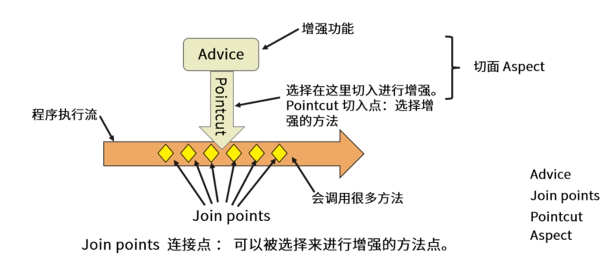

# Aop

## 概念

* 切面(**Aspect**)、通知(**Advice**)、切入点(**Pointcut**)与连接点(**JoinPoint**)

* 切入方式
* 织入

## 手写AOP框架

### 需求

**框架就是写好结构，补充业务原料**

在框架的人员中存在两种角色，用户和开发

用户：框架使用者，不需要知道底层原理，只需要会业务功能编写就可以的程序员

开发：了解底层原理

