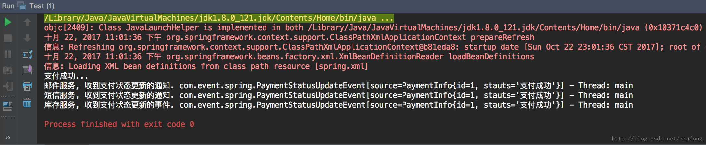

# Spring事件驱动模型

## 一、事件驱动模型简介

事件驱动模型，也即是我们通常说的观察者。基于发布-订阅模式的编程模型。

### 概念

  定义对象间的一种一对多的依赖关系，当一个对象的状态发生变化时，所有依赖它的对象都得到通知并自动更新。

> 百度百科：
> 从事件角度说，事件驱动程序的基本结构是由一个事件收集器、一个事件发送器和一个事件处理器组成。
> 事件收集器专门负责收集所有事件，包括来自用户的（如鼠标、键盘事件等）、来自硬件的（如时钟事件等）和来自软件的（如操作系统、应用程序本身等）。
> 事件发送器负责将收集器收集到的事件分发到目标对象中。
> 事件处理器做具体的事件响应工作。

从程序设计的角度来看，事件驱动模型的核心构件通常包含以下几个：

1. 事件源：负责产生事件的对象。比如我们常见的按钮，按钮就是一个事件源，能够产生“点击”这个事件
2. 事件监听器（事件处理器）：负责处理事件的对象
3. 事件：或者称为事件对象，是事件源和事件监听器之间的信息桥梁。是整个事件模型驱动的核心

下图展示了事件、事件源、监听器直接的关系：


举个例子：

产品经理经过百般调研和思考过后提出开发一个新系统，确定需求后将需求录入到需求管理系统，这时开发人员得知确认需求后开始进入技术开发阶段。

在这个例子中，“产品经理”就是一个事件源，事件对象是“开发一个新系统”，然后“开发人员”就是一个事件监听器或者事件处理器，负责新系统的开发。那么此处为什么是开发人员开发需求，而不是销售人员开发需求呢？所以一个事件监听器要能够处理某个事件，需要提前建立某种关系。这种关系的建立采用事件驱动模型来表达就是注册或者订阅。当某种关系建立后，事件监听器才能处理相关联的事件，也就是开发人员来开发需求，而不是销售人员来开发需求。

事件监听器监听其感兴趣的事件，当事件源发布事件时，便能得到通知。

## 二、事件模型的应用

基于事件模型驱动的程序设计，笔者在开发过程中比较常遇到的关于事件驱动模型的应用包括以下几类：

1. 观察这模式

2. JDK观察者模式

3. JavaBean事件驱动

4. Spring事件驱动

   下面对着4类事件驱动模型进行详细介绍，包括原理介绍和给出可运行的案例。

### 1、 观察者模式

#### 原理解析

观察者模式的UML图如下：


具体类说明如下：

1. Observer观察者，即为事件模型中的事件监听器，该接口定义一个方法update，即为事件处理方法。当观察到有事件产生时，该方法便会处理
2. Subject被观察者，即事件模型中的事件源，负责产生事件，定义与观察者建立关联的方法（添加观察者、删除观察者、通知观察者）
3. ConreteObserver具体的观察者实现类，实现Observer接口中的update方法，具体实例会被添加到被观察者的观察者队列中（observers[List]）
4. ConreteSubject具体的被观察者实现类，实现Subject接口。定义观察者队列（observers[List]），并定义实现如何将观察者对象添加到观察者队列中以及如何通所有知观察者


在上述类图中，具体的ConreteSubject被观察者，其中包含observers一个列表，保存所有观察者对象。doAction方法是需要通知观察者对象的动作，当该方法执行后，会通知保存在observers中的所有观察者。

也就是在执行方法ConreteSubject#doAction()时，需要调用ConreteSubject#notifyObservers()通知保存在observers中的所有观察者，让其能够做出相应。


#### 案例

上面描述感觉有点晦涩，我们举个例子：

以支付状态更新通知为例，自定义观察者设计模式，当支付状态更新时，通知邮件服务和库存服务。


##### Observer接口及实现类

```java
/**
 * Created by zhurudong on 2017/10/21.
 * 观察者
 */
public interface Observer {
    void update();
}

/**
 * Created by zhurudong on 2017/10/21.
 * 库存服务
 */
public class MyStockObserver implements Observer {
    @Override
    public void update() {
        System.out.println("库存服务收到通知");
    }
}


/**
 * Created by zhurudong on 2017/10/21.
 * 邮件服务
 */
public class MyEmailObserver implements Observer{
    @Override
    public void update() {
        System.out.println("邮件服务收到通知.");
    }
}
```

##### Subjest接口及实现类

```java
/**
 * Created by zhurudong on 2017/10/21.
 * 被观察者
 */
public interface Subject {
    /**
     * 添加观察者
     * @param observer
     */
    void addObserver(Observer observer);

    /**
     * 删除观察者
     * @param observer
     */
    void removeObserver(Observer observer);

    /**
     * 通知观察者
     */
    void notifyObservers();
}

/**
 * Created by zhurudong on 2017/10/21.
 *
 * 更改支付状态的被观察则
 */
public class MyPaymentStatusUpdateSubject implements Subject {

    private List<Observer> observers = new Vector<>();

    @Override
    public void addObserver(Observer observer) {
        observers.add(observer);
    }

    @Override
    public void removeObserver(Observer observer) {
        observers.remove(observer);
    }

    @Override
    public void notifyObservers() {
        for (Observer observer : observers) {
            observer.update();
        }
    }

    public void updatePaymentStatus(int newStatus) {

        // 业务逻辑操作
        System.out.println("更新新的支付状态为：" + newStatus);

        // 通知观察者
        this.notifyObservers();
    }
}
```

##### 测试

```java
/**
 * Created by zhurudong on 2017/10/21.
 *
 * 观察者模式
 */
public class Test {
    public static void main(String[] args) {

        // "支付状态更新"->看做一个事件，可以被监听的事件

        // 被观察者。即事件源
        MyPaymentStatusUpdateSubject myPaymentStatusUpdateSubject = new MyPaymentStatusUpdateSubject();

        // 观察者。即事件监听器
        MyEmailObserver myEmailObserver = new MyEmailObserver();
        MyStockObserver myStockObserver = new MyStockObserver();

        // 添加观察者。
        myPaymentStatusUpdateSubject.addObserver(myEmailObserver);
        myPaymentStatusUpdateSubject.addObserver(myStockObserver);

        // 发布事件。支付状态更新。
        myPaymentStatusUpdateSubject.updatePaymentStatus(2);
    }
}
```


### 2、JDK中的观察者模式

#### 原理解析

JDK已经帮我们实现了一个观察者模式，事件收集器采用Vector容器保存，操作事件收集器的方法都是线程安全的。

UML图如下：


跟上面我们自己实现的观察者模式十分类似，具体类说明如下：

1. Observer观察者

2. Observable可观察，即被观察者，是一个具体的类

3. ConreteObserver具体的观察者实现类

4. ConreteObservable具体的被观察者实现类，继承Observable类

观察发现，Observable可观察，即被观察者，已经实现了添加观察者、删除观察者、通知观察者等等操作事件收集器的方法，不用每个子类都要去实现一遍，只需要按照它的方式使用接口。

不同的是，我们做的是在执行方法ConreteObservable#doAction()时，在调用Observable#notifyObservers()通知观察者之前需要调用Observable#setChanged()表示可观察者状态已经发生改变，观察者可以对此做出想用。

#### 案例

我们举个栗子：
还是“以支付状态更新通知为例，自定义观察者设计模式，当支付状态更新时，通知邮件服务和库存服务。”，下面看看类之间的关系：


##### 观察者接口

摘选JDK源码

```java
public interface Observer {
    /**
     * This method is called whenever the observed object is changed. An
     * application calls an <tt>Observable</tt> object's
     * <code>notifyObservers</code> method to have all the object's
     * observers notified of the change.
     *
     * @param   o     the observable object.
     * @param   arg   an argument passed to the <code>notifyObservers</code>
     *                 method.
     */
    void update(Observable o, Object arg);
}
```

##### 可观察对象

摘选自JDK源码

```java
package java.util;

/**
 * @author  Chris Warth
 * @see     java.util.Observable#notifyObservers()
 * @see     java.util.Observable#notifyObservers(java.lang.Object)
 * @see     java.util.Observer
 * @see     java.util.Observer#update(java.util.Observable, java.lang.Object)
 * @since   JDK1.0
 */
public class Observable {
    private boolean changed = false;
    private Vector<Observer> obs;
    /** Construct an Observable with zero Observers. */
    public Observable() {
        obs = new Vector<>();
    }

    public synchronized void addObserver(Observer o) {
        if (o == null)
            throw new NullPointerException();
        if (!obs.contains(o)) {
            obs.addElement(o);
        }
    }

    public synchronized void deleteObserver(Observer o) {
        obs.removeElement(o);
    }

    public void notifyObservers() {
        notifyObservers(null);
    }

    public void notifyObservers(Object arg) {
        Object[] arrLocal;
        synchronized (this) {
            /* 这里存在2个潜在的糟糕结果：
             * 1) 一个新加入的观察者错过了正在执行的通知
             * 2) 一个刚刚删除的观察者不需要关心变更时有可能会错误地被通知
             */
            if (!changed)
                return;
            arrLocal = obs.toArray();
            clearChanged();
        }
        for (int i = arrLocal.length-1; i>=0; i--)
            ((Observer)arrLocal[i]).update(this, arg);
    }

    public synchronized void deleteObservers() {
        obs.removeAllElements();
    }

    protected synchronized void setChanged() {
        changed = true;
    }

    protected synchronized void clearChanged() {
        changed = false;
    }

    public synchronized boolean hasChanged() {
        return changed;
    }

    public synchronized int countObservers() {
        return obs.size();
    }
}
```

##### 邮件服务和库存服务

```java
/**
 * Created by zhurudong on 2017/10/21.
 * 邮件服务
 */
public class EmailObserver implements Observer {
    @Override
    public void update(Observable o, Object arg) {
        System.out.println("邮件服务收到通知");
    }
}

/**
 * Created by zhurudong on 2017/10/21.
 * 库存服务
 */
public class StockObserver implements Observer {
    @Override
    public void update(Observable o, Object arg) {
        System.out.println("库存服务收到通知");
    }
}
```

##### 支付服务类

```java
/**
 * Created by zhurudong on 2017/10/21.
 *
 * 支付状态变更做为一个可观察者
 */
public class PaymentStatusObservable extends Observable {

    public void updatePaymentStatus(int newStatus) {
        // 业务逻辑操作
        System.out.println("更新新的支付状态为：" + newStatus);

        // 通知观察者
        this.setChanged();//需要调用一下这这方法，表示被观察者的状态已发生变更，Observable才会通知观察者
        this.notifyObservers();
    }
}
```

##### 测试类

```java
/**
 * Created by zhurudong on 2017/10/21.
 *
 * 使用JDK中的观察者模式
 */
public class Test {

    public static void main(String[] args) {

        // "支付状态更新"->看做一个事件，可以被监听的事件

        // 被观察者。即事件源
        PaymentStatusObservable paymentStatusObservable = new PaymentStatusObservable();

        // 添加观察者
        paymentStatusObservable.addObserver(new EmailObserver());
        paymentStatusObservable.addObserver(new StockObserver());

        // 支付状态变更
        paymentStatusObservable.updatePaymentStatus(3);
    }
}
```

操作事件的编码工作。

但也正因为如此，Observable把部分的编码操作实现了，导致灵活性降低了，没有很好地进行抽象，而是几乎是给出了所有的实现。因此很多框架例如Spring在实现事件驱动的时候，没有直接使用JDK提供的API，而是大部分定义了自己的事件驱动模型。

我们针对JDK给出的观察者模式的解决方案总结几点：

1. Observable实现了大部分的逻辑，没有很好地进行抽象，灵活性降低了

2. 存在2个潜在的问题：一个刚刚加入的观察者错过了通知；一个刚刚删除的观察者被错误的通知

3. Observable实现的方法采用synchronized，操作同一个方法时串行，可能会存在效率问题

### 3、JavaBean中的事件驱动

#### 原理解析

javabean规范中提供了一种监听属性变化的事件驱动模型。提供操作Javabean属性的类PropertyChangeSupport和PropertyEditorSupport。

从事件驱动模型的各个构建来分析，PropertyChangeSupport和PropertyEditorSupport都属于事件源，能够产生事件。如果以观察模式的角度来看，则是被观察者

事件监听器实现PropertyChangeListener接口，通过PropertyChangeSupport和PropertyEditorSupport添加到事件队列中。

一旦有Javabean属性发生变化通过调用PropertyChangeSupport#firePropertyChange()、PropertyEditorSupport#firePropertyChange()即可触发监听器处理事件。


JDK提供的API给我们展示了PropertyChangeSupport的用法，照葫芦画瓢写一个自己的示例。


#### 案例
当一条订单支付状态更新时能够实时收到变更的通知。

##### 1、事件源

```java
import java.beans.PropertyChangeListener;
import java.beans.PropertyChangeSupport;
/**

 * Created by zhurudong on 2017/10/21.
 */
public class PaymentStatusUpdateBean {

    PropertyChangeSupport paymentlisteners = new PropertyChangeSupport(this);

    public void updateStatus(int newStatus) {
        // 模拟业务逻辑
        System.out.println("支付状态更新： " + newStatus);
        // 触发通知
        paymentlisteners.firePropertyChange("paymentStatuUpdate", 0, newStatus);        ;
    }

    public void addPropertyChangeListener(PropertyChangeListener listener) {
        paymentlisteners.addPropertyChangeListener(listener);
    }

    public void removePropertyChangeListener(PropertyChangeListener listener){
        paymentlisteners.addPropertyChangeListener(listener);
    }
}
```

##### 2、事件监听器
```java
import java.beans.PropertyChangeEvent;
import java.beans.PropertyChangeListener;

/**
 * Created by zhurudong on 2017/10/21.
 * 支付状态变更的监听器
 */
public class PaymentStatusUpdateListener implements PropertyChangeListener {
    @Override
    public void propertyChange(PropertyChangeEvent evt) {
        System.out.printf("支付状态变更. eventName : %s, oldValue : %s, newValue : %s", evt.getPropertyName(), evt.getOldValue(), evt.getNewValue());
    }
}
```

##### 3、测试类

```java
/**
 * Created by zhurudong on 2017/10/21.
 * 测试JDK提供的PropertyChangeEvent
 */
public class Test {
    public static void main(String[] args) {
        PaymentStatusUpdateBean paymentStatusUpdateBean = new PaymentStatusUpdateBean();

        // 添加监听器
        paymentStatusUpdateBean.addPropertyChangeListener(new PaymentStatusUpdateListener());
    
        // 更新支付状态
        paymentStatusUpdateBean.updateStatus(3);
    }
}
```
通过设定的PaymentstatusUpdateListener监听器可以实时地感知到支付状态发生的变化。

### 4、Spring事件驱动

Spring事件驱动模型原理比较复杂，涉及到的类比较多，我们先来看一个案例，从一个案例入手再逐渐理解Spring事件驱动模型。

#### 1、 案例

跟之前的例子一样，当一个订单的支付状态发生变化时，能够通知到邮件服务、短信服务、库存服-
    public boolean supportsEventType(Class<? extends ApplicationEvent> eventType) {
        return eventType == PaymentStatusUpdateEvent.class;
    }

    @Override
    public boolean supportsSourceType(Class<?> sourceType) {
        return sourceType == PaymentInfo.class;
    }
    
    @Override
    public void onApplicationEvent(ApplicationEvent event) {
        System.out.println("短信服务, 收到支付状态更新的通知. " + event+ " - Thread: " + Thread.currentThread().getName());
    }
    
    // 排序
    @Override
    public int getOrder() {
        return 2;
    }
}

```
上述3个类分别定义了一个无序监听器`StockPaymentStatusUpdateListener`和两个有序监听器`MailPaymentStatusUpdateListener`和`SmsPaymentStatusUpdateListener`。在有序监听器中可以看到`xxx#getOrder()`获取他们的执行顺序，数字越小执行的优先级越高。也就是当事件被触发后`MailPaymentStatusUpdateListener`会优于`SmsPaymentStatusUpdateListener`被执行。

Spring的配置文件如下：

​```xml

<?xml version="1.0" encoding="UTF-8"?>
<beans xmlns="http://www.springframework.org/schema/beans"
       xmlns:xsi="http://www.w3.org/2001/XMLSchema-instance"
       xmlns:context="http://www.springframework.org/schema/context"
       xmlns:aop="http://www.springframework.org/schema/aop"
       xmlns:task="http://www.springframework.org/schema/task"
       xsi:schemaLocation="http://www.springframework.org/schema/beans http://www.springframework.org/schema/beans/spring-beans.xsd
       http://www.springframework.org/schema/aop http://www.springframework.org/schema/aop/spring-aop.xsd
       http://www.springframework.org/schema/task http://www.springframework.org/schema/task/spring-task.xsd
       http://www.springframework.org/schema/context http://www.springframework.org/schema/context/spring-context.xsd
       " default-lazy-init="true">

    <context:component-scan base-package="com.event"/>

</beans>
```

测试类：

```java
/**
 * Created by zhurudong on 2017/10/22.
 * Spring事件驱动模型
 */
public class Test {

    public static void main(String[] args) throws InterruptedException {
        ApplicationContext applicationContext = new ClassPathXmlApplicationContext("spring.xml");

        PaymentService paymentService = applicationContext.getBean(PaymentService.class);

        paymentService.pay(1, "支付成功");
    }

}
```

执行结果如下：



通过上图我们知道，有序邮件服务和短信服务是有序的事件监听器，并定义了邮件服务优于短信服务先执行。所以程序多次运行后结果都是邮件服务先执行，然后是短信服务。

仔细观察上图展示的结果我们发现，所有的监听器都是在主线程中执行的。这就可能会引发性能问题，我们能否将这些事件监听器放到额外的线程去执行，而不在主线程中执行呢？答案是有的。

很方便Spring为我们提供了2种方式将事件执行放到另外的线程中执行

#### 2、执行方式

##### **第一种方式：全局异步**

先看看Spring文件是如何配置的

```xml
<?xml version="1.0" encoding="UTF-8"?>
<beans xmlns="http://www.springframework.org/schema/beans"
       xmlns:xsi="http://www.w3.org/2001/XMLSchema-instance"
       xmlns:context="http://www.springframework.org/schema/context"
       xmlns:aop="http://www.springframework.org/schema/aop"
       xmlns:task="http://www.springframework.org/schema/task"
       xsi:schemaLocation="http://www.springframework.org/schema/beans http://www.springframework.org/schema/beans/spring-beans.xsd
       http://www.springframework.org/schema/aop http://www.springframework.org/schema/aop/spring-aop.xsd
       http://www.springframework.org/schema/task http://www.springframework.org/schema/task/spring-task.xsd
       http://www.springframework.org/schema/context http://www.springframework.org/schema/context/spring-context.xsd
       " default-lazy-init="true">
    <context:component-scan base-package="com.event"/>

    <!-- 任务执行器 -->
    <task:executor id="payment-status-update-thread" pool-size="10"/>

    <bean id="applicationEventMulticaster" class="org.springframework.context.event.SimpleApplicationEventMulticaster">
        <property name="taskExecutor" ref="payment-status-update-thread"/>
    </bean>
</beans>
```

定义任务执行器，需要配置`SimpleApplicationEventMulticaster#taskExecutor`属性，将任务执行器配置

```xml
<task:executor id="payment-status-update-thread" pool-size="10"/>
```


注入到SimpleApplicationEventMulticaster中即可，监听器不需要做任何变动。

需要注意的是实例化`SimpleApplicationEventMulticaster`时的名称必须为**applicationEventMulticaster**，是固定的，因为在`AbstractApplicationContext`类中查找事件触发器是通过定义好的bean的名称查找。

关于`SimpleApplicationEventMulticaster`更多内容后文会有分析。

```java
public static final String APPLICATION_EVENT_MULTICASTER_BEAN_NAME = "applicationEventMulticaster";
```

我们来看看执行结果


使用这种方式开启异步化执行事件，也就是所有的事件监听器执行事件时都会在配置的线程中执行。
Spring还提供了一种比较灵活的方式配置，可以将部分的监听器设置为异步执行

##### **第二种方式：注解式配置异步**

采用注解的方式配置，将注解`@Async`放到`ApplicationListener#onApplicationEvent(Eevent)`监听器的实现类上，即可将监听器设置为异步化处理

看看spring配置文件

```xml
<?xml version="1.0" encoding="UTF-8"?>
<beans xmlns="http://www.springframework.org/schema/beans"
       xmlns:xsi="http://www.w3.org/2001/XMLSchema-instance"
       xmlns:context="http://www.springframework.org/schema/context"
       xmlns:aop="http://www.springframework.org/schema/aop"
       xmlns:task="http://www.springframework.org/schema/task"
       xsi:schemaLocation="http://www.springframework.org/schema/beans http://www.springframework.org/schema/beans/spring-beans.xsd
       http://www.springframework.org/schema/aop http://www.springframework.org/schema/aop/spring-aop.xsd
       http://www.springframework.org/schema/task http://www.springframework.org/schema/task/spring-task.xsd
       http://www.springframework.org/schema/context http://www.springframework.org/schema/context/spring-context.xsd
       " default-lazy-init="true">
    <context:component-scan base-package="com.event"/>

    <!-- 任务调度器 -->
    <task:scheduler id="scheduler"  pool-size="5"/>

    <!-- 任务执行器 -->
    <task:executor id="payment-status-update-thread" pool-size="10"/>

    <!--开启注解调度支持 @Async @Scheduled-->
    <task:annotation-driven executor="payment-status-update-thread" scheduler="scheduler" proxy-target-class="true"/>
</beans>
```

在监听器中的使用

```java
/**
 * Created by zhurudong on 2017/10/22.
 */
@Component
public class StockPaymentStatusUpdateListener implements ApplicationListener<PaymentStatusUpdateEvent> {

    @Async
    @Override
    public void onApplicationEvent(PaymentStatusUpdateEvent event) {
        System.out.println("库存服务, 收到支付状态更新的事件. " + event + " - Thread: " + Thread.currentThread().getName());
    }
}
```

通过上面的注解@Async便可方便地将事件监听器异步化，没有加这个注解的监听器仍然在发布事件的线程中执行。

我们看看执行的结果：


通过上面的执行结果我们可以知道，邮件服务和短信服务因为没有加@Async注解，看到监听器的执行线程是在发布线程中运行的。而加了@Async注解的库存服务器执行线程是在spring配置文件中配置的执行器

#### 3、原理分析


从这个图中我们可以大致的了解Spring事件驱动中的各个组件是如何协同一起完成事件的触发和事件的执行。ApplicationListener作为Spring事件驱动中的监听器基类接口，要想实现一个由Spring驱动的事件监听，可以继承于该类；而ApplicationEventPublisher定义了事件的发布接口，Spring容器ApplicatonContext继承了该类，并实现了如何将是一个事件对象ApplicationEvent发布，并通知到事件监听器。先看分析下面几个比较重要的类：

1. ApplicationEvent: 事件对象，Spring事件驱动模型中的对象源，继承JDK EventObject，通过在发布事件时通过EventObject.source字段携带事件相关的数据。
2. ApplicationListener: 应用监听器，负责监听事件对象是否有发生变化，实现该接口并实现onApplicationEvent方法，完成事件发生变化时的逻辑处理
3. ApplicationEventPublisher: 事件发布器，定义了事件发布规范，只定义了接口，具体的实现交由其他类中实现。Spring提供了SimpleApplicationEventMulticaster实现了广播事件发布器。

理解Spring的事件模型可以从上的类图中，清晰地看到各个组件之间的合作关系，并将合作关系的共性抽象出来，对观察者模式做了抽象。

下文我们会从事件驱动模型的各个构件出发分析Spring的事件驱动模型，包含事件对象、事件源（发布事件者）、事件监听器。

##### 1、 事件（事件对象）

Spring事件驱动模型中，承担事件对象的类是ApplicationEvent，集成JDK提供的事件对象EventObject.

此类为Spring事件中用于扩展的事件对象，所有需要使用事件驱动模型发布的事件都可以继承此类，并将事件对象Object source;传递给事件监听器使用，通过该source可以得到事件源，监听器拿到事件源后便可以处理自己的业务逻辑。

```java

public abstract class ApplicationEvent extends EventObject {

   /** use serialVersionUID from Spring 1.2 for interoperability */
   private static final long serialVersionUID = 7099057708183571937L;

   /** System time when the event happened */
   private final long timestamp;

   public ApplicationEvent(Object source) {
      super(source);
      this.timestamp = System.currentTimeMillis();
   }

   public final long getTimestamp() {
      return this.timestamp;
   }
}
```
Spring自身的实现中，有很多地方用到了事件它自己定义的事件驱动模型。ApplicationContextEvent就是Spring容器事件的基类。
```java
public abstract class ApplicationContextEvent extends ApplicationEvent {

   public ApplicationContextEvent(ApplicationContext source) {
      super(source);
   }

   public final ApplicationContext getApplicationContext() {
      return (ApplicationContext) getSource();
   }
}
```
例如Spring中基于ApplicationContextEvent实现的事件如图所示：


`ContextStartedEvent`：`Spring Application`容器启动后触发的事件。
`ContextStopedEvent`：`Spring Application`容器停止后触发的事件。
`ContextClosedEvent`：`Spring Application`容器关闭后触发的事件。
`ContextRefreshedEvent`：`Spring Application`容器初始化或者刷新完成后触发的事件。

##### 2、 事件源-发布事件者

有了上面的事件对象后，如何发布事件对象呢？同样，Spring也提供了事件发布器，ApplicationContext继承了ApplicationEventPublisher，也就是说明Application有了事件发布的功能。


```java
public abstract class AbstractApplicationContext extends DefaultResourceLoader
      implements ConfigurableApplicationContext, DisposableBean {

// 省略其他代码
    public static final String APPLICATION_EVENT_MULTICASTER_BEAN_NAME = "applicationEventMulticaster";

    @Override
    public void publishEvent(ApplicationEvent event) {
        publishEvent(event, null);
    }

    @Override
    public void publishEvent(Object event) {
        publishEvent(event, null);
    }      
    protected void publishEvent(Object event, ResolvableType eventType) {
        Assert.notNull(event, "Event must not be null");
        if (logger.isTraceEnabled()) {
            logger.trace("Publishing event in " + getDisplayName() + ": " + event);
        }

        // Decorate event as an ApplicationEvent if necessary
        ApplicationEvent applicationEvent;
        if (event instanceof ApplicationEvent) {
            applicationEvent = (ApplicationEvent) event;
        } else {
            applicationEvent = new PayloadApplicationEvent<Object>(this, event);
            if (eventType == null) {
                eventType = ResolvableType.forClassWithGenerics(PayloadApplicationEvent.class, event.getClass());
            }
        }

        // Multicast right now if possible - or lazily once the multicaster is initialized
        if (this.earlyApplicationEvents != null) {
            this.earlyApplicationEvents.add(applicationEvent);
        } else {
            getApplicationEventMulticaster().multicastEvent(applicationEvent, eventType);
        }

        // Publish event via parent context as well...
        if (this.parent != null) {
        if (this.parent instanceof AbstractApplicationContext) {
            ((AbstractApplicationContext) this.parent).publishEvent(event, eventType);
        }
        else {
            this.parent.publishEvent(event);
        }
    }
}
```


###### 1). 事件发布器是如何初始化

先来看AbstractApplicationContext中定义的一个常量：

```java
public static final String APPLICATION_EVENT_MULTICASTER_BEAN_NAME = "applicationEventMulticaster";
```


该行代码会根据Spring bean容器byName的方式初始化一个事件广播发布器，所以在自定义事件发布器时，需要将bean的id设置为applicationEventMulticaster，这时才能将自定义的事件发布器注入。

例如如下代码：

```xml
<bean id="applicationEventMulticaster" class="xx.xx.MySimpleApplicationEventMulticaster">
    <property name="taskExecutor" ref="spring-task-executor"/>
</bean>
```

Spring初始化事件发布器的代码如下：

```java
protected void initApplicationEventMulticaster() {
   ConfigurableListableBeanFactory beanFactory = getBeanFactory();
   // 先从beanfactory容器中查找，如果有广播事件发布器则直接饮用；如果没有创建默认的SimpleApplicationEventMulticaster广播事件发布器
   if (beanFactory.containsLocalBean(APPLICATION_EVENT_MULTICASTER_BEAN_NAME)) {
      this.applicationEventMulticaster = beanFactory.getBean(APPLICATION_EVENT_MULTICASTER_BEAN_NAME, ApplicationEventMulticaster.class);
      if (logger.isDebugEnabled()) {
         logger.debug("Using ApplicationEventMulticaster [" + this.applicationEventMulticaster + "]");
      }
   }
   else {
      this.applicationEventMulticaster = new SimpleApplicationEventMulticaster(beanFactory);
      beanFactory.registerSingleton(APPLICATION_EVENT_MULTICASTER_BEAN_NAME, this.applicationEventMulticaster);
      if (logger.isDebugEnabled()) {
         logger.debug("Unable to locate ApplicationEventMulticaster with name '" + APPLICATION_EVENT_MULTICASTER_BEAN_NAME + "': using default [" + this.applicationEventMulticaster + "]");
      }
   }
}
```

Spring中定义的事件发布器需要实现`ApplicationEventMulticaster`该接口，该接口具有广播的功能。

Spring事件发布器的初始化比较简单。首先从`BeanFactory`容器中，根据byName的方式查找名称为`applicationEventMulticaster`的事件发布器，如果bean容器中没有定义，则Spring会为我们初始化一个默认的事发广播发布器`SimpleApplicationEventMulticaster`，该类实现了`ApplicationEventMulticaster`接口，初始化后将对象的引用复制`this.applicationEventMulticaster`，到此事件发布器初始化完毕。

###### 思考：

1. 我们仔细观察上面的类图，`ApplicationEventPublishe`r定义了事件发布的基础接口，也就是一个事件发布器应该如何发布。
2. 具体是如何发布事件的Spring容器并没有直接从该`ApplicationEventPublisher`接口中去实现，而是从新定义了`ApplicationEventMulticaster`广播事件发布器，并以对象关联的方式注入到`AbstractApplicationContext`当中，作为`AbstractApplicationContext`的成员变量。这种强对象关联的方式，也就强调了所有要使用Spring的事件驱动模型的发布器必须要实现`ApplicationEventMulticaster`接口。
3. 幸运的是，Spring已经默认为我们实现了一个广播事件发布器`SimpleApplicationEventMulticaster`，一般的使用场景里面，直接使用该事件发布器就足够了。有特殊需求如需要设置全局异步模式，可以将`SimpleApplicationEventMulticaster`初始化，设置`taskExecutor`属性即可，具体如何使用上文有提到。

###### 2). 事件时如何发布

```java
@Override
public void publishEvent(ApplicationEvent event) {
   publishEvent(event, null);
}

@Override
public void publishEvent(Object event) {
   publishEvent(event, null);
}

protected void publishEvent(Object event, ResolvableType eventType) {
}
```


从上述的源码中可以看出，最终需要发布事件的方法是`AbstractApplicationContext#publishEvent(Object event, ResolvableType eventType)`; publishEvent接受一个Object和ResolvableType做为参数发布事件对象。

第二个参数ResolvableType主要用于区分发布的事件类型，对不同的事件可以根据`Object`和`ResolvableType`作为一个key从监听器列表中筛选出可以执行任务的监听器出来，具体如何筛选下文再分析。

回过头看看事件时如何发布的：

1. 将Object转成ApplicationEvent事件对象。如果不是ApplicationEvent的子类，则通过PayloadApplicationEvent包装，该类继承了ApplicationEvent
2. 获取广播事件发布器`AbstractApplication#getApplicationEventMulticaster().multicastEvent(applicationEvent, eventType);` 发布事件
3. 判断`ApplicationContext`上下文是否存在IOC父容器，如果存在调用父容器的`publishEvent(event)`发布事件。这样IOC子容器发布的事件父容器也能感知得到。

事件的发布源码如下：

```java
protected void publishEvent(Object event, ResolvableType eventType) {
   Assert.notNull(event, "Event must not be null");
   if (logger.isTraceEnabled()) {
      logger.trace("Publishing event in " + getDisplayName() + ": " + event);
   }

   // 1 将object转成ApplicationEvent
   ApplicationEvent applicationEvent;
   if (event instanceof ApplicationEvent) {
      applicationEvent = (ApplicationEvent) event;
   }
   else {
      applicationEvent = new PayloadApplicationEvent<Object>(this, event);
      if (eventType == null) {
         eventType = ResolvableType.forClassWithGenerics(PayloadApplicationEvent.class, event.getClass());
      }
   }

   // 2. 获取广播事件发布器，进行事件发布
   if (this.earlyApplicationEvents != null) {
      this.earlyApplicationEvents.add(applicationEvent);
   }
   else {
      getApplicationEventMulticaster().multicastEvent(applicationEvent, eventType);
   }

   // 3. 对当前IOC的父容器发布下事件
   if (this.parent != null) {
      if (this.parent instanceof AbstractApplicationContext) {
         ((AbstractApplicationContext) this.parent).publishEvent(event, eventType);
      }
      else {
         this.parent.publishEvent(event);
      }
   }
}
```

###### 3). 事件发布总结

到此，我们已经把如何发布一个事件对象说完了。ApplicationContext通过继承ApplicationEventPublisher让Spring应用上下文有了发布事件的能力，并通过publishEvent接口将一个事件源ApplicationEvent，通过具体事件发布器的具体实现类SimpleApplicationEventMulticaster将事件发布出去。

到这里，好像还有东西没有说完。没错，当事件发布出去后，监听器是如何监听到的，并且如何筛选出合适的监听器来执行任务的呢？接下来就应该是监听器登场的时刻

##### 3、 事件监听器

我们先来看看事件监听的继承结构：


从上图我们可以看出，监听的继承结构比较简单，统一继承了JDK定义的EventListener，ApplicationListner作为Spring事件驱动模型的监听器基类。

如果要实现一个监听器，可以实现`ApplicationListener`接口，然后重写`onApplicationEvent(E event);`方法。

那么当一个事件发布后，如何通知到监听器去执行任务，监听器是如何感知到有事件发布呢，下面我们来聊聊事件监听器的筛选过程和事件监听器是如何执行的。

###### 1). 检索合适事件监听器

> 筛选原则
> 根据ApplicationEvent中的source class类型进行筛选。

前面我们聊过一个事件是通过

```java 
getApplicationEventMulticaster().multicastEvent(applicationEvent, eventType); 
```

这行代码被发布出去的。我们来看看该`SimpleApplicationEventMulticaster#mullticastEvent(applicationEvent, eventType) `是如何对事件监听器进行筛选，筛选出合适的事件监听器。

```java
@Override
public void multicastEvent(final ApplicationEvent event, ResolvableType eventType) {
   ResolvableType type = (eventType != null ? eventType : resolveDefaultEventType(event));
   // getApplicationListeners该方法筛选出合适的事件监听器
   for (final ApplicationListener<?> listener : getApplicationListeners(event, type)) {
      Executor executor = getTaskExecutor();
      if (executor != null) {
         executor.execute(new Runnable() {
            @Override
            public void run() {
               invokeListener(listener, event);
            }
         });
      }
      else {
         invokeListener(listener, event);
      }
   }
}
```
其中，比较重要的是一句是`getApplicationListeners(event, type)`，该方法通过event对象本身和包装了`ResolvableType`事件解析类型，筛选出合适的监听器。这个方法是在`AbstractApplicationEventMulticaster`类中实现的，该类还定义了`retrieverCache`的`CurrentHashMap`用于缓存加载过的监听器。
```java
private final Map<ListenerCacheKey, ListenerRetriever> retrieverCache = new ConcurrentHashMap<ListenerCacheKey, ListenerRetriever>(64);
```
`getApplicationListeners(event, type)`方法执行步骤如下：

> 1. 构建ListenerCacheKey, 从缓存retrieverCache中获取事件事件监听器，如果有则直接调用retriever.getApplicationListeners(); 返回事件监听器
>
> 2. AbstractApplicationEventMulticaster#retrieveApplicationListeners(ResolvableType eventType, Class<?> sourceType, ListenerRetriever retriever)，调用此方式根据sourceType检索。
>    sourceType是event.getSource()，也就是事件对象里面的source对象源
>
> 3. 将上一步检索到的监听器添加到retrieverCache缓存中，此过程中是synchronized
>

至于上面第2步中是如何检索？Spring在容器初始化时，相应的factoryBean信息已经在beanFactory Spring工厂中构建好。在执行上面第2步时，会调用

```java
ApplicationListener<?> listener = beanFactory.getBean(listenerBeanName, ApplicationListener.class); 
```

进行初始化factoryBean，并将监听器封装到`ListenerRetriever retriever`中，后面将retriever添加到retrieveCache中，提供下次检索时直接从缓存中获取，不用再进行bean的初始化。

###### 2). 事件监听器执行

通过上个步骤根据`event.getSource()`的Class类型检索到对应的Listener，到事件监听器的执行就非常容易了。

分两步执行：

1. 判断applicationEventMulticaster初始化广播事件发布器时，有没有对该taskExecutor属性进行赋值。如果有采用线程池中的线程执行AbstractApplicationEventMulticaster#invokeListener(listener, event)。
2. 如果没有设置线程池，进行同步执行。由发布事件的线程执行

在`invokeListener`方法中，直接调用`listener.onApplicationEvent(event)`便可执行事件。

到此事件驱动模型已经分析完毕，本文撰写跨越的时间周期比较长，希望通过此文能把观察者模式和Spring事件模型讲解清楚。
