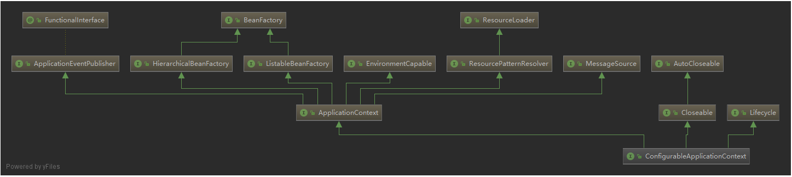
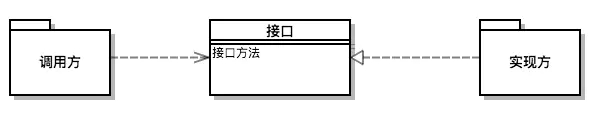

# Spring Boot 启动流程

[TOC]

## 1. main方法

从一个最基本的main方法开始 这就是一个springboot的应用 没有各种配置，不需要打包，然后找个tomcat运行一下 一个main方法 就可以访问接口了 这么神奇

```java
@EnableAsync
@EnableHystrix
@EnableEurekaClient
@EnableConfigurationProperties
@EnableTransactionManagement
@SpringBootApplication(exclude = {RedisAutoConfiguration.class, MongoAutoConfiguration.class})
@ComponentScan(value = {"com.yiche.mapi.business.third", "com.yiche.mapi.platform.common", "com.yiche.mapi.platform.redis", "com.yiche.mapi.platform.mongodb", "com.yiche.mapi.platform.cache", "com.yiche.mapi.activity"})
public class MapiActivityApiApplication {
    public static void main(String[] args) {
        System.setProperty("projectName", "mapi-activity-api");
        SpringApplication.run(MapiActivityApiApplication.class, args);
    }
}
```

### 1. SpringApplication.run

先不管那一堆注解，各种enable是啥玩意不管他，直奔主题 从这一句开始`SpringApplication.run(MapiActivityApiApplication.class, args);` 

一看他就很不简单 就是它启动了整个应用 点进去看看是个啥

```java
public static ConfigurableApplicationContext run(Class<?> primarySource, String... args) {
  return run(new Class[]{primarySource}, args);
}
public static ConfigurableApplicationContext run(Class<?>[] primarySources, String[] args) {
  return (new SpringApplication(primarySources)).run(args);
}
```

### 2.ConfigurableApplicationContext

一上来就看到了一个非常非常重要的类**ConfigurableApplicationContext** Spring体系中的核心 上下文



各种spring中的关键类基本都在这个图上有体现 BeanFactory、Resouce、Environment、ApplicationContext 暂且也不管它,后面慢慢分析

### 3.SpringApplication类

```java
public class SpringApplication {
  ***** 
}
```

这就是一个普普通通的类 算是一个通往spring世界的大门 构造方法如下 初始化了一堆变量，具体用途用的时候再分析

```java
@SuppressWarnings({"unchecked", "rawtypes"})
public SpringApplication(ResourceLoader resourceLoader, Class<?>... primarySources) {
  // 指定资源加载器
  this.resourceLoader = resourceLoader;
  // 判断主资源信息
  Assert.notNull(primarySources, "PrimarySources must not be null");
  // 执行主资源信息
  this.primarySources = new LinkedHashSet<>(Arrays.asList(primarySources));
  // 从classpath中推送应用类型
  this.webApplicationType = WebApplicationType.deduceFromClasspath();
  // 指定初始化类
  setInitializers((Collection) getSpringFactoriesInstances(ApplicationContextInitializer.class));
  // 设置监听器
  setListeners((Collection) getSpringFactoriesInstances(ApplicationListener.class));
  // 推算启动应用类
  this.mainApplicationClass = deduceMainApplicationClass();
}
```

### 4.run方法

芝麻开门 这个方法正式打开了spring的大门，以后无数篇章（我也不知道会有多少篇章,甚至不知道还能否回到最初的原点）都是在分析这个方法

```java
public ConfigurableApplicationContext run(String... args) {
		StopWatch stopWatch = new StopWatch();
		stopWatch.start();
		ConfigurableApplicationContext context = null;
		// 配置参数 java.awt.headless属性
		configureHeadlessProperty();
		// 创建运行时监听器
		SpringApplicationRunListeners listeners = getRunListeners(args);
		listeners.starting();
		try {
			// 解析应用参数 args
			ApplicationArguments applicationArguments = new DefaultApplicationArguments(args);
			// 准备环境
			ConfigurableEnvironment environment = prepareEnvironment(listeners, applicationArguments);
			// 配置过滤bean信息
			configureIgnoreBeanInfo(environment);
			// 打印banner
			Banner printedBanner = printBanner(environment);
			// 创建容器
			// AnnotationConfigServletWebServerApplicationContext
			context = createApplicationContext();
			// 容器准备工作
			prepareContext(context, environment, listeners, applicationArguments, printedBanner);
			// 刷新容器
			refreshContext(context);
      // 容器刷新完成
			afterRefresh(context, applicationArguments);
			stopWatch.stop();
			if (this.logStartupInfo) {
				new StartupInfoLogger(this.mainApplicationClass).logStarted(getApplicationLog(), stopWatch);
			}
			listeners.started(context);
			callRunners(context, applicationArguments);
		} catch (Throwable ex) {
			handleRunFailure(context, ex, listeners);
			throw new IllegalStateException(ex);
		}

		try {
			listeners.running(context);
		} catch (Throwable ex) {
			handleRunFailure(context, ex, null);
			throw new IllegalStateException(ex);
		}
		return context;
	}
```

## 2. 事件监听器

### 2.1  SpringApplicationRunListener

```java
SpringApplicationRunListeners listeners = this.getRunListeners(args);
listeners.starting();
```

listener一听名字，就知道是一个监听器，监听各种事件的，先看看这个类。

#### 1 SpringApplicationRunListeners

```java
package org.springframework.boot;
class SpringApplicationRunListeners {
    private final Log log;
    private final List<SpringApplicationRunListener> listeners;
    ........
    
     public void starting() {
        Iterator var1 = this.listeners.iterator();

        while(var1.hasNext()) {
            SpringApplicationRunListener listener = (SpringApplicationRunListener)var1.next();
            listener.starting();
        }

    }
    下面其他的方法差不多
}
```

是一个springboot的内部的类，不对外暴露, 里面是一个SpringApplicationRunListener的list，遍历各种SpringApplicationRunListener执行相关的监听方法

#### 2 SpringApplicationRunListener

```java
public interface SpringApplicationRunListener {
    //启动
    void starting();
    //环境准备完毕( 在prepareEnvironment方法内部调用。)
    void environmentPrepared(ConfigurableEnvironment environment);
    //上下文准备完毕(在prepareContext的开始阶段被调用。)
    void contextPrepared(ConfigurableApplicationContext context);
    //上下文加载完毕(在prepareContext的最后一步被调用。)
    void contextLoaded(ConfigurableApplicationContext context);
    //启动完成( 在所有执行完成，ApplicationRunner和CommandLineRunner回调之前。)
    void started(ConfigurableApplicationContext context);
    //运行中(在run方法最后单独使用try catch执行，只要上面没有异常，项目已经启动完成。那么running回调异常也不能影响正常流程。)
    void running(ConfigurableApplicationContext context);
    //失败( 在handleRunFailure异常处理中被调用。)
    void failed(ConfigurableApplicationContext context, Throwable exception);
}
```

#### 3 EventPublishingRunListener

> springboot中SpringApplicationRunListener的实现类只有这一个

##### 3.1 构造器和参数

```java
private final SpringApplication application;

private final String[] args;

private final SimpleApplicationEventMulticaster initialMulticaster;

public EventPublishingRunListener(SpringApplication application, String[] args) {
  this.application = application;
  this.args = args;
  this.initialMulticaster = new SimpleApplicationEventMulticaster();
  for (ApplicationListener<?> listener : application.getListeners()) {
    this.initialMulticaster.addApplicationListener(listener);
  }
}
```

##### 3.2 starting

```java
public void starting() {
  this.initialMulticaster.multicastEvent(new ApplicationStartingEvent(this.application, this.args));
}
```

> 一看这里就涉及了两个关键的东西 一个是ApplicationEventMulticaster 一个是ApplicationListener

#### 4 ApplicationEventMulticaster

```java
/**
 *应用事件多播器ApplicationEventMulticaster的实现可以管理多个应用监听器对象，
 *并发布事件到相关监听器。
 *应用事件多播器的使用典型场景，应用上下文可以使用应用事件多播器代理事件的发布事件操作。
 * @author Rod Johnson
 * @author Juergen Hoeller
 * @author Stephane Nicoll
 */
public interface ApplicationEventMulticaster {

  /**
	 * 添加监听器
	 * @param listener the listener to add
	 */
  void addApplicationListener(ApplicationListener<?> listener);

  /**
	 * 添加监听器bean
	 * @param listenerBeanName the name of the listener bean to add
	 */
  void addApplicationListenerBean(String listenerBeanName);

  /**
	 * 移除监听器
	 * @param listener the listener to remove
	 */
  void removeApplicationListener(ApplicationListener<?> listener);

  /**
	 * 移除监听器bean
	 * @param listenerBeanName the name of the listener bean to add
	 */
  void removeApplicationListenerBean(String listenerBeanName);

  /**
	 * 移除所有注册到多播器的监听器。
	 * 在移除所有监听器操作调用后，多播器对于发生的事件不做任何处理，直到有新的监听器注册
	 */
  void removeAllListeners();

  /**
	 * 多播给定的应用事件到相关监听器
	 * 如果想要尽可能中的支持一般的事件，可以考虑使用{@link #multicastEvent(ApplicationEvent, ResolvableType)}
	 * 方法。
	 * @param event the event to multicast
	 */
  void multicastEvent(ApplicationEvent event);

  /**
	 * Multicast the given application event to appropriate listeners.
	 * 多播给定的事件到关联监听器。
	 * 如果eventType类型为空，则将基于event实例 构建一个默认的类型
	 * @param event the event to multicast
	 * @param eventType the type of event (can be null)
	 * @since 4.2
	 */
  void multicastEvent(ApplicationEvent event, ResolvableType eventType);

}
```

> ### SimpleApplicationEventMulticaster
>
> ApplicationEventMulticaster的实现类就这一个 主要是聚合多个ApplicationListener批量事件触发

#### 5 ApplicationListener

##### 5.1 Spring中事件监听器ApplicationListener

```java
//注:EventListener是java中的接口
@FunctionalInterface
public interface ApplicationListener<E extends ApplicationEvent> extends EventListener {
    void onApplicationEvent(E var1);
}
```

##### 5.2 Spring中事件ApplicationEvent

```java
//EventObject也是java中的类
public abstract class ApplicationEvent extends EventObject {
    private static final long serialVersionUID = 7099057708183571937L;
    private final long timestamp = System.currentTimeMillis();

    public ApplicationEvent(Object source) {
        super(source);
    }

    public final long getTimestamp() {
        return this.timestamp;
    }
}
```

监听器主要作用就是在适当的阶段触发适当的操作

##### 5.3 Spring内置事件类型

- ContextRefreshedEvent ApplicationContext 被初始化或刷新时，该事件被发布。这也可以在 ConfigurableApplicationContext 接口中使用 refresh() 方法来发生。
- ContextStartedEvent 当使用 ConfigurableApplicationContext 接口中的 start() 方法启动 ApplicationContext 时，该事件被发布。你可以调查你的数据库，或者你可以在接受到这个事件后重启任何停止的应用程序。
- ContextStoppedEvent 当使用 ConfigurableApplicationContext 接口中的 stop() 方法停止 ApplicationContext 时，发布这个事件。你可以在接受到这个事件后做必要的清理的工作。
- ContextClosedEvent 当使用 ConfigurableApplicationContext 接口中的 close() 方法关闭 ApplicationContext 时，该事件被发布。一个已关闭的上下文到达生命周期末端；它不能被刷新或重启。
- RequestHandledEvent 这是一个 web-specific 事件，告诉所有 bean HTTP 请求已经被服务。

##### 5.4 springboot内置事件类型

- starting ApplicationStartingEvent
- environmentPrepared ApplicationEnvironmentPreparedEvent
- contextPrepared ApplicationContextInitializedEvent
- contextLoaded ApplicationPreparedEvent
- started ApplicationStartedEvent
- running ApplicationReadyEvent
- failed ApplicationFailedEvent

#### 6 初步总结

看到这里就可以知道springboot监听机制 就是SpringApplicationRunListeners包装了一堆SpringApplicationRunListener 而SpringApplicationRunListener又同时包装了一个ApplicationEventMulticaster ApplicationEventMulticaster又包装了一堆ApplicationListener 最终还是用ApplicationListener来实现事件监听

随之而来的问题来了

- listener从哪里来的？
- 默认都有哪些listener

### 2.2 SpringApplicationRunListener-Listener初始化

返回SpringApplication初始化类可以看到这么一句

```java
this.setListeners(this.getSpringFactoriesInstances(ApplicationListener.class));
```

#### getSpringFactoriesInstances

```java
private <T> Collection<T> getSpringFactoriesInstances(Class<T> type) {
  return this.getSpringFactoriesInstances(type, new Class[0]);
}
private <T> Collection<T> getSpringFactoriesInstances(Class<T> type, Class<?>[] parameterTypes, Object... args) {
  ClassLoader classLoader = this.getClassLoader();
  Set<String> names = new LinkedHashSet(SpringFactoriesLoader.loadFactoryNames(type, classLoader));
  List<T> instances = this.createSpringFactoriesInstances(type, parameterTypes, classLoader, args, names);
  AnnotationAwareOrderComparator.sort(instances);
  return instances;
}
```

#### SpringFactoriesLoader

这是一个普通的类 属性有下面三个

```java
public static final String FACTORIES_RESOURCE_LOCATION = "META-INF/spring.factories";
private static final Log logger = LogFactory.getLog(SpringFactoriesLoader.class);
private static final Map<ClassLoader, MultiValueMap<String, String>> cache = new ConcurrentReferenceHashMap();
```

**看到了一个不得了的文件META-INF/spring.factories，这个文件非常非常重要 很多配置都在这里**

#### spring.factories

看看springboot源码里这个文件里都有啥吧

```properties
# PropertySource Loaders
org.springframework.boot.env.PropertySourceLoader=\
org.springframework.boot.env.PropertiesPropertySourceLoader,\
org.springframework.boot.env.YamlPropertySourceLoader

# Run Listeners
org.springframework.boot.SpringApplicationRunListener=\
org.springframework.boot.context.event.EventPublishingRunListener

# Error Reporters
org.springframework.boot.SpringBootExceptionReporter=\
org.springframework.boot.diagnostics.FailureAnalyzers

# Application Context Initializers
org.springframework.context.ApplicationContextInitializer=\
org.springframework.boot.context.ConfigurationWarningsApplicationContextInitializer,\
org.springframework.boot.context.ContextIdApplicationContextInitializer,\
org.springframework.boot.context.config.DelegatingApplicationContextInitializer,\
org.springframework.boot.web.context.ServerPortInfoApplicationContextInitializer

# Application Listeners
org.springframework.context.ApplicationListener=\
org.springframework.boot.ClearCachesApplicationListener,\
org.springframework.boot.builder.ParentContextCloserApplicationListener,\
org.springframework.boot.context.FileEncodingApplicationListener,\
org.springframework.boot.context.config.AnsiOutputApplicationListener,\
org.springframework.boot.context.config.ConfigFileApplicationListener,\
org.springframework.boot.context.config.DelegatingApplicationListener,\
org.springframework.boot.context.logging.ClasspathLoggingApplicationListener,\
org.springframework.boot.context.logging.LoggingApplicationListener,\
org.springframework.boot.liquibase.LiquibaseServiceLocatorApplicationListener

# Environment Post Processors
org.springframework.boot.env.EnvironmentPostProcessor=\
org.springframework.boot.cloud.CloudFoundryVcapEnvironmentPostProcessor,\
org.springframework.boot.env.SpringApplicationJsonEnvironmentPostProcessor,\
org.springframework.boot.env.SystemEnvironmentPropertySourceEnvironmentPostProcessor

# Failure Analyzers
org.springframework.boot.diagnostics.FailureAnalyzer=\
org.springframework.boot.diagnostics.analyzer.BeanCurrentlyInCreationFailureAnalyzer,\
org.springframework.boot.diagnostics.analyzer.BeanDefinitionOverrideFailureAnalyzer,\
org.springframework.boot.diagnostics.analyzer.BeanNotOfRequiredTypeFailureAnalyzer,\
org.springframework.boot.diagnostics.analyzer.BindFailureAnalyzer,\
org.springframework.boot.diagnostics.analyzer.BindValidationFailureAnalyzer,\
org.springframework.boot.diagnostics.analyzer.UnboundConfigurationPropertyFailureAnalyzer,\
org.springframework.boot.diagnostics.analyzer.ConnectorStartFailureAnalyzer,\
org.springframework.boot.diagnostics.analyzer.NoSuchMethodFailureAnalyzer,\
org.springframework.boot.diagnostics.analyzer.NoUniqueBeanDefinitionFailureAnalyzer,\
org.springframework.boot.diagnostics.analyzer.PortInUseFailureAnalyzer,\
org.springframework.boot.diagnostics.analyzer.ValidationExceptionFailureAnalyzer,\
org.springframework.boot.diagnostics.analyzer.InvalidConfigurationPropertyNameFailureAnalyzer,\
org.springframework.boot.diagnostics.analyzer.InvalidConfigurationPropertyValueFailureAnalyzer

# FailureAnalysisReporters
org.springframework.boot.diagnostics.FailureAnalysisReporter=\
org.springframework.boot.diagnostics.LoggingFailureAnalysisReporter
```

这么一堆 各种熟悉的名词都在这 SpringApplicationRunListener、ApplicationContextInitializer、ApplicationListener、PropertySourceLoader

#### loadFactoryNames(type, classLoader)

```java
public static List<String> loadFactoryNames(Class<?> factoryClass, @Nullable ClassLoader classLoader) {
  String factoryClassName = factoryClass.getName();
  return (List)loadSpringFactories(classLoader).getOrDefault(factoryClassName, Collections.emptyList());
}

private static Map<String, List<String>> loadSpringFactories(@Nullable ClassLoader classLoader) {
  MultiValueMap<String, String> result = (MultiValueMap)cache.get(classLoader);
  if (result != null) {
    return result;
  } else {
    try {
      Enumeration<URL> urls = classLoader != null ? classLoader.getResources("META-INF/spring.factories") : ClassLoader.getSystemResources("META-INF/spring.factories");
      LinkedMultiValueMap result = new LinkedMultiValueMap();

      while(urls.hasMoreElements()) {
        URL url = (URL)urls.nextElement();
        UrlResource resource = new UrlResource(url);
        Properties properties = PropertiesLoaderUtils.loadProperties(resource);
        Iterator var6 = properties.entrySet().iterator();

        while(var6.hasNext()) {
          Entry<?, ?> entry = (Entry)var6.next();
          String factoryClassName = ((String)entry.getKey()).trim();
          String[] var9 = StringUtils.commaDelimitedListToStringArray((String)entry.getValue());
          int var10 = var9.length;

          for(int var11 = 0; var11 < var10; ++var11) {
            String factoryName = var9[var11];
            result.add(factoryClassName, factoryName.trim());
          }
        }
      }

      cache.put(classLoader, result);
      return result;
    } catch (IOException var13) {
      throw new IllegalArgumentException("Unable to load factories from location [META-INF/spring.factories]", var13);
    }
  }
}
```

//todo 这个方法暂且不分析了，大体就是从spring.factories里根据key 取vale 这里涉及到一个概念 **SPI(Service provider Interface)**，具体请看《SpringBoot-SPI是个什么东东》

### 2.3 Spring-SPI是怎么回事

SPI(Service Provider Interface)

#### 介绍

SPI 全称为 (Service Provider Interface) ，是JDK内置的一种服务提供发现机制。SPI是一种动态替换发现的机制， 比如有个接口，想运行时动态的给它添加实现，你只需要添加一个实现。我们经常遇到的就是java.sql.Driver接口，其他不同厂商可以针对同一接口做出不同的实现，mysql和postgresql都有不同的实现提供给用户，而Java的SPI机制可以为某个接口寻找服务实现。 

#### 快速开始

##### 1.写个接口并实现

```java
package org.xrq.test.spi;

public interface SpiService {

  public void hello();

}

package org.xrq.test.spi;

public class SpiServiceA implements SpiService {

  public void hello() {
    System.out.println("SpiServiceA.Hello");
  }

}

package org.xrq.test.spi;

public class SpiServiceB implements SpiService {

  @Override
  public void hello() {
    System.out.println("SpiServiceB.hello");
  }

}
```

##### 2.新建一个文件

Resource下面创建META-INF/services 目录里创建一个以服务接口命名(org.xrq.test.spi.SpiService)的文件 内容就写 org.xrq.test.spi.SpiServiceA org.xrq.test.spi.SpiServiceB

##### 3.写个测试类

```java
public class SpiTest {

  @Test
  public void testSpi() {
    ServiceLoader<SpiService> serviceLoader = ServiceLoader.load(SpiService.class);

    Iterator<SpiService> iterator = serviceLoader.iterator();
    while (iterator.hasNext()) {
      SpiService spiService = iterator.next();

      spiService.hello();
    }
  }

}
```

#### 实际案例

> JDBC

##### DriverManager

```java
static {
  loadInitialDrivers();
  println("JDBC DriverManager initialized");
}

private static void loadInitialDrivers() {
  String drivers;
  try {
    drivers = AccessController.doPrivileged(new PrivilegedAction<String>() {
      public String run() {
        return System.getProperty("jdbc.drivers");
      }
    });
  } catch (Exception ex) {
    drivers = null;
  }
  // If the driver is packaged as a Service Provider, load it.
  // Get all the drivers through the classloader
  // exposed as a java.sql.Driver.class service.
  // ServiceLoader.load() replaces the sun.misc.Providers()

  AccessController.doPrivileged(new PrivilegedAction<Void>() {
    public Void run() {

      ServiceLoader<Driver> loadedDrivers = ServiceLoader.load(Driver.class);
      Iterator<Driver> driversIterator = loadedDrivers.iterator();

      /* Load these drivers, so that they can be instantiated.
* It may be the case that the driver class may not be there
* i.e. there may be a packaged driver with the service class
* as implementation of java.sql.Driver but the actual class
* may be missing. In that case a java.util.ServiceConfigurationError
* will be thrown at runtime by the VM trying to locate
* and load the service.
*
* Adding a try catch block to catch those runtime errors
* if driver not available in classpath but it's
* packaged as service and that service is there in classpath.
*/
      try{
        while(driversIterator.hasNext()) {
          driversIterator.next();
        }
      } catch(Throwable t) {
        // Do nothing
      }
      return null;
    }
  });

  println("DriverManager.initialize: jdbc.drivers = " + drivers);

  if (drivers == null || drivers.equals("")) {
    return;
  }
  String[] driversList = drivers.split(":");
  println("number of Drivers:" + driversList.length);
  for (String aDriver : driversList) {
    try {
      println("DriverManager.Initialize: loading " + aDriver);
      Class.forName(aDriver, true,
                    ClassLoader.getSystemClassLoader());
    } catch (Exception ex) {
      println("DriverManager.Initialize: load failed: " + ex);
    }
  }
}
```

这里最重要的是 ServiceLoader.load(Driver.class); 真正的执行查找是在这里 while(driversIterator.hasNext()) { driversIterator.next(); } 这里会搜索classpath下以及jar包中所有的META-INF/services目录下的java.sql.Driver文件，并找到文件中的实现类的名字，此时并没有实例化具体的实现类。

#### Spring中的SPI

Spring看不上Java的SPI,自己实现了一套自己的SPI 就是这个类SpringFactoriesLoader,从`META-INF/spring.factories`这个文件去读取自己需要的信息， 然后调用自己的bean方法实例化对象

具体例子可以从这里查看

```java
private <T> Collection<T> getSpringFactoriesInstances(Class<T> type, Class<?>[] parameterTypes, Object... args) {
  ClassLoader classLoader = this.getClassLoader();
  Set<String> names = new LinkedHashSet(SpringFactoriesLoader.loadFactoryNames(type, classLoader));
  List<T> instances = this.createSpringFactoriesInstances(type, parameterTypes, classLoader, args, names);
  AnnotationAwareOrderComparator.sort(instances);
  return instances;
}
```

## 3.环境初始化

- [3. SpringBoot启动流程-Environment](https://my.oschina.net/cuiqq/blog/4397288)
- [3.1 SpringBoot启动流程-StandardServletEnvironment](https://my.oschina.net/cuiqq/blog/4397298)
- [3.1.1 PropertyResolver和Environment](https://my.oschina.net/cuiqq/blog/4397304)

## 4.准备上下文

- [4. SpringBoot启动流程-createApplicationContext](https://my.oschina.net/cuiqq/blog/4397323)
- [4.1 SprigBoot启动流程-prepareContext](https://my.oschina.net/cuiqq/blog/4405192)

## 5.刷新上下文

- [5. refreshContext](https://my.oschina.net/cuiqq/blog/4405200)

## 5.1 Spring 刷新上下文入口

- [1. Spring启动流程-refresh()](https://my.oschina.net/cuiqq/blog/4405206)

## 5.2 Spring 准备上下文

- [2.Spring启动流程-prepareRefresh](https://my.oschina.net/cuiqq/blog/4391543)

## 5.3 Spring obtainFreshBeanFactory

- [3.Spring启动流程-obtainFreshBeanFactory](https://my.oschina.net/cuiqq/blog/4413846)

## 5.4 Spring prepareBeanFactory

- [4.Spring启动流程-prepareBeanFactory](https://my.oschina.net/cuiqq/blog/4413850)

## 5.5 Spring postProcessBeanFactory

- [5.Spring启动流程-postProcessBeanFactory](https://my.oschina.net/cuiqq/blog/4413852)