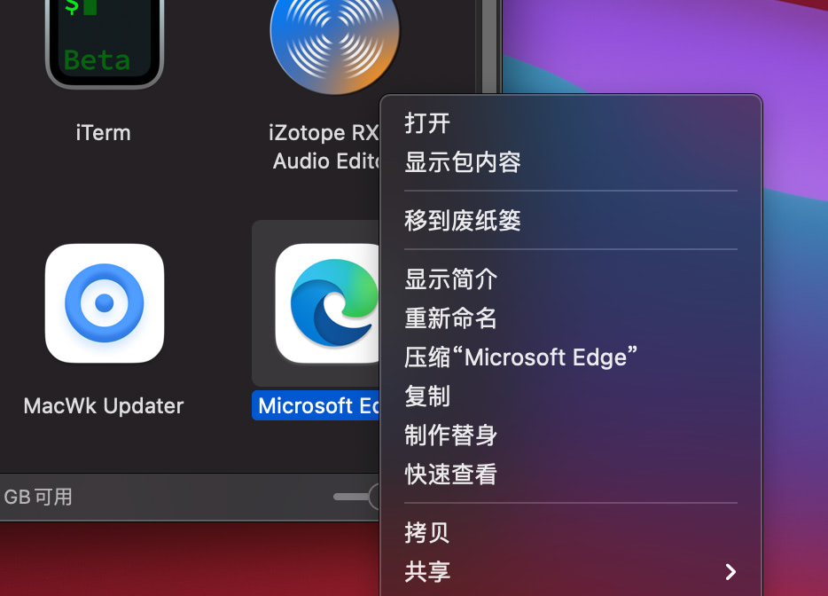

# E彻底卸载Edge

## 步骤1：卸载 Microsoft Edge 应用程序主体

1在空白桌面时，点击「前往」菜单，选择并打开「应用程序」文件夹；或者直接使用 ⇧Shift + ⌘Command + A 快捷键打开「应用程序」


2找到 Microsoft Edge 应用程序主体——右击鼠标选择将其「移到废纸篓」



## 步骤1：移除 Microsoft Edge 残余文件

1. 在空白桌面时，点击「前往」菜单——选择「前往文件夹…」选项，或者使用 ⇧Shift + ⌘Command + G 快捷键打开「前往文件夹」窗口。

2. 在路径中输入 ~/资源库 ——点击「前往」按钮打开「资源库」文件夹。

3. 在「资源库」文件夹中找到并打开「Application Support」文件夹——删除其中的 Microsoft Edge 文件夹

```
~/资源库/Application Support/
```

 


 

4. 在 ~/资源库/Caches/ 文件夹中找到并删除其中的 Microsoft Edge 文件夹

5. 在 ~/资源库/Saved Application State/ 文件夹中找到并删除其中的 com.microsoft.edgemac.savedState 文件夹

6. 在 ~/资源库/WebKit/ 文件夹中找到并删除其中的 com.microsoft.edgemac 文件夹

7. 在 ~/资源库/Preferences/ 文件夹中找到并删除其中的 com.microsoft.edgemac.plist 文件

在完成上述所有步骤后，我们就已经通过手动方式在 macOS 系统中完整卸载了 Microsoft Edge 浏览器。
