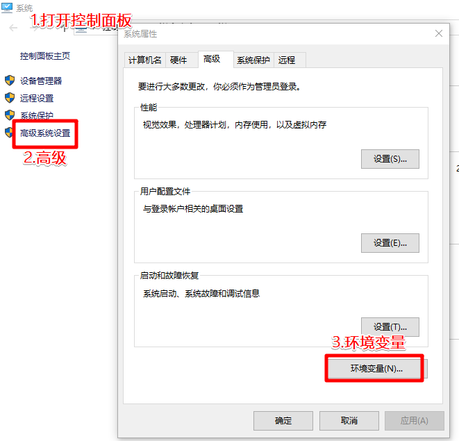

# Win10安装cygwin并添加apt-cyg

 1.去Cygwin官网：https://www.cygwin.com/

[](https://images2018.cnblogs.com/blog/871381/201803/871381-20180313112635620-1563912802.png)

进入上图的install链接（下图），根据自己的电脑选择32位还是64位

[](https://images2018.cnblogs.com/blog/871381/201803/871381-20180313112755562-134467431.png)

我选择了一个32位的：

[](https://images2018.cnblogs.com/blog/871381/201803/871381-20180313112942021-1176481399.png)

[](https://images2018.cnblogs.com/blog/871381/201803/871381-20180313113003153-888227303.png)

[](https://images2018.cnblogs.com/blog/871381/201803/871381-20180313113015669-1356366809.png)

[](https://images2018.cnblogs.com/blog/871381/201803/871381-20180313113031902-1984739256.png)

[](https://images2018.cnblogs.com/blog/871381/201803/871381-20180313113143089-723694703.png)

[](https://images2018.cnblogs.com/blog/871381/201803/871381-20180313113154389-340535926.png)

一直下一步下图：

[](https://images2018.cnblogs.com/blog/871381/201803/871381-20180313113319056-609922352.png)

163镜像链接：

```
http://mirrors.163.com/
```

 下图中选择要安装的包：

 [](https://images2018.cnblogs.com/blog/871381/201803/871381-20180313113431365-1905961524.png)

[](https://images2018.cnblogs.com/blog/871381/201803/871381-20180313113625885-485957028.png)

为什么要安装apt-cyg?

安装了apt-cyg就能向使用Ubuntu一样使用apt-get install/remove命令安装卸载软件了，非常方便。

安装apt-cyg需要依赖的包有如下几个，在上图的页面中都选择上：

```
wget
tar
gawk
bzip2
```

 [](https://images2018.cnblogs.com/blog/871381/201803/871381-20180313114023790-36307915.png)

然后一路下一步就可以了。

 2.添加apt-cyg

去GitHub下载脚本：https://github.com/transcode-open/apt-cyg

[](https://images2018.cnblogs.com/blog/871381/201803/871381-20180313114154032-69391022.png)

解压刚刚下载的zip文件：

[](https://images2018.cnblogs.com/blog/871381/201803/871381-20180313114305601-782327269.png)

[](https://images2018.cnblogs.com/blog/871381/201803/871381-20180313114408945-1880256884.png)

打开Cygwin

[](https://images2018.cnblogs.com/blog/871381/201803/871381-20180313114715003-666815775.png)

输入：

```
apt-cyg install vim
```

 [](https://images2018.cnblogs.com/blog/871381/201803/871381-20180313114524664-733350106.png)

由于我已经安装过，所以这里就跳过了，这句命令测试apt-cyg是否成功运行。

3.添加环境变量一边在cmd或者powershell中可以使用Linux命令

[](https://images2018.cnblogs.com/blog/871381/201803/871381-20180313114858185-1458107564.png)

[](https://images2018.cnblogs.com/blog/871381/201803/871381-20180313115012168-216445240.png)

[](https://images2018.cnblogs.com/blog/871381/201803/871381-20180313115154156-1009478494.png)

[](https://images2018.cnblogs.com/blog/871381/201803/871381-20180313115305252-316236999.png)