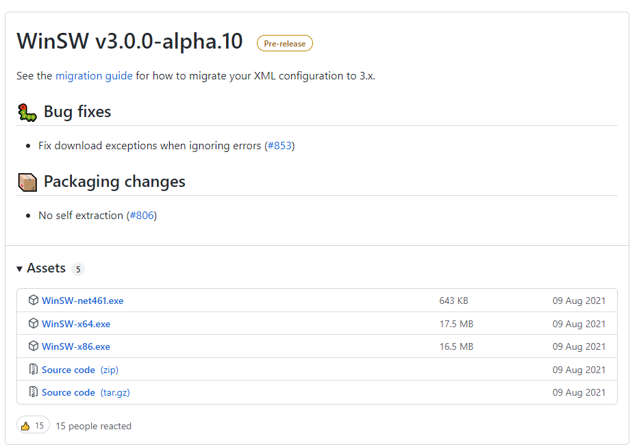
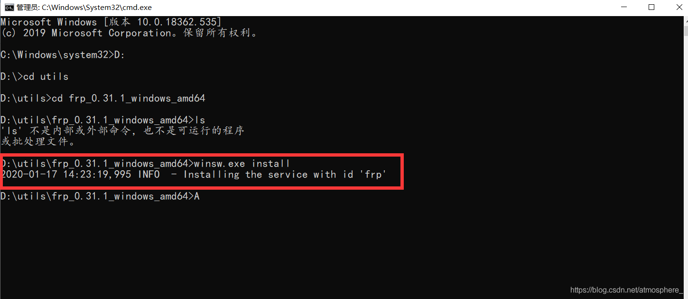

# windows 配置frpc并且开机自启

### 1.此处需要使用到winsw 下载地址: https://github.com/kohsuke/winsw/releases

### 2.下载解压至任意目录并CD进入;



这里将下载WinSW-x64.exe重命名为winsw.exe了，以方便后面操作;

### 3.创建与winsw同名的配置文件，后缀为xml

此处以配置FRP客户端为例:

```xml
<service>
	<!-- 该服务的唯一标识 -->
    <id>frp</id>
    <!-- 该服务的名称 -->
    <name>frp_0.41.0_windows_amd64</name>
    <!-- 该服务的描述 -->
    <description>frpc客户端 这个服务用 frpc 实现内网穿透</description>
    <!-- 要运行的程序路径 -->
    <executable>D:\app\frp_0.41.0_windows_amd64\frpc.exe</executable>
    <!-- 携带的参数 -->
    <arguments>-c frpc.ini</arguments>
    <!-- 第一次启动失败 60秒重启 -->
    <onfailure action="restart" delay="60 sec"/>
    <!-- 第二次启动失败 120秒后重启 -->
    <onfailure action="restart" delay="120 sec"/>
    <!-- 日志模式 -->
    <logmode>append</logmode>
    <!-- 指定日志文件目录(相对于executable配置的路径) -->
    <logpath>logs</logpath>
</service>
```

### 4.开始使用

```bash
//注册服务
winsw.exe install
//卸载服务
winsw.exe uninstall
//启动服务
winsw.exe start
//停止服务
winsw.exe stop
//重启服务
winsw.exe restart
//查看状态
winsw.exe status
```



### 5.不出意外的话打开任务管理器就能看到刚刚添加的服务了

