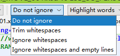

## Idea 行注释设置（不显示在行首）

进入 Settings -> Code Style -> Java ，在右边选择 “Code Generation” Tab，然后找到 Comment Code 那块，把 
Line comment at first column 
Block comment at first column 
去掉前面两个的复选框

## Intellij IDEA运行报command line is too long. shorten command line for xxx 解法


解决方法：

在项目/.idea/workspace.xml文件中添加一行代码如下

```xml
<component name="PropertiesComponent">
  ...
 <property name="dynamic.classpath" value="true" />
</component>
```

## compare

（1）对比和剪贴板
直接将需要对比的文件复制到剪贴板（Ctrl+C）上，直接在idea中右击Compare with Clipboard即可显示差异。


 

2 对比和文件
1、首先，选中要比对的文件右键选择Compare With.


2、选择本地需要带比对的文件，双击即可。


3、显示出对比的文件。


四种对比的区别：



1. Do not ignore：所有差异都会突出显示。默认情况下选择此选项。

2. Trim whitespaces：修剪空格 。("\t", " ")如果它们出现在行的末尾和行的开头。如果两行仅在尾随空格中不同，则这些行被认为是相等的。如果两行不同，则在“ 按字”模式下不会突出显示此类尾随空格。

3. Ignore whitespaces：忽略空格。白色空格并不重要，无论它们在源代码中的位置如何。

4. Ignore imports and formatting：忽略空格和空行：忽略以下实体：所有空格（如'忽略空白'选项）。所有添加或删除的行仅包含空格。所有更改包括拆分或连接线而不更改非空白部分。例如，在此模式下不会突出显示更改a b c为a \n b c。

突出显示模式：


