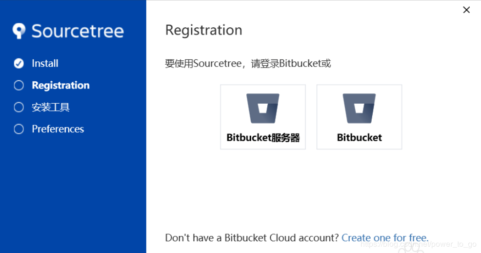

# Source Tree

## 1、跳过注册

前提：安装Git

1. 下载Windows系统可执行文件SourceTreeSetup-3.1.3.exe

2. 双击安装，会出现如下界面：

3. 增加accounts.json文件

   `C:\Users\当前用户文件夹\AppData\Local\Atlassian\SourceTree`添加accounts.json文件，内容如下：

   ```json
   [
     {
       "$id": "1",
       "$type": "SourceTree.Api.Host.Identity.Model.IdentityAccount, SourceTree.Api.Host.Identity",
       "Authenticate": true,
       "HostInstance": {
         "$id": "2",
         "$type": "SourceTree.Host.Atlassianaccount.AtlassianAccountInstance, SourceTree.Host.AtlassianAccount",
         "Host": {
           "$id": "3",
           "$type": "SourceTree.Host.Atlassianaccount.AtlassianAccountHost, SourceTree.Host.AtlassianAccount",
           "Id": "atlassian account"
         },
         "BaseUrl": "https://id.atlassian.com/"
       },
       "Credentials": {
         "$id": "4",
         "$type": "SourceTree.Model.BasicAuthCredentials, SourceTree.Api.Account",
         "Username": "",
         "Email": null
       },
       "IsDefault": false
     }
   ]
   ```

   

4. `user.config`

   编辑文件`C:\Users\当前用户文件夹\AppData\Local\Atlassian\SourceTree.exe_Url_2pp5ph5o52ezn1jhauso0c3bpdeplqgk\3.1.3.3158\user.config`，`configuration` `userSettings`` SourceTree.Properties.Settings` 之下添加以下 6 行内容：

   ```xml
   <setting name="AgreedToEULA" serializeAs="String">
           <value>True</value>
   </setting>
   <setting name="AgreedToEULAVersion" serializeAs="String">
           <value>20160201</value>
   </setting>
   ```

5. 重新点击可执行文件SourceTreeSetup-3.1.3.exe，选择最后一项：我不需要mercurial