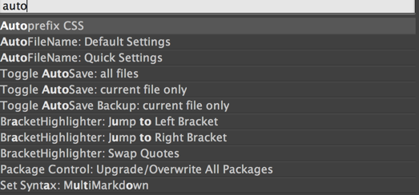
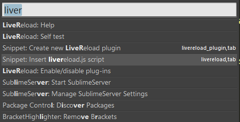
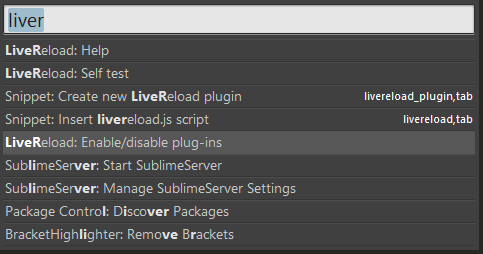
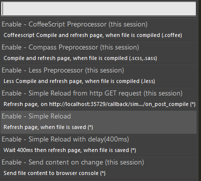
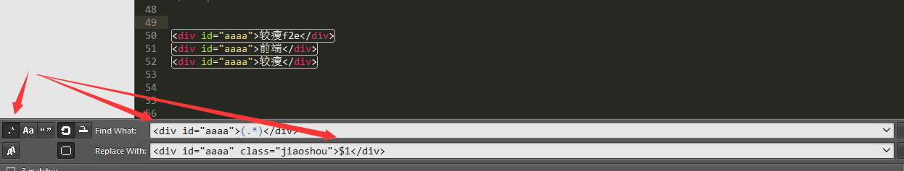

# [sublime text3插件使用](https://www.cnblogs.com/jiaoshou/p/4356156.html)

## 一、常用配置设置

### 一、安装emmet、Package Control插件

ctrl+shift+p -> install package ->emmet(Zen Coding)[默认安装文件路径F:\Sublime Text 3\Data\Installed Packages]

安装Package Control插件

报错情况 Package Control:There are no packages available for installation
直接将文件放到Sublime Text\Data\Packages\Package Control下面重启sublime软件即可


### 二、Sublime Text 打开Preferences--->Settings-User配置

```json
{
    "ignored_packages":
    [
        "Vintage"
    ],
    "font_size": 12,
    // 左侧列表中文文件名显示方框
    "dpi_scale": 1.0,
    // 自动换行
    "word_wrap" : true,
    // 文件失去焦点自动保存文件
    "save_on_focus_lost": true,
    // 关闭软件更新提示
    "update_check": false
}
```

　 

### 三、设置F12预览快捷键

1、 点击菜单Tools -> New Plugin...（工具->新插件…），在创建好的py文件输入下列内容：

```python
import sublime, sublime_plugin
import webbrowser
  
url_map = {
    '/Users/jerry/Sites/test/' : 'http://test/',
}
  
class OpenBrowserCommand(sublime_plugin.TextCommand):
    def run(self,edit):
        window = sublime.active_window()
        window.run_command('save')
        url = self.view.file_name()
        for path, domain in url_map.items():
            if url.startswith(path):
                url = url.replace(path, domain).replace('\\', '\/')
                break
  
        webbrowser.open_new(url)
```

　　

将文件保存到Packages/User目录（Packages可通过菜单里的Browser Packages...打开），文件名随意，如open_browser.py。插件部分完工了。

2、 接下来，为刚才的插件分配快捷键。点菜单Tools -> Command Palette...（工具- >命令面板…），或者shift+cmd+p，打开命令集，选择“key Bindings - User”（手动输入 key Bindings就会出现相应提示）打开个人快捷键配置，输入下列内容：

```json
[{ "keys": ["f12"], "command": "open_browser" }]
```

\---------------------------------------------------------------------------------------------------------------------------------------------------------

## 二、sublime text 插件

### 一、auto_save文件自动保存

打开Preferences--->Package-Settings--->Auto_save--->Settings-Use配置里面添加

```json
{
    "auto_save_on_modified": true,
    "auto_save_delay_in_seconds":5
}
```

### 二、Terminal运行框

#### 打开cmd窗口配置

打开Preferences--->Package-Settings--->Terminal--->Settings-Use配置里面添加

> Windows

```json
{
　　//window下终端路径
　　"terminal": "C:\\windows\\system32\\cmd.exe",
　　//window下终端参数
　　"parameters": ["/START", "%CWD%"]
}
```

>  Mac 

```json
{
  //mac 下配置终端 
  "terminal": "Terminal.sh",
  "parameters": ["--open-in-tab"]
}
```

#### 打开git bash窗口配置

打开Preferences--->Package-Settings--->Terminal--->Settings-Use配置里面添加

```json
{
 
　　// The command to execute for the terminal, leave blank for the OS default
　　// On OS X the terminal can be set to iTerm.sh to execute iTerm
　　// "terminal": "C:\\Program Files (x86)\\Git\\bin\\sh.exe",
　　"terminal": "D:\\Git\\bin\\sh.exe",
 
　　// A list of default parameters to pass to the terminal, this can be
　　// overridden by passing the "parameters" key with a list value to the args
　　// dict when calling the "open_terminal" or "open_terminal_project_folder"
　　// commands
　　// "parameters": ["-c", "cd \"%CWD%\" && \"C:\\Program Files (x86)\\Git\\bin\\sh.exe\" -i -l"]
　　"parameters": ["-c", "cd \"%CWD%\" && \"D:\\Git\\bin\\sh.exe\" -i -l"]
 
}
```

#### 打开cmder窗口配置

a、把 Cmder 加到环境变量

把Cmder.exe存放的目录添加到系统环境变量；加完之后,Win+r一下输入cmder,即可。

b、添加 cmder 到右键菜单添加后在任意文件夹中即可打开Cmder，上一步的把 Cmder 加到环境变量就是为此服务的, 在管理员权限的终端输入以下语句即可: Cmder.exe /REGISTER ALL

打开Preferences--->Package-Settings--->Terminal--->Settings-Use配置里面添加

```json
{
 
　　// The command to execute for the terminal, leave blank for the OS default
　　// On OS X the terminal can be set to iTerm.sh to execute iTerm
　　// "terminal": "C:\\Program Files (x86)\\Git\\bin\\sh.exe",
　　"terminal": "E:\\cmder\\Cmder.exe",
 
　　// A list of default parameters to pass to the terminal, this can be
　　// overridden by passing the "parameters" key with a list value to the args
　　// dict when calling the "open_terminal" or "open_terminal_project_folder"
　　// commands
　　// "parameters": ["-c", "cd \"%CWD%\" && \"C:\\Program Files (x86)\\Git\\bin\\sh.exe\" -i -l"]
　　"parameters": ["/START", "%CWD%"]
 
}	
```

还可以设置按键

打开Preferences--->Package-Settings--->Terminal--->Key Bindings-Default配置里面添加

```json
[
　　{ "keys": ["ctrl+shift+t"], "command": "open_terminal" },
　　{ "keys": ["ctrl+shift+alt+t"], "command": "open_terminal_project_folder" }
]
```

　　 

### 三、AutoFileName显示文件路径

### 四、BracketHighlinghter显示标签对提示

### 五、SublimeServer简易本地服务器环境

### 六、Babel 编写ES6

### 七、Autoprefixer自动生成css3前缀

前提要先安装nodejs,配置默认兼容浏览器版本 打开Preferences--->Package-Settings--->Autopreifxer--->Autoprefixer Settings-Use配置里面添加

```json
{``  ``"browsers": ["last 1 version", "> 10%", "> 5% in US", "ie 8", "ie 7"]``}
```

可选浏览器列表

```json
browserslist('last 1 version, > 10%');``//=> ["and_chr 51", "chrome 52", "chrome 51", "edge 13", "firefox 47",``//  "ie 11", "ie_mob 11", "ios_saf 9.3", "opera 38", "safari 9.1"]
```

　

```
You can specify the versions by queries (case insensitive):` `last 2 versions: the last 2 versions for each major browser.``last 2 Chrome versions: the last 2 versions of Chrome browser.``> 5%: versions selected by global usage statistics.``> 5% in US: uses USA usage statistics. It accepts two-letter country code.``> 5% in my stats: uses custom usage data.``ie 6-8: selects an inclusive range of versions.``Firefox > 20: versions of Firefox newer than 20.``Firefox >= 20: versions of Firefox newer than or equal to 20.``Firefox < 20: versions of Firefox less than 20.``Firefox <= 20: versions of Firefox less than or equal to 20.``Firefox ESR: the latest [Firefox ESR] version.``iOS 7: the iOS browser version 7 directly.``not ie <= 8: exclude browsers selected before by previous queries. You can add not to any quer
```

配置完毕后，只需在css文件中选择Autoprefix CSS即可

　　　

 

### 八、FileHeader自动生成文件修改时间插件

配置默认字段模板 打开Preferences--->Package-Settings--->File Header--->Settings-Use配置里面添加

```json
{
    "Default": {
        "author":"JiaoShouf2e",
        "last_modified_by":"JiaoShouf2e"
    }
}
```

　　

### 九、DocBlockr自动生成注释模板

　　配置注释模板 打开Preferences--->Package-Settings--->DocBlockr--->Settings-Use配置里面添加

```json
{
    "jsdocs_extra_tags":["@Author JiaoShouf2e","@DateTime {{datetime}}"]
}
```

　　

### 十、SFTP文件上传插件

### 十一、JsFormat js文件格式化插件 

HTMLPrettify html、css、js格式化插件 均可配置成自动保存格式化

### 十二、LiveReload 浏览器自动刷新插件

　　安装LiveReload扩展（chrome） https://chrome.google.com/webstore/detail/livereload/jnihajbhpnppcggbcgedagnk

　　给文档添加监测代码

　　

　　2、选LiveReload: Enable/disable plug-ins

　　

　　3、选Enable - SimpleReload

　　

\---------------------------------------------------------------------------------------------------------------------------------------------------------

## sublime text 默认配置

 

```json
// 默认设置
{
    // 配色方案
    "color_scheme": "Packages/Color Scheme - Default/Monokai.tmTheme",
 
    // 字体
    "font_face": "",
    // 字号
    "font_size": 10,
    // 字型
    "font_options": [],
 
    // 双击选中的分隔字符
    "word_separators": "./\\()\"'-:,.;<>~!@#$%^&*|+=[]{}`~?",
 
    // 显示行号
    "line_numbers": true,
    // 显示行号边界
    "gutter": true,
    // 行号边界和文字的间距
    "margin": 4,
 
    // 显示代码折叠按钮
    "fold_buttons": true,
    // 代码折叠按钮，鼠标移开时隐藏
    "fade_fold_buttons": true,
 
    // 垂直标尺宽度（单位：字符）
    "rulers": [],
 
    // 拼写检查
    "spell_check": false,
 
    // 制表符大小（单位：字符）
    "tab_size": 4,
    // 制表符转换为空格
    "translate_tabs_to_spaces": false,
    // 按制表符大小来插入及删除
    "use_tab_stops": true,
    // 载入时检查缩进
    "detect_indentation": true,
    // 回车键自动对齐缩进
    "auto_indent": true,
    // 针对 C 语言的花括号自动对齐
    "smart_indent": true,
    // 缩进时对齐括号
    "indent_to_bracket": false,
    // 移出一行时去除自动缩进的空白
    "trim_automatic_white_space": true,
 
    // 自动换行
    "word_wrap": "auto",
    // 换行宽度（单位：字符）
    "wrap_width": 0,
    // 防止被缩进到同一级的字符换行
    "indent_subsequent_lines": true,
 
    // 窗口居中显示
    "draw_centered": false,
 
    // 自动匹配引号、括号等
    "auto_match_enabled": true,
 
    // 拼写检查的单词列表
    "dictionary": "Packages/Language - English/en_US.dic",
    // 拼写检查的范围
    "spelling_selector": "markup.raw, source string.quoted - punctuation - meta.preprocessor.c.include, source comment - source comment.block.preprocessor, -(source, constant, keyword, storage, support, variable, markup.underline.link, meta.tag)",
 
    // 缩略图边框
    "draw_minimap_border": false,
    // 默认显示缩略图
    "always_show_minimap_viewport": false,
 
    // 当前行高亮
    "highlight_line": false,
 
    // 光标闪动方式
    "caret_style": "smooth",
    // 光标尺寸（单位：像素）
    "caret_extra_top": 0,
    "caret_extra_bottom": 0,
    "caret_extra_width": 0,
 
    // 当前匹配的闭合标签高亮
    "match_brackets": true,
    // 当前匹配的闭合标签（圆括号）高亮
    "match_brackets_content": true,
    // 当前匹配的闭合标签（方括号）高亮
    "match_brackets_square": true,
    // 当前匹配的闭合标签（大括号）高亮
    "match_brackets_braces": true,
    // 当前匹配的闭合标签（尖括号）高亮
    "match_brackets_angle": false,
 
    // 当前匹配的闭合标签（HTML 及 XML）高亮
    "match_tags": true,
    // 当前选中字符的其他相同字符高亮
    "match_selection": true,
 
    // 行距（单位：像素）
    "line_padding_top": 0,
    "line_padding_bottom": 0,
 
    // 超过页尾时滚动
    "scroll_past_end": true,
    // 页首或页尾的移动限制
    "move_to_limit_on_up_down": false,
 
    // 显示空白标记
    "draw_white_space": "selection",
    // 显示缩进标记
    "draw_indent_guides": true,
    // 缩进标记的选项
    "indent_guide_options": ["draw_normal"],
 
    // 保存时，删除行尾多余的空白
    "trim_trailing_white_space_on_save": false,
    // 保存时，页尾确保为空行
    "ensure_newline_at_eof_on_save": false,
    // 失去焦点时，文件自动保存
    "save_on_focus_lost": false,
    // 恢复原始保存
    "atomic_save": false,
 
    // 回调编码格式
    "fallback_encoding": "Western (Windows 1252)",
    // 默认编码格式
    "default_encoding": "UTF-8",
    // 使用 HEX 编码格式打开包含空字节的文件
    "enable_hexadecimal_encoding": true,
    // 行尾终止符默认的编码格式
    "default_line_ending": "system",
 
    // 制表键补全
    "tab_completion": true,
 
    // 自动完成
    "auto_complete": true,
    // 自动完成的大小限制
    "auto_complete_size_limit": 4194304,
    // 自动完成的延时（单位：毫秒）
    "auto_complete_delay": 50,
    // 自动完成的范围
    "auto_complete_selector": "meta.tag - punctuation.definition.tag.begin, source - comment - string.quoted.double.block - string.quoted.single.block - string.unquoted.heredoc",
    // 触发自动完成的其他情况
    "auto_complete_triggers": [ {"selector": "text.html", "characters": "<"} ],
    // 自动完成上屏后换行
    "auto_complete_commit_on_tab": false,
    // 自动完成跟随活跃字段
    "auto_complete_with_fields": false,
    // 自动完成循环选择提示
    "auto_complete_cycle": false,
 
    // 自动闭合匹配的 HTML 及 XML 标签
    "auto_close_tags": true,
 
    // 转换键 + 制表键取消缩进
    "shift_tab_unindent": false,
 
    // 空选择的复制与剪切
    "copy_with_empty_selection": true,
    // 查找文本框默认显示选中的文本
    "find_selected_text": true,
    // 自动在选中的范围内搜索
    "auto_find_in_selection": false,
    // 拖拽选中的文本
    "drag_text": true,
 
    //
    // 用户界面设置
    //
 
    // 界面主题
    "theme": "Default.sublime-theme",
 
    // 平滑滚动速度
    "scroll_speed": 1.0,
 
    // 侧边栏文件夹动画
    "tree_animation_enabled": true,
    // 动画总控制
    "animation_enabled": true,
 
    // 高亮未保存的文件
    "highlight_modified_tabs": false,
    // 显示标签页的关闭按钮
    "show_tab_close_buttons": true,
    // 加粗显示侧边栏的文件夹标签
    "bold_folder_labels": false,
 
    // OS X 平台选项
    "use_simple_full_screen": false,
    "gpu_window_buffer": "auto",
 
    // 显示滚动条
    "overlay_scroll_bars": "system",
    // 滚动标签栏
    "enable_tab_scrolling": true,
 
    // 状态栏显示文件编码格式
    "show_encoding": false,
    // 状态栏显示行尾编码格式
    "show_line_endings": false,
 
    //
    // 程序行为设置
    //
 
    // 热退出：关闭时不提示，打开时恢复退出前状态
    "hot_exit": true,
 
    // 记住全屏显示
    "remember_full_screen": false,
 
    // 总是提示文件被修改
    "always_prompt_for_file_reload": false,
 
    // OS X 平台选项
    "open_files_in_new_window": true,
    "create_window_at_startup": true,
 
    // 窗口跟随最后一个标签关闭
    "close_windows_when_empty": false,
 
    // 标题栏显示完整路径
    "show_full_path": true,
 
    // 编译时显示结果面板
    "show_panel_on_build": true,
 
    // 侧边栏的文件单击预览
    "preview_on_click": true,
    // 侧边栏的文件夹排除
    "folder_exclude_patterns": [".svn", ".git", ".hg", "CVS"],
    // 侧边栏的文件排除
    "file_exclude_patterns": ["*.pyc", "*.pyo", "*.exe", "*.dll", "*.obj","*.o", "*.a", "*.lib", "*.so", "*.dylib", "*.ncb", "*.sdf", "*.suo", "*.pdb", "*.idb", ".DS_Store", "*.class", "*.psd", "*.db", "*.sublime-workspace"],
    // 侧边栏的文件保留
    "binary_file_patterns": ["*.jpg", "*.jpeg", "*.png", "*.gif", "*.ttf", "*.tga", "*.dds", "*.ico", "*.eot", "*.pdf", "*.swf", "*.jar", "*.zip"],
    // 侧边栏的文件索引
    "index_files": true,
    // 侧边栏的文件索引线程
    "index_workers": 0,
    // 侧边栏的文件索引排除
    "index_exclude_patterns": ["*.log"],
 
    // 忽略插件，重启后生效
    "ignored_packages": ["Vintage"]
}
```

\---------------------------------------------------------------------------------------------------------------------------------------------------------

## sublime text 快捷键

Ctrl+D:按词，多按++(过程中如果想跳过某个选项，Ctrl+k即可)
Alt+F3:按下全选一类
列选模式：鼠标右键+shift(Ctrl + Alt + Down)
Ctrl+kk:删除行
Ctrl+Shift+D:复制光标所在整行，插入在该行之前
Ctrl+J:合并行（已选择需要合并的多行时）
Ctrl+KU:改为大写
Ctrl+KL:改为小写 
Ctrl+Shift+↑ 向上移动一行
Ctrl+Shift+↓ 向下移动一行
Ctrl+M:光标移动至括号内开始或结束的位置
Ctrl+Shift+M:选择括号内的内容（按住-继续选择父括号）
Ctrl+Y:恢复撤销
Ctrl+Shift+A:选择光标位置父标签对儿
Ctrl+Shift+[:折叠代码
Ctrl+Shift+]:展开代码
Ctrl+KT:折叠属性 
Ctrl+K0:展开所有
Ctrl+T:词互换
Ctrl+Shift+UP:与上行互换
Ctrl+Shift+DOWN:与下行互换
Ctrl+Enter:插入行后 
Ctrl+Shift Enter:插入行前
ctrl + g,或ctrl + p,再输入 : 数字 可以跳转到行
ctrl + r 或 ctrl + p ,在执行@。 之后填写要搜索的函数名

选中一对标签(标签开头和标签结尾),Ctrl+Shift+'

按Cmd-Shift-Y (Win: Ctrl-Shift-Y)计算数值

 

正则替换

目标

将类似 <div id="aaaa">1</𝑑𝑖𝑣>这样的语句替换成<𝑑𝑖𝑣𝑖𝑑="𝑎𝑎𝑎𝑎"𝑐𝑙𝑎𝑠𝑠="𝑗𝑖𝑎𝑜𝑠ℎ𝑜𝑢">1</div>这样的语句替换成<divid="aaaa"class="jiaoshou">1</div>

替换方法

调出查找和替换界面
点下最左侧的.*按钮，启用正则搜索
Find What界面中输入 "<div id="aaaa">(.*)</div>"，别忘了这儿的小括号
Replace With中输入 "<div id="aaaa" class="jiaoshou">1</𝑑𝑖𝑣>"这儿的1</div>"这儿的1就代表了第一个括号中匹配的内容
Replace ALL！

<div id="aaaa">较瘦f2e</div> <div id="aaaa">前端</div> <div id="aaaa">较瘦</div>



 

稍微再加点限制：

<div id="aaaa">较瘦f2e</div> <span id="bbbb">前端</span> <a id="cccc">较瘦</a>

Find What界面中输入  <(.*) id=(.*)>(.*)</(.*)> 
Replace With中输入 <1𝑖𝑑=1id=2 class="jiaoshou">3</3</4> 


E
元素名（div、p）；
eg:<div></div>、<p></p>

E#id
带Id的元素（div#content、p#intro、span#error）；
eg:<div id="content"></div>、<p id="intro"></p>、<span id="error"></span>

E.class
带class的的元素（div.header、p.error）,id和class可以连着写，div#content.column
eg:<div class="header"></div>、<p class="error"></p>、<div id="content" class="column"></div>

使用E[attr]添加属性
使用E{text}添加文本

E>N 生成彼此嵌套的元素
子元素（div>p、div#footer>p>span）
eg:<div>
<p></p>
</div>、<div id="footer">
<p><span></span></p>
</div>

E*N 多项元素（ul#nav>li*5>a） eg:<ul id="nav"> <li><a href=""></a></li> <li><a href=""></a></li> <li><a href=""></a></li> <li><a href=""></a></li> <li><a href=""></a></li> </ul>

E+N 用来生成彼此相邻的元素
多项元素(div+p+a+ul+li)
eg:<div></div>
<p></p>
<a href=""></a>
<ul></ul>
<li></li>

E∗𝑁带序号的元素(𝑑𝑖𝑣∗N带序号的元素(div*5)
eg:<div1></div1>
<div2></div2>
<div3></div3>
<div4></div4>
<div5></div5>