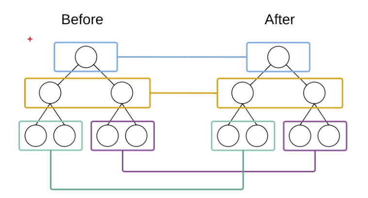

# React 

* 清楚两个概念

  * library：小而巧是库，只提供了特定的挨api，优点是船小好调头，可以很方便从一个库切换到另外的库，但是代码几乎不会改变
  * Framework:大而全是框架，提供一整套的解决方案，所以在项目中间，想要切换到另外的框架，是比较困难的

* 三大框架

  > 三大框架一大抄

  * Angular.js：出现最早的前端框架
  * Vue.js：**最火**(关注的人比较多)的一门框架
  * React.js:**最流行**(使用的人最多)的框架

## 1、React/Vue 对比

### 1.组件化方面

1. **什么是模块化**

   是从**代码**的角度来进行分析；把可复用的代码提取为单个模块，便于项目的维护和开发；比如Node中

2. **什么是组件化**

   是从**UI界面**的角度来进行分析；把可复用的UI元素抽离为单独组件，便于项目的维护和开发

3. **组件化的好处**

   随着项目的增大，手里的组件就会越来越多，很方便就可以把现有的组件拼接成一个页面

4. **vue如何实现组件化**

   Vue.component()

   Vue.extends()

   通过.vue的模板文件来创建组件

   * template 结构
   * script 行为
   * style 样式

5. **react如何实现组件化**

   react中存在组件化概念，并没有像vue的模板文件，**在react中，一切都是以js来表现的**，因此要学习react，js要合格，ES6和ES5都要会用


### 2.开发团队

* react Facebook开发
* vue 由游雨溪开发

### 3.社区方面

### 4.移动APP开发团队

## 2、为什么学习React

1. 与Angular相比，设计更优秀，一切基于js并且实现了组件化开发的思想
2. 开发团队实力强悍，不必担心断更的情况
3. 社区强大，很多问题都能找到对应的解决方案
4. 提供了无缝转到React Native上的开发体验，让开发能力得到拓展
5. 很多企业中，前端项目的技术选型采用React.js

## 3、React核心概念

### 3.1 虚拟DOM(Virtual Document Object Model)

* DOM本质是什么

  **浏览器中的概念**，用js对象来表示页面上面的元素，提供了操作DOM对象的API

* 什么是React中的虚拟DOM

  **框架中概念**，是程序员用**js对象**来模拟页面上的DOM和DOM嵌套关系

* 为什么要实现虚拟DOM(虚拟DOM的目的)：

  为了实现在页面中，DOM元素的高效更新

* DOM和虚拟DOM的区别

  * DOM：浏览器中概念，用JS对象表示页面上的元素，并提供了操作元素的API
  * 虚拟DOM：**框架中概念**，是开发框架的程序员手动用**js对象**来模拟页面上的DOM元素和DOM嵌套关系
    * 本质：用**js对象**来模拟页面上的DOM元素和DOM嵌套关系
    * 目的：为了实现在页面中，元素的高效更新

  >1. 虚拟DOM不会进行排版与重绘操作
  >2. 虚拟DOM进行频繁修改，然后一次性比较并修改真实DOM中需要改的部分（注意！），最后并在真实DOM中进行排版与重绘，减少过多DOM节点排版与重绘损耗
  >3. 真实DOM频繁排版与重绘的效率是相当低的
  >4. 虚拟DOM有效降低大面积（真实DOM节点）的重绘与排版，因为最终与真实DOM比较差异，可以只渲染局部（同2）
  >
  >使用虚拟DOM的损耗计算：
  >
  >```undefined
  >总损耗 = 虚拟DOM增删改 + （与Diff算法效率有关）真实DOM差异增删改 + （较少的节点）排版与重绘
  >```
  >
  >直接使用真实DOM的损耗计算：
  >
  >```undefined
  >总损耗 = 真实DOM完全增删改 + （可能较多的节点）排版与重绘
  >```
  >
  >**总之，一切为了减弱频繁的大面积重绘引发的性能问题，不同框架不一定需要虚拟DOM，关键看框架是否频繁会引发大面积的DOM操作**

  

### 3.2 diff算法

* tree diff

  新旧两颗DOM数，逐层对比的过程，就是tree diff算法；当整颗DOM逐层对比完毕，则所有需要被按需更新的元素就可以找到

* component diff

  在进行tree diff的时候，每一层中，组件级别的对比，叫做component diff

  * 如果对比前后，组件类型相同，则**暂时**为当前组件不需要被更新
  * 如果对比前后，组件类型不同，则需要移除就组件，创建新组件，并追加到页面上

* element diff

  在进行component diff的时候，组件类型相同，则进行元素级别的对比，这叫做Element diff

   

   

## 4、创建基本的webpack 4.x项目

1. 初始化项目

   ```bash
   npm init -y
   ```

2. 创建目录

   ```bash
   mkdir src dist
   ```

3. 创建文件index.html和入口文件index.js

4. 安装webpack webpack-cli

   ```bash
   cnpm install webpack webpack-cli -D
   ```

5. 注意：

   * 在webpack 4.x中提供了**约定大于配置**的概念，目的是尽量较少配置文件的体积
   * 默认约定如下：
     * 打包的默认入口文件是：`src/index.js`
     * 打包的默认输出文件是：`dist/main.js`
     * 4.x中新增了mode的判断*必选项*，可选值为 `development`/`production`/`none`

```js
// 向外暴露一个打包配置对象，因为webpack是基于Node构建的，所以webpack支持所有的Node API和语法
module.exports = {
   mode: 'production'  // development  production 
   //  在webpack 4.x 中，有一个很大的特性，约定大于配置，默认的打包入口文件就是src/index.js
}

// export default {} 是否可以使用？
// 目前不行，上述这种写法是ES6的导出模块的API写法，与之对应的是 import * from '标识符'
// 在node中不支持上述写法
// 如果chrome浏览器支持哪些，则Node就支持哪些，主要是因为Node是基于chrome的V8引擎的运行环境
// 如果需要使用es6全部语法则需要使用babel
```

### 4.1 webpack-dev-server 基本使用

将main.js托管的内存中

1. 安装

   ```bash
   cnpm install webpack-dev-server -D
   ```

2. 配置 package.json 

   ```bash
     "scripts": {
       "test": "echo \"Error: no test specified\" && exit 1",
       "dev": "webpack-dev-server"
     },
   ```

   > 参数说明：
   >
   > --content-base 设定`webpack-dev-server`伺服的`directory`，默认是在当前目录下，如果配置了`output`的`publicPath`这个字段的值的话，在`index.html`文件里面也应该做出调整。**因为`webpack-dev-server`伺服的文件是相对`publicPath`这个路径的，因为`webpack-dev-server`伺服的文件是相对`publicPath`这个路径的**
   >
   > ```js
   > module.exports = {
   >         entry: './src/js/index.js',
   >         output: {
   >             path: './dist/js',
   >             filename: 'bundle.js'，
   >             publicPath: '/assets/'
   >         }
   >     }
   > ```
   >
   > Index.html
   >
   > ```html
   > <!DOCTYPE html>
   >     <html lang="en">
   >     <head>
   >         <meta charset="UTF-8">
   >         <title>Demo</title>
   >     </head>
   >     <body>
   >         <script src="assets/bundle.js"></script>
   >     </body>
   >     </html>
   > ```
   >
   > --inline  inline 模式自动刷新
   >
   > --open   打开浏览器
   >
   > --port 3000  指定端口
   >
   > --host 10.0.0.1 指定IP
   >
   > --hot  热加载
   >
   > --progress  显示打包的进度
   >
   > --compress 压缩
   >
   > --quiet 控制台中不输出打包的信息

3. 运行

   ```bash
   cnpm run dev
   ```

   > webpack-dev-server打包好的main.js是托管在内存中，所以在项目的根路径是看不见这个文件的
   >
   > 但是我们可以认为，在项目的根目录中，有一个看不见的main.js

### 4.2 html-webpack-plugin插件

将index.html托管的内存中

配置

```js
const path = require('path')
const HtmlWebpackPlugin = require('html-webpack-plugin') // 导入到内存中生成index.html
// 插件一个插件实例
const htmlPlugin = new HtmlWebpackPlugin({
   template: path.join(__dirname,'./src/index.html'), // 源文件
   filename: 'index.html'  // 生成到内存中文件名称
})
// 向外暴露一个打包配置对象，因为webpack是基于Node构建的，所以webpack支持所有的Node API和语法
module.exports = {
   mode: 'development',  // development  production 
   //  在webpack 4.x 中，有一个很大的特性，约定大于配置，默认的打包入口文件就是src/index.js
   plugins:[
      htmlPlugin
   ]
}
```

## 5、在项目中使用react

### 5.1 安装依赖包

   * react 专门用来创建组件和虚拟DOM的，同时组件的生命周期都在这个包中
   * react-dom 专门进行dom操作的，最主要运行场景是`ReactDOM.render()`

   ```bash
cnpm install react react-dom -S
   ```

### 5.2 插件react运行容器

   在index.html创建容器

   ```html
   <!-- 容器，将来，使用react创建虚拟dom元素，都会被渲染到这个指定容器中 -->
   <div id="app"></div>
   ```

### 5.3 导入包

   在index.js中引入react

   ```js
   import React from 'react'
   import ReactDOM from 'react-dom'
   ```

### 5.4 创建虚拟DOM元素

   ```js
   // 创建虚拟DOM
   // 参数1 创建元素类型，字符串，表示元素的名称
   // 参数2 是一个对象或null，表示当前这个dom元素的属性
   // 参数3 子节点(包括其他虚拟dom或者文本节点)
   // 参数n 其他子节点
   const myH1 = React.createElement('h1',null,'这是一个大大的H1')
   // 配置属性
   const myH1 = React.createElement('h1', {
       id: 'myH1',
       title: 'this is a h1'
   }, '这是一个大大的H1')
   ```

### 5.5 渲染

   ```js
   // 渲染
   // 参数1 要渲染的那个虚拟DOM
   // 参数2 渲染的容器 接收的是一个dom元素
   ReactDOM.render(myH1, document.getElementById('app'))
   ```

### 5.6 元素嵌套

   ```js
   const myH1 = React.createElement('h1', {
       id: 'myH1',
       title: 'this is a h1'
   }, '这是一个大大的H1')
   
   const myDiv = React.createElement('div', {
       id: 'myDiv',
       title: 'this is a div'
   }, '这是一个的DIV',myH1)
   
   // 渲染
   // 参数1 要渲染的那个虚拟DOM
   // 参数2 渲染的容器 接收的是一个dom元素
   ReactDOM.render(myDiv, document.getElementById('app'))
   ```

## 6、jsx语法

### 6.1 项目中使用jsx

在项目中如果使用babel，则需要按照如下的进行安装与配置

##### Babel 7

* 安装插件
  
```bash
# babel插件
cnpm i babel-core babel-loader babel-plugin-transform-runtime -D
# babel语法包
cnpm i babel-preset-env babel-preset-stage-0 babel-preset-react -D
```

* 配置第三方loader `webpack.config.js`

```js
module: { // 所有第三方 模块配置规则
  rules: [ // 第三方匹配规则
    { test: /\.js|.jsx$/, use: 'babel-loader', exclude: /node_modules/}, // babel千万不要忘记exclude排除项node_modules
  ]
}
```

* 添加`.babelrc`配置文件
      
```js
{
  "presets": ["env", "stage-0", "react"],
    "plugins": ["transform-runtime"]
}
// presets 语法
// plugins 插件
```

##### Babel 8

* 安装插件
  
```bash
cnpm install @babel/core babel-loader babel-plugin-import -D
cnpm install @babel/preset-env @babel/preset-react -D
cnpm install @babel/plugin-transform-runtime @babel/plugin-proposal-class-properties -D
cnpm install @babel/runtime -S 
```

* 配置第三方loader `webpack.config.js`
  
```js
module: { // 所有第三方 模块配置规则
  rules: [ // 第三方匹配规则
    { test: /\.js|.jsx$/, use: 'babel-loader', exclude: /node_modules/}, // babel千万不要忘记exclude排除项node_modules
  ]
}
```

* 添加`.babelrc`配置文件
  
```js
{
  "presets": ["@babel/preset-env", "@babel/preset-react"],
  "plugins": ["@babel/plugin-transform-runtime","@babel/plugin-proposal-class-properties"]
}
```

### 6.2 jsx语法

* jsx使用

   ```js
   // 渲染到页面上的dom结构最佳方式，就是直接书写html代码
   // 使用html书写标签 但是这种语法在js中不支持，可以通过安装babel的方式来实现
   // 使用babel来转换这些js中的标签
   // 注意：这种在js中，混合写入类似于html的语法，叫做jsx语法，符合xml规范的js
   //        jsx 语法本质，还是在运行的时候，被转换为React.createElement形式来执行的
   const div = <div id="div" title="div title">这是一个DIV元素</div>
   ```

* jsx本质

  并不是直接将jsx标签直接渲染到页面上，而是在内部先React.createElement形式，在转换

* 在jsx中混合写入js表达式

  在jsx语法中，要把js代码写在`{}`中

  * 渲染数字
  * 渲染字符串
  * 渲染布尔值
  * 为属性绑定值
  * 渲染jsx元素
  * 渲染jsx元素数组
    ```js
    // 字符串
    let a = 10
    // 数字
    let str = "这是一个数字"
    // 布尔类型
    let boo = true
    // 属性
    let title = 'p-tag'
    // jsx元素
    const h1 = <h1>这个一个对象</h1>
    // jsx元素数组
    const arr = [
        <h2>这是H2</h2>,
        <h3>这是H3</h3>
    ]
    ReactDOM.render(
      <div>
        {a}
        <hr />
        {str}
        <hr />
        {boo ? "A" : "B"}
        <hr />
        <p title={title}>这是p</p>
        <hr />
        {h1}
        <hr />
        {arr}
      </div>,
      document.getElementById("app")
    );
    ```

  * 将普通字符数组转为jsx数组并渲染

    ```js
    const strs = ['毛利','柯南','毛利兰','灰原哀']
    // 方案1 外部for循环
names = []
    strs.forEach(item => {
      let temp = <h5>{item}</h>
      names.push(temp)
    })
    ReactDOM.render(
      <div>
        {names}
      </div>,
      document.getElementById("app")
    );
    // 方案2√ arrays.map
    ReactDOM.render(
      <div>
        {strs.map(item => <h5>{item}</h5>)}
      </div>,
      document.getElementById("app")
    );
    ```
    

#### 6.2.1 常用操作

1. 在react中，需要把key添加到被forEach、map、for循环的元素
2. 在jsx中推荐使用`{/*注释内容*/}`
3. 为jsx中元素添加`class`类名：需要使用`className`来替换`class`;`htmlfor`替换`label`的`for`属性
   * 主要是`class`和`for`在`react`中都是关键字
4. 在jsx创建DOM的时候，所有节点必须有**唯一**的根元素进行包裹
5. 在jsx语法中，标签必须成对出现，如果是单标签，则必须闭合

> 在编译引擎编译jsx过程中，
> 如果遇到`<`，那么就会把它当做html进行编译
> 如果遇到`{`，就会把花括号内部的代码当做普通js进行编译

## 7、组件创建

### 7.1 基于构造函数组件创建

> **使用构造函数来创建组件**，如果要接收外界传递的数据，需要在构造函数的参数列表中使用`props`来接收；
> 必须要向外返回一个合法的jsx创建的虚拟DOM

```jsx
// 第一种创建组件
function Hello () {
    // 如果一个组件返回null，表明此组件为空，不渲染
    // return null
    // 必须要向外返回一个合法的jsx创建的虚拟DOM
    return <h1>这是一个好</h1>
}

ReactDOM.render(
  <div>
    123
    {/* 直接把组件以标签形式放在文件中即可 */}
    <Hello></Hello>
  </div>,
  document.getElementById("app")
);

```

1. 父组件向子组件传递数据

   ```jsx
   // 第一种创建组件
   // 在构造函数中，使用props 接收参数
   function Hello(props) {
     // 如果一个组件返回null，表明此组件为空，不渲染
     // return null
     // 必须要向外返回一个合法的jsx创建的虚拟DOM
     // 不论vue还是react，组件中props都是只读的，不能被重新赋值
     return <h1>这是一个好 --- {props.name}</h1>;
   }
   const user = {
     name: "tom",
     age: 3,
     gender: "熊",
   };
   ReactDOM.render(
     <div>
       123
       {/* 直接把组件以标签形式放在文件中即可,使用组件，并为组件传递数据 */}
       <Hello name={user.name} age={user.age} gender={user.gender}></Hello>
     </div>,
     document.getElementById("app")
   );
   ```

2. 使用`{...obj}`属性扩散传递数据

   >`...`三个点用于传参时可以看作是**Rest参数**的逆运算，将一个数组转为用逗号分隔的参数数组,就是说将参数数组展开了传入函数中。
   >
   >```javascript
   >let a = [1,2,3]
   >function f(x1,x2,x3){
   >	...
   >}
   >f(...a) // 等价于 f(1,2,3)
   >123
   >```
   >**Rest参数和arguments对象的区别：**
   >
   >- rest参数只包括那些没有给出名称的参数，arguments包含所有参数
   >- arguments 对象不是真正的数组，而rest 参数是数组实例，可以直接应用sort, map, forEach, pop等方法
   >- arguments 对象拥有一些自己额外的功能
   >
   >当用于函数形参时，后面就不能有其他参数，如下将会报错
   >
   >```javascript
   >function func(a, ...b, c) {
   >   // ...
   >}
   >// Rest parameter must be last formal parameter
   >1234
   >```
   >
   >使用三个点，在许多时候可以**代替数组的apply方法**
   >
   >```javascript
   >// ES6以前
   >Math.max.apply(null, [22, 2, 222])
   >// ES6
   >Math.max(...[22, 2, 222])
   >//  等价于
   >Math.max(22, 2, 222);
   >```

   ```jsx
   // 多参数传递
   const data = {
     name: "tom1",
     age: 31,
     gender: "熊",
   };
   //  定义组件
   function Demo(props) {
       console.log(props);
       return <h2>这是一个Demo</h2>;
   }
   
   ReactDOM.render(
     <div>
       123
       {/* 使用{...obj}方式传递参数 */}
       <Demo {...data}></Demo>
     </div>,
     document.getElementById("app")
   );
   ```

3. 将组件封装到单独的文件中

   ```jsx
   // HelloWorld.jsx
   // 必须引入react
   import React from "react"; // 创建组件、虚拟DOM、生命周期
   
   // 将组件封装到单独的文件中
   function HelloWorld(props) {
       // 如果一个组件返回null，表明此组件为空，不渲染
       // return null
       console.log(props)
       // 必须要向外返回一个合法的jsx创建的虚拟DOM
       // 不论vue还是react，组件中props都是只读的，不能被重新赋值
       return <h1>这是一个好 --- {props.name}</h1>;
     }
   
     export default HelloWorld
   
   // index.js
   // 导入组件
   // 默认，如果不做单独配置的话，.jsx后缀名不能省略
   // 组件中必须导入react
   import HelloWorld from "./components/HelloWorld.jsx";
   
   const user = {
     name: "tom",
     age: 3,
     gender: "熊",
   }
   ReactDOM.render(
     <div>
       123
       <HelloWorld {...user}></HelloWorld>
     </div>,
     document.getElementById("app")
   )
   ```

4. 注意：组件名称必须是大写的

5. 后缀名省略处理

   ```js
   // webpack.config.js
   // Resolve配置webpack如何寻找模块对应的文件 
   resolve: {
     //  后缀名问题处理 表示 下面几个文件类型的后缀名会自动补全，可以不写
     extensions: ['.js', '.jsx','.css', '.json'],
   },
   ```
6. `@`符号使用
   ```js
   // webpack.config.js
   // Resolve配置webpack如何寻找模块对应的文件 
    // Resolve配置webpack如何寻找模块对应的文件
     resolve: {
       //  后缀名问题处理 表示 下面几个文件类型的后缀名会自动补全，可以不写
       extensions: [".js", ".jsx", ".css", ".json"],
      //  表示别名
       alias: {
         "@": path.join(__dirname, "./src"), // 这样就可以使用@表示src目录了
       },
     },
   ```
   
### 7.2 基于class来组件创建

> 使用**class**关键字来创建组件
> ES6 中 class关键字，是实现面向对象编程的新形式

#### 7.2.1 了解ES6中class关键字的作用

1. class中`constructor`的基本使用

   ```js
   class Animal {
     // 这是类中的构造器
     // 每一个类都有一个构造器，如果未指定，则是有一个默认的构造器
     constructor(name, age, high) {
       //  实例属性
       this.name = name;
       this.age = age;
       this.high = high;
     }
   }
   const a = new Animal("111", 12, 23232);
   console.log(a.high);
   ```

2. 实例属性和静态属性

   ```js
   // 实例属性：通过new出来的实例，可以直接访问的属性
   // 静态属性：通过构造函数直接访问的属性
   function Person(name, age) {
     this.name = name; // 实例属性
     this.age = age;
   }
   
   var p1 = new Person("aaa", 15);
   
   console.log(p1);
   // 通过new出来的实例，可以直接访问的属性，叫做实例属性
   console.log(p1.name);
   // 通过构造函数直接访问的属性叫做静态属性
   // info 属性，直接挂载给构造函数 静态属性
   Person.info = 'bbbb'
   
   
   // -------------------------------------------
   console.log("-------------------------------------------");
   // 创建了一个类
   class Animal {
     // 这是类中的构造器
     // 每一个类都有一个构造器，如果未指定，则是有一个默认的构造器
     constructor(name, age, high) {
       //  实例属性
       this.name = name;
       this.age = age;
       this.high = high;
     }
   
     // 静态属性 在class内部通过static修饰的属性
     static info = 'aaaa'
   }
   
   const a = new Animal("111", 12, 23232);
   console.log(a);
   console.log(a.high);
   console.log(Animal.info)
   ```

3. 实例方法和静态方法

   ```js
   // class 的实例方法和静态方法
   function Person(name, age) {
     this.name = name; // 实例属性
     this.age = age;
   }
   var p1 = new Person("aaa", 15);
   // info 属性，直接挂载给构造函数 静态属性
   Person.info = 'bbbb'
   // 通过prototype来指定实例方法
   Person.prototype.say = function () {
       console.log('Person say 实例方法');
   }
   // 这是实例方法
   p1.say() 
   
   Person.show = function () {
       console.log('Person show 静态方法');
   }
   // 这是静态方法
   Person.show()
   console.log(Person);
   
   // -------------------------------------------
   console.log("-------------------------------------------");
   // 创建了一个类
   class Animal {
     // 这是类中的构造器
     // 每一个类都有一个构造器，如果未指定，则是有一个默认的构造器
     constructor(name, age, high) {
       //  实例属性
       this.name = name;
       this.age = age;
       this.high = high;
     }
   
     // 静态属性 在class内部通过static修饰的属性
     static info = 'aaaa'
     // 实例方法
     sayHi() {
       console.log('Animal sayHi 实例方法');
     }
   
     static showHi(){
       console.log('Animal showHi 静态方法');
     }
   
   }
   
   const a = new Animal("111", 12, 23232);
   // class Animal 实例方法 sayHi
   a.sayHi()
   console.log(a);
   Animal.showHi()
   ```

4. `class` 关键字注意

   1. `class`  {}中只能写构造器、静态属性、实例方法和静态方法
   2. `class` 关键字内部还是使用原来的配方实现的，只是在语法层面上更加好理解一些，所以class关键字也被称之为语法糖
      1. 静态方法和静态属性挂载在构造器上
      2. 实例方法通过prototype挂载在原型上

5. 使用`extends`关键字实现继承

   ```js
   console.log("-----------------子类调用父类方法------------------");
   // 这是父类 可以把父类直接看成原型对象[prototype]
   class Person {
     constructor(name, age) {
       this.name = name;
       this.age = age;
     }
     // 公共实例方法
     sayHi() {
       console.log("大家好");
     }
   }
   // 这是子类
   // 在class中可以使用extends关键字实现父类继承子类
   class American extends Person {
     constructor(name, age, sex) {
       // 调用父类构造方法
       super(name, age);
       // 特定的实例属性
       this.sex = sex;
     }
     
     // 重写实例方法
     sayHi() {
       // 调用父类实例方法
       super.sayHi();
       console.log("I'm " + this.name);
     }
     // 特定的实例方法
     showMe() {
       console.log(
         "I'm " + this.name + ",age:" + this.age + ",sex:" + this.sex
       );
     }
   }
   
   const a1 = new American("Jack", 20, "male");
   console.log(a1);
   a1.sayHi();
   a1.showMe()
   
   // 这是子类
   class Chinese extends Person {
     constructor(name, age, gender) {
       // 调用父类构造方法
       super(name, age);
       this.gender = gender;
     }
     sayHi() {
       // 调用父类实例方法
       super.sayHi();
       console.log("我是" + this.name);
     }
   
     show() {
       console.log(
         "我是" + this.name + ",年龄" + this.age + ",性别：" + this.gender
       );
     }
   }
   
   const c1 = new Chinese("zs", 20, "雄");
   console.log(c1);
   c1.sayHi();
   c1.show();
   
   console.log("------------------------------------------------");
   ```

#### 7.2.2 基于class创建组件

1. 基本组件结构

   ```js
   import React from "react";
   
   class DemoIndex extends React.Component {
     constructor(props) {
       super(props);
       console.log(props);
     }
     render() {
       return <div>这是一个 class 创建组件</div>;
     }
   }
   
   export default DemoIndex;
   ```

### 7.3 两种创建方式对比

> 使用class关键字创建的组件有自己的私有数据(this.state)和生命周期函数
>
> 使用function创建的组件，只有props，没有自己私有数据和生命周期函数

1. 用**构造函数**创建出来的组件，叫做"无状态组件"

2. 用**class关键字**创建出来的组件，叫做"有状态组件"

3. 两种组件应该用在什么情况下？

   1. 如果存在私有数据，则推荐使用class创建组件
   2. 如果组件不需要私有数据，则推荐使用function创建组件
   3. React官方说：无状态组件，由于没有state和生命周期函数，运行效率高于有状态组件

4. 组件中props和state/data的区别

   1. 数据来源

      1. props是外界传输过来的
      2. state/data都是组件私有的，一般都是通过ajax获取的
2. 数据属性
   1. props中的数据都是只读属性
   2. state/data中数据都是可读可写的

> 无状态组件和有状态组件之间的**本质差别**就是：有无state属性和有无生命周期函数

