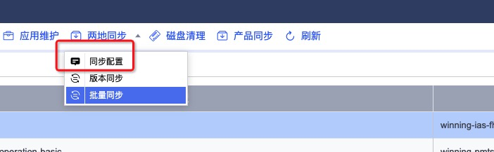
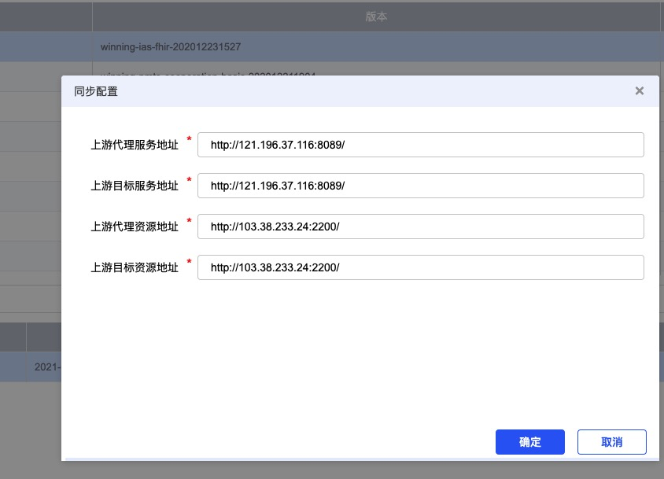

# 现场运维平台搭建

## 1、下载资源

```bash
# 下载初始化系统包
wget http://121.196.37.116/source/init_system/init_system.run
# 下载转发的程序
wget http://121.196.37.116/source/clientnode-0.0.1-SNAPSHOT.jar.tar.gz
# 下载平台初始化资源
wget http://121.196.37.116/source/winning_source.run
# 赋权
chmod +x init_system.run 
chmod +x winning_source.run 
# 初始化系统
# 执行如下命令将会修改root用户密码 Win@2019
sh init_system.run
# 初始化运维平台
sh winning_source.run 
```

## 2、系统配置

> 直接公网服务

### 2.1 产品包管理




、


https://winwiki.winning.com.cn/pages/viewpage.action?pageId=20402558

